文本表情推荐(text emoji recommendation)可以归约成一种有监督分类问题,分类的意图比较明显,即每个表情包或者多个表情包合并对应一种类.该任务建立在一系列短文本数据上,这些数据特征十分类似微博、说说等用户媒体文本特征,同样的具有高稀疏性和先验知识需求.

### 表情推荐文本挖掘流程

在这里笔者给出相应的文本挖掘流程,并按照这些流程进行逐层分析.见图1

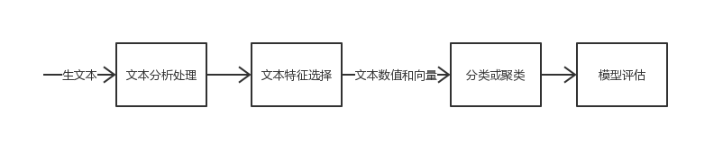

### 文本分析处理

#### 预处理

对于生文本笔者首先合并了标签生成相应的生训练集和测试集,其次对文本字符集搜索发现,部分特殊非中英文数字等字符只出现很少次,本身不常见并且语义难以分析,比如🏻、﹌等,因此利用正则表达式去除非中英文数字(这里中英文包括正常标点),即r'\[u4e00-u9fa5A-Z0-9a-z\].

#### 类关系与语义分析

笔者首先对72个表情类数量进行分析.见图2,其中横轴数字对应一种表情,和原数据集对应.

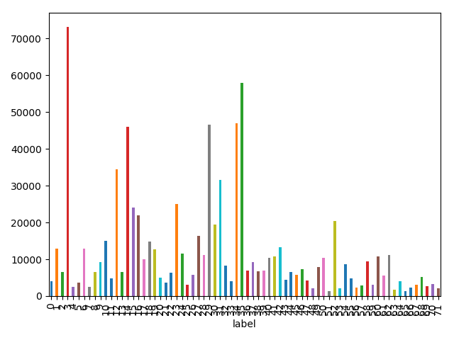

可以看到类间数量极不平衡,以类别3(表情“心”)和类35(表情“泪”)居多.对于类不平衡,一种方法是手工合并语义相同的类即设置一级分类、二级分类,并去除特征不明显难以预测分类的类,另一个方法在分类的时候通过多种采样方法或者调整类权重来平衡数据.在预处理步骤中我们先手工分析,第二种方法见分类.

表情类有很明显的特征: 有用户常用表情、与用户习惯有关、有意义很相近的表情.比如表情中有“左哼哼”和“右哼哼”,这两个词使用哪个和用户习惯有关,语义基本是一致的,再比如“悲伤”、“泪”、“伤心”等表情语义基本一致,从数据集角度也很难区分.另一方面,如“笑而不语”、“并不简单”、“思考”、“黑线”等表情需要先验知识和“左哼哼”、“右哼哼”等很不常用表情予以剔除.

基于以上分析,我们预先标注可能需要删除的类以及可能的二级分类合并.见表1.箭头右边表示分类时暂时代替的类.(注意此方法是备用方法,分类时此方法和未使用此方法的数据都会测试,见分类)

**Table 1** Classes analyze

| Delete                                                       | Merge   |
| ------------------------------------------------------------ | ------- |
| 0, 7, 11, 25, 26, 47, 48, 50, 52, 53, 55, 56, 58, 59, 61, 63, 65, 66, 70, 71 | 4, 5->5 13, 14, 27, 31, 38->14 15, 16, 18, 46->15 9, 28, 39, 44, 45, 64->28 21, 51->21 37, 67, 68->37 17, 41, 69->17|

#### 分词分析&停用词处理

为了更容易进行模型构建和关键字分析,我们需要提前对文本进行分词.中文文本与英文文本有个不同是中文很多词汇是两个字及以上的,即词间无空格,而语法语义分析以及词性分析是要建立在词上的,因此需要对中文进行分词.直接利用单字进行处理也有相应的做法,这里两种方法皆保留,对第一个方法做特别的介绍.

一般中文分词有词典型、规则型、统计型、标注语义型分词等等,统计型解法自动化效果好且消耗资源小,这里使用词典型和统计型解法,即对于登入词采用构建Trier词典树构建DAG分词,未登入词将其归约成HMM问题利用Viterbi算法求解.举数据中文本例子\[train.data第26行\].

在字典中有分别有买、电、动、电动、牙、刷、电动牙刷、牙刷的词及其词频、词性标注,构建前缀词典,以此生成DAG,见图3.接下来可以通过词频或者词性提出登入词,这里选用词频计算最大概率.即对于到某节点的最佳路径为词频和最高的那条路径,归约成动态规划问题即

按照字典法切词结果为“买/电动牙刷”.

假设词首为状态B(Begin),词中的字为状态M(Middle),词尾为状态E(End),假设词序状态符合齐次马尔可夫假设,这便成为一个典型的HMM模型.我们首先需要得到先验的状态转移概率以及某状态条件下的观测值的概率值,这里可以利用字典法构建普适概率.求解HMM采取Viterbi\[1\]状态递推计算单路径最大概率和前路径最优节点状态获得概率最优路径.令节点到的状态转移概率为,观察变量为,状态序列为,对于t时刻最终状态为t的状态序列概率为我们有

递归计算可以得到最终结果“SBMME”.

可以看到不论如何登入词以其词频能够更好的解决问题,另一方面语义理解的分词并不是此任务的重点,因此笔者针对这类数据(微博、说说等)给出了一个简单的登入词表,方便后续的文本分析.

对于停用词,注意到分类时感情是分类的重点,而部分标点、感叹词带有及强烈的感情比如“……”“啊啊啊”等都对分类有影响.这里使用*中文常用停用词表*,但是去除了对除逗号之外标点的停用、感叹词的停用、否定词的停用以及程度副词的停用.

#### (类)关键字分析

关键字能够大致查看文本的特征信息.笔者对分词后的数据分别采用TextRank\[2\]和TF-IDF进行关键词分析.

TextRank从PageRank算法衍生出来,其核心思想是一个TextRank值高的单词后面跟着的一个单词,那么这个单词的TextRank值会相应地因此而提高.假设d为阻尼系数,V为文本单元节点,In为节点前的文本节点,Out为节点后的文本节点.TextRank值即

为了方便展示笔者打出每个类Top20综合的词云.见图4.

输出每个类Top20 TF-IDF的结果基本与TextRank一致.这里最终以TextRank为标准.

对于每个类的关键字,如果某关键字都有出现且重要水平基本一致,那么这个词即使不是常用停用词也应该归为停用词,因为他对区分文本没有帮助,比如每个类都有“没有”、“知道”、“时候”等.对于文本中的关键程度低的词也应该予以剔除,他们并不是类的重要成份并且让整个数据集变得更加稀疏从而降低了分类效果.

### 文本特征选择

#### 结构特征分析

对于文本数据,笔者分别进行了句长、感叹词使用频率、标点(除了逗号、顿号等连接递进标点)使用频率和连续重复字频率的分析.之所以选取这些特征是因为笔者发现部分文本诸如“我死啦啊啊啊啊”、“这好难啊……”等短文本这些特征数值都较高,因而可能对模型构建有影响.

#### 句情感分析

由于表情包和句情感息息相关,比如“耶”是正向的情感,“伤心”是负向的情感,情感分析也可以成为特征的一部分.这里笔者使用*Boson*给微博数据打分的情感数据.每个词的数值表示其情感,值绝对值越大情感越强烈,正值Positive,负值Negative.比如“扰民”对应分数是-6.49756445867.打分原理和原始数据集的情感程度分类有关(即句子的情感程度标注),这里笔者不对数据集作介绍.笔者通过对于每句分词后截取否定词以及程度副词的个数(数据集来自知网),具体最终打分是

注意到总分数只是一维的变量,因此这三个乘子也可以作为特征的一部分作为输入.

#### TF-IDF

TF-IDF是经典的文本数值化(特征提取)的计算方法,它一定程度上选出了全文档不频繁但少文档频繁的字词从而找出部分文档的关键特征字词.这里略去TF-IDF原理.笔者使用的时候TF-IDF最大词数取2500,词频最小为2.值得注意的是,TF-IDF本身仍是稀疏的向量,因此笔者还对TF-IDF利用PCA进行降维.取主成分为60.

#### N-Gram

由于依靠词频和TF-IDF的特征选择很容易忽视词的顺序,我们需要用其他模型来得到更好的特征.N-Gram是一种基于统计语言模型的算法.它的基本思想是将文本里面的内容按照字节进行大小为N的滑动窗口操作,形成了长度是N的字节片段序列. 该模型基于这样一种假设,第N个词的出现只与前面N-1个词相关,而与其它任何词都不相关,即马尔可夫链

因此Unigram为

Bigram为

以此类推.笔者使用N-Gram主要是在TF-IDF上加上限制,笔者取N-Gram范围为(1,2)的TF-IDF作为特征输入.

#### Word2Vec

Word2Vec包括CBOW和Skip-Gram.见图9.

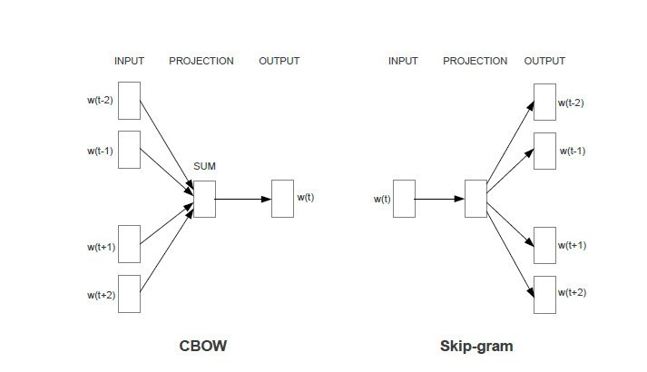

现在一般利用神经网络训练,加速方法有Hierarchical Softmax和Negative Sampling,这里从略.一般来说,One-Hot变量的嵌入形式空间稀疏维度很大,一般会采用嵌入式表示,即映射到较短的向量上来,这也是这两个模型的来源之一.从概率角度来看,CBOW是极大似然估计

Skip-Gram则是极大似然估计

一般来说Word2Vec对于符合语法规范的数据集实验效果会较好,而对于此类不规范的文本数据, Word2Vec的训练可能会因为噪声而降低鲁棒性,因此对于Word2Vec选择预训练模型效果应该比没有预训练模型好.这里两种方法都保留.建模时使用的预训练模型是*微博预训练模型*建模,对于非复杂神经网络的模型,直接输入嵌入层会让复杂度直接升高,这里做一个调整,对于非复杂神经网络模型将里面在预训练模型中的向量加和作为特征的一部分(这里也可以用SVD降维).

#### LDA\[3\]

由于数据集很稀疏,我们需要寻找而外的降维手段.对于短文本寻找其主题向量也是一种降维方法.我们使用LDA生成主题模型降维.当然生成主题也可以成为聚类的成份.这里LDA是指隐含狄利克雷分布,是pLSA的贝叶斯版本.它使用狄利克雷先验来处理文档-主题和单词-主题分布，从而有助于更好地泛化.见图9.

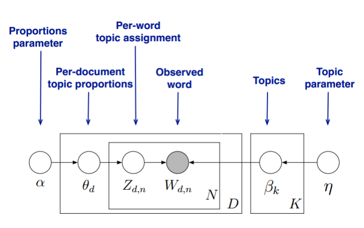

首先由pLSA我们了解到了主题模型(Mixture of Unigram),我们假设文档为d,词为w,主题为z,MU可以看成

pLSA对于文档进行了延伸,从而不再是MU一篇文档一个主题,而是一篇文档多个主题.LDA可以看成pLSA的延伸,所有主题分布符合Dirichlet分布,因而有

可以看成是在pLSA基础上加入了主题分布的分布和词分布的分布参数,一般LDA使用Gibbs采样求解,也可以使用EM算法求解.这里从略.

注意在大数据量的时候实际上Bayesian是会趋近于Orthodoxian的,而我们这里的数据,尤其是除了几个占主要成分的数据,其余量数并不是很客观.换句话说,所需要的先验知识可能还需要增加,这也是这里不直接使用pLSA的原因,如果数据足够让效果好,pLSA将会因为性能而成为更好的选择(毕竟少算一层).这里取主题数为60.在输入文档-词矩阵时,笔者限制了最大的词频计数数量2500和最小词频2,结果主要得到文档主题分布向量.当然同样也实现了词的聚类

#### 特征选用

现在我们得到了TF-IDF的SVD降维数据、LDA对应文档主题分布概率、结构化特征数据、Word2Vec预训练加和数据、情感分析值的连接数据,还有可以用以神经网络训练的整个Word2Vec预训练数据.上文所选取的特征并不一定全都是所需特征,在使用这些特征之前(除了Word2Vec)笔者使用Random Forest对每一个特征进行三折交评价Weight F1-Score,其中结构化数据得到的分数最少(0.06),考虑到后续结构化特征可能有用,还是做了保留.

### 模型构建

在特征提取之后需要进行模型的构建拟合这些特征从而能够泛化结果.除了特征种类多样之外,不同的模型也有不同的使用特征的特点.在这里给出笔者列出的所有模型的构建使用原因以及模型大致调优手段.模型损失以及结果评估见模型比较与评估.

### 分类

这里举出所有笔者实验中上的分类模型.注意,不同模型输入特征不一,具体笔者有给出.

#### **Multinomial Naïve Bayes(MNB)**

这里略去Multinomial Naïve Bayes的原理.MNB有训练快,受数据稀疏性影响小等特点,因此其往往是短文本分类的首选. MNB的特点便是需要比较好的词之间的独立才能够达到好结果.MNB输入的特征分别使用TF-IDF和LDA主题向量作为稀疏特征输入.笔者还对Naïve Bayes进行Laplace修正并且添加部分类先验概率调整数据不平衡问题.

#### **LinearSVM(SVC)**

这里略去LinearSVC的原理.原则上LinearSVC对于噪声小类少的数据在恰当的特征提取下会有非常好的效果(需要的松弛变量少,并且SVC擅长解决有规律的高维问题).但是我们实验的数据属于类十分多高维噪声大数据,从经验上对于LinearSVC来说如果类非常多并且类与类之间还有不少部分重合的话分类效果会下降明显.因此笔者尽可能的来提取特征提高分类效果.笔者输入的特征使用TF-IDF的SVD降维数据、LDA对应文档主题分布概率、结构化特征数据、预训练加和数据、情感分析值的连接数据,对分类采用OvR,类标注使用合并删除后的类,对于预测合并类利用比例在高斯分布上随机生成.此外笔者加入样本权重调整类分布.

**下面2.3.1.3-2.3.18笔者输入的特征皆使用TF-IDF的SVD降维数据、结构化特征数据、预训练加和数据、情感分析值的连接数据.笔者还加入样本权重调整类分布,类使用全部类.**

#### **多层全连接网络(NN)**

这里略去全连接网络的原理.笔者使用NN是作为尝试笔者构建简单的多层全连接神经网络,其中激活函数除输出层为softmax,其余全为ReLU,损失函数使用交叉熵.

#### **Logistic Regression(LR)**

这里略去Logistic Regression的原理.笔者使用LR是作为尝试.

#### **投票集成(Voting)**

这里使用Soft Voting,即继承结果为所有模型的加权平均.笔者实验的主要是MNB+BNB+NN+LR.

#### **Bagging**

这里略去Bagging的原理. 笔者使用Bagging是作为尝试.这里笔者主要实验了NN和MNB的Bagging.

#### **GBDT**

GBDT即Gradient Boost Decision Tree.这里的DT使用回归树.回归树与分类树的不同是回归树的节点是预测值并且这个预测值最大程度降低均方差.GB的意思是向残差方向梯度迭代,即分类器学习的不是原值而是残差.此外,GBDT还有个重要的概念:缩减,即学习残差使用小步逼近,而不是直接逼近,从而降低过拟合概率.我们假设第n-1个强学习器为,损失函数为,则新一轮的弱学习器需要让最小,首先学习负梯度

利用拟合一颗回归树,得到t棵,并对原叶子节点拟合最佳值,从而更新原强学习器.

由于GBDT普遍在许多任务上精度高,因此笔者将其作为实验的一部分.笔者使用CART作为回归子累加100个估计子,损失函数取交叉熵,学习率0.01(即Shrinkage缩减).

#### **XGBoost\[4\]**

XGBoost可以看作GBDT的延伸,在其原来的一阶梯度中额外添加了二阶导数,并添加了正则化.原理从略.

由于XGBoost比GBDT快且精度更高,笔者利用XGBoost进行了实验,取损失函数为交叉熵,回归子200个,最大深度4(特征是浅层稀疏的,因此深度也不能太大),L2正则Lambda为0.5

#### **LightGBM\[5\]**

LightGBM使用直方图优化等等方法又对XGBoost进一步延伸,在大数据集上大程度提高它的速度.原理从略.笔者使用LightGBM参数基本与XGBoost一致,值得一提的是LightGBM一般是限制叶子个数而不是深度,因此笔者也做了替换.此外,针对GBDT有学界给出Dropout的做法(即DART)\[6\].笔者也进行了实验.

**2.3.1.10-2.3.1.15使用嵌入层(分别使用有无预训练向量)数据作为特征输入.模型给出粗略的解释,使用主要仍是在同样的嵌入层(微博Word2Vec向量)上有更好的准确率.嵌入层这里统一设置为动态,因为不确定这些文本一定和微博吻合.**

#### **KimCNN**

KimCNN即TextCNN,网络结构.这里笔者使用自己的TextCNN网络结构,和论文有一部分出入.见图11

为什么使用CNN?多个长条状不同长短的卷积核对于文本相当于多窗口多长度的N-Gram,对于局部关键词以及局部词相关性有很好的计算效果.一方面得益于神经网络的优化效果,另一方面捕捉许多局部关系,从而让短文本分类效果提升.

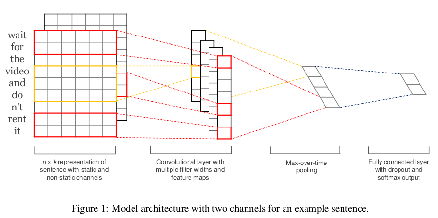

#### **MultiLayerCNN**

为了更快的收敛速度,笔者在TextCNN基础上加深了网络并添加NB层.网络结构见图13.

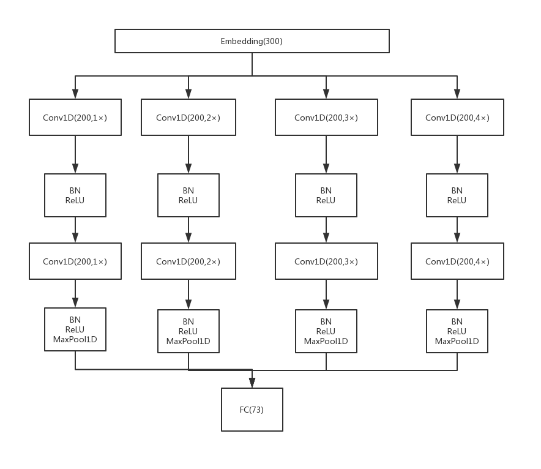

#### **LSTM**

LSTM是RNN的延伸版本,旨在解决RNN的梯度消失问题.结构见图14.

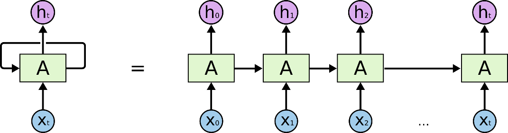

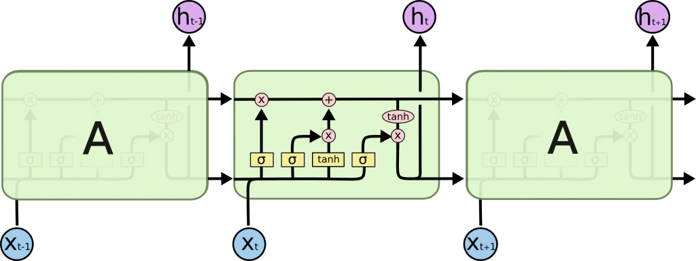

为什么使用LSTM?LSTM一方面有较快的收敛速度(虽然一般比CNN慢得多),另一方面可以通过激活照顾很长的上下文文本. 也就是说,LSTM的目的很明确,就是要控制信息传递，通过控制信息的传递,实现激活long-term的信息.笔者使用LSTM隐藏节点为512,后利用全连接层直接分类.

#### **LSTM-Attention\[7\]**

Attention的结构见图14.计算玩Score的权重分布输出便是Attention的输出.

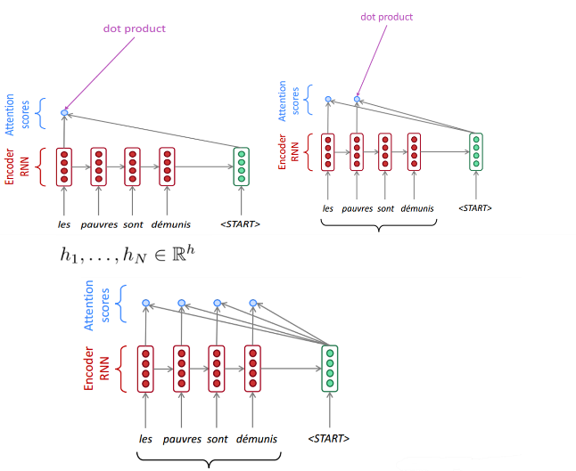

为什么使用Attention?Attention相当于给了词一个权重分配,从而强调信息的影响程度.笔者将Attention加入在LSTM的输出中.网络结构见图16

#### **BiLSTM**

笔者为了更好的精度,将LSTM换成了BiLSTM,并且加深了网络和使用KMaxPooling\[8\].网络结构见图17.

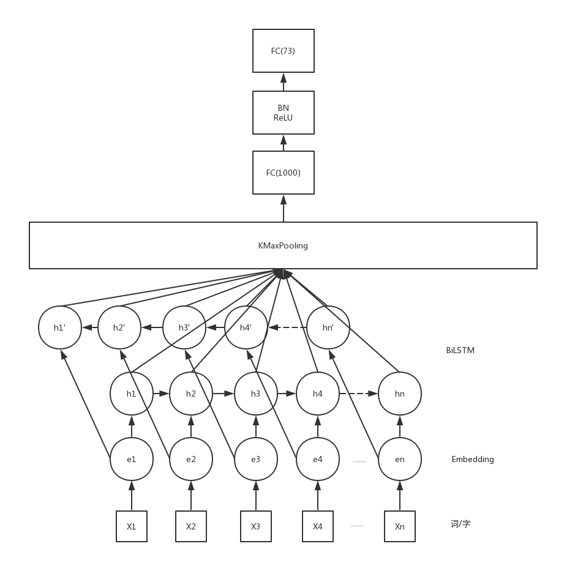

### 聚类

笔者这里仅利用关键词和表情类语义进行聚类,即一个句子所包含的关键词(设置阈值超过一定TF-IDF值(这里取0.15)或TextRank计算值)向量与表情类向量计算Cosine距离,平均和最短的属于此类.笔者这个仅作为实验,不利用其结果作为实验结果.因为这个与其他模型不一致,因此特地提出.(由于很多句子关键字很少,聚类不能把所有的句子全部归类,另一方面聚类效果和实际分类对应结果很不理想(0.01))

## **模型比较与评估**

为了对多分类有更稳健的评估效果,笔者采取十折交验证检验2.3.1.1-2.3.1.7的模型评估结果,其余由于时间限制笔者只划分0.1比例的验证集作调参.对于有参榜的模型会给出对应的Average F1-score.在这里笔者给出对模型评估给出进一步解释.

F1-Score是针对二分类的,因此Mean(Average) F1-Score即全部F1-Score的平均,Weight F1-Score是加权平均F1-Score,权重取决于数据量.对于全局的Precision和Recall平均他们计算并不直接等于Mean F1-Score,主要是对各类的分析比较有意义.

我们先查看2.3.1.1-2.3.1.9的模型情况.括号为实际上榜情况

| Model                | MNB  | LinearSVC | NN   | LR   | Voting | Bagging(MNB) | GBDT | XGBoost | LightGBM    |
| -------------------- | ---- | --------- | ---- | ---- | ------ | ------------ | ---- | ------- | ----------- |
| **Average F1-Score** | 0.16 | 0.11      | 0.09 | 0.12 | 0.15   | 0.15         | 0.13 | 0.15    | 0.15(0.151) |

我们可以看到基于提取特征的模型很大程度上不能上升,原因很可能是提取的不够充分.另外在对每个数据查看的时候,可以发现比如类别48、67、71等数据预测往往Recall和Precision皆为0,也就是说分类器识别不出他们的特征.笔者通过手工分类也很难区分比如“思考”这种表情所代表的句子.因此需要先验知识的加入.

对于网络模型,我们均利用预训练模型来提高准确度.我们首先查看他们在验证集上的情况,见图18.

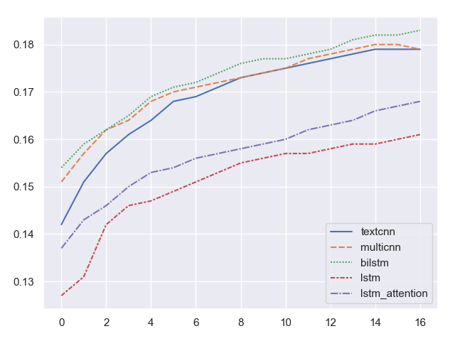

可以看到有无加深深度带来的精度变化不大,主要是加快了网络收敛.我们给出每个模型对应的准确率.注意F1-Score一栏即为上榜情况

|                      | **TextCNN** | **MultiLayerCNN** | **LSTM**   | **LSTM-Attention** | **BiLSTM** |
| -------------------- | ----------- | ----------------- | ---------- | ------------------ | ---------- |
| **Accuracy**         | 0.18        | 0.18              | 0.16       | 0.17               | 0.188      |
| **Average F1-Score** | 0.167       | 0.181             | 无上榜检验 | 无上榜检验         | **0.1845** |

可以看到预训练模型比较传统特征有小幅度的提升,证明了先验知识的重要性.这里笔者不给出无预训练模型的结果(均未上榜检验).

笔者最终选用的模型是**BiLSTM**.

References:

1. Foundations of Statistical Natural Language Processing. Christopher D. Manning, Hinrich Schütze.
2. TextRank: Bringing Order into Texts. Rada Mihalcea and Paul Tarau
3. Latent Dirichlet Allocation. David M. Blei, Andrew Y. Ng, Michael I. Jordan.
4. XGBoost: A Scalable Tree Boosting System. Tianqi Chen.
5. LightGBM: A Highly Efficient Gradient Boosting Decision Tree.
6. DART: Dropouts meet Multiple Additive Regression Trees.
7. Attention is all you need.
8. A Convolutional Neural Network for Modelling Sentences.

