## DCNN

神经网络种类繁多，机器学习课上我们学过了感知机、BP网络、RBF、Boltzmann机等等神经网络的构造，而我们现在说的神经网络一般指的就是BP网络，卷积神经网络其实就是BP网络的一个推广，把神经元全连接的操作扩展成卷积、池化等等，从而能够处理类似图像这样的多维数据。

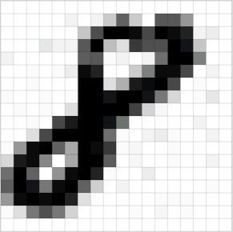


### 神经网络结构与概念

广义上，神经网络的前向结构通常是DAG，通俗的说也就是一些张量经过一系列处理输出另一系列张量。举一个最简单的例子，还记得感知机和异或问题

我们画出相应的DAG，加上权重和截断函数就可以用前馈网络来实现异或。也就是说前馈网络除了是一个复合函数，一种映射，他还可以用图来理解。通常这些输出张量代表的都是概率质量密度，比如图像分类问题或者语义分割问题，这些输出代表的也就是第i个类的后验概率。最后一层是损失层，和标签计算输出损失然后反向传播。[1]

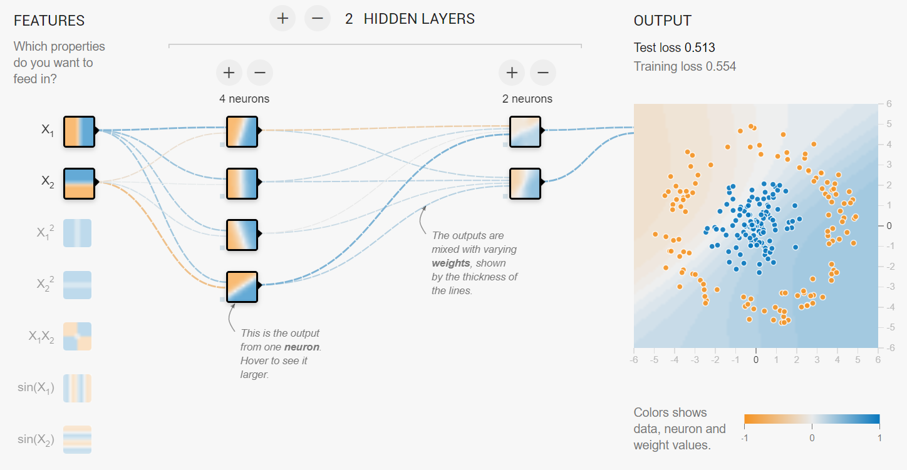

虽然我们没有显式说，可以看到我们输入和输出经过一个又一个的层或者模块，这是一种操作模块化的思想，那么构造一个网络其实可以看作这些操作的堆叠/排列组合。这是一种启发式的做法。我们参考一下最早的卷积神经网络LeNet[2]


它符合一种端到端的模式，我们在数据挖掘的时候处理数据，比如就原来的图像分类，我们需要做预处理、特征提取选择、分类器设计等等步骤，而这样的卷积网络提供了一个范式，也就是并不进行人工划分，而是直接交给网络进行映射。而我们的各个模块实际上不同程度地反映了特征，比如卷积是对图像的特征提取，池化是一种特征选择等等，这也方便了我们启发式地设计神经网络。当然，操作模块化还有更大的好处。比如对于一个L层的单向神经网络，我们有


计算损失函数


我们一般使用一些非凸优化方法来最小化损失函数，这是因为光是带有卷积和非线性激活函数下的神经网络很难求出闭式解，并且输出损失函数其光滑性和凸性都是未知的，比如SGD下更新参数

还有其他优化器比如Nesterov、Adam，也就是说使用的非凸优化器基本都是一阶优化器，一阶特性这个非常重要，反向传播的时候我们只需记录每一层的网络的、，然后通过链式法则


更准确的，我们可以写成[3]


其中表示按行向量展开的列向量。就可以计算对上一层所对应的输入和参数的偏导。公式里的数字可以是向量或矩阵或张量等，他们可以统一摊平成向量，计算的时候加一个转置就可以了。这是一种分而治之的思想，也就是说，我可以将反向传播交给每一个操作计算，事实上各个框架的代码也是这么设计的，比如说利用Pytorch的Function作自定义的反向传播

```python
# By Kruskal Lin
class MyFunction(Function):

    @staticmethod
    def forward(ctx, input, weight, ...): # get x^i, w^i
        ctx.save_for_backward(input, weight...) # save x^i, w^i
        output = _cuda_wrapper(input, weight, ...) # foward in cuda
        return output # x^{i+1}

    @staticmethod
    def backward(ctx, grad_output): # get \frac{\partial{z}}{\partial{x^{i+1}}}
        input, ... = ctx.saved_variables # extract x^i, w^i
        grad_input, grad_weight, ... = _cuda_backward_wrapper(grad_output, input, ...) # calculate \frac{\partial x^{i+1}}{\partial w^{i}} &&
        # \frac{\partial x^{i+1}}{\partial x^{i}}
        return grad_input, grad_weight, ... # number of items is equal to inputs of the forward function(except for ctx) 
```

因此我们只需要定义每一个操作的前向反传的方法，就可以构出一套计算图，因而分治操作是一种非常重要的手段。接下来我将介绍卷积神经网络里面最重要的部分，也就是离散卷积。


### 离散卷积

卷积定义为


也就是一个函数翻转平移后与另一个函数的积分，得到一个关于x的新函数或函数簇。我们首先记几个卷积的性质，假设f和g是上的函数，那么有


其中，这条性质也就是平移同变性。如果f是紧支集上的连续可微函数，g是可积函数，那么


还有和卷积相对应的一个概念，叫做互相关，也就是


二维卷积是卷积神经网络中最常见的卷积，它相当于对于一个小区域线性加权编码


经典的卷积核譬如Sobel、Laplace算子等高通滤波核有检测边缘的功能，均值滤波等低通滤波有平滑图像的功能。比如Laplace


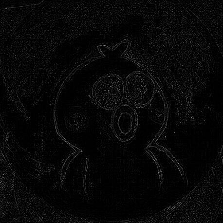

有人问为什么会检测出边缘，卷积结果是和具体的卷积算子有关系的，Laplace、Sobel是有限差分算子[4]。此外，我们再看一个更简单的例子。

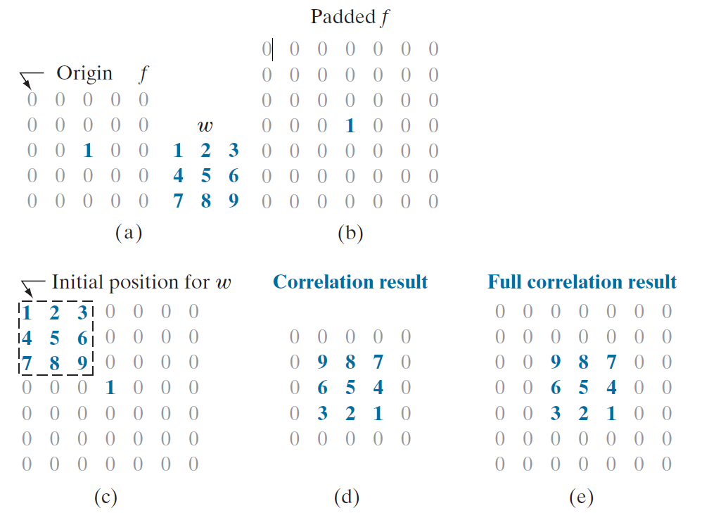

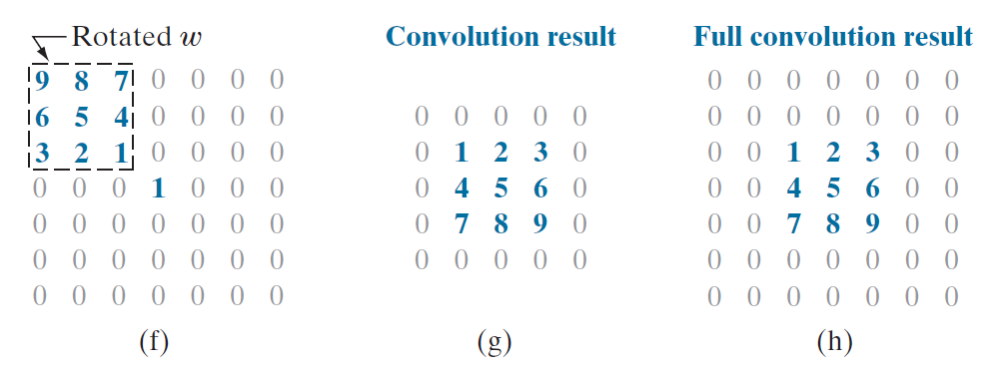

神经网络中的卷积计算可以说是一种启发式的想法，真正网络训练的时候我们初始化的卷积核都是对称的，也就是说可以不翻转卷积核直接点点相乘，比如在Pytorch[5]。实际上大家可以证明看看这两种离散操作在训练时候是否是等价的，这个我并不清楚。

```python
# By Kruskal Lin
def main():
    input = torch.zeros(1, 1, 8, 8, dtype=torch.float64)
    input[0, 0, :, 4] = 1
    ker = np.zeros((1, 1, 3, 3), dtype=float)
    ker[0, 0, :] = [1, 2, 3]
    ker = torch.from_numpy(ker)
    print(input)
    print(ker)
    conop = nn.Conv2d(1, 1, 3, bias=False)
    conop.weight = nn.Parameter(ker)
    output = conop(input)
    print(output)


if __name__ == "__main__":
    main()
```


```
tensor([[[[0., 0., 0., 0., 0.],
          [0., 0., 0., 0., 0.],
          [0., 0., 1., 0., 0.],
          [0., 0., 0., 0., 0.],
          [0., 0., 0., 0., 0.]]]], dtype=torch.float64)
tensor([[[[1., 2., 3.],
          [4., 5., 6.],
          [7., 8., 9.]]]], dtype=torch.float64)
tensor([[[[0., 0., 0., 0., 0., 0., 0.],
          [0., 0., 0., 0., 0., 0., 0.],
          [0., 0., 9., 8., 7., 0., 0.],
          [0., 0., 6., 5., 4., 0., 0.],
          [0., 0., 3., 2., 1., 0., 0.],
          [0., 0., 0., 0., 0., 0., 0.],
          [0., 0., 0., 0., 0., 0., 0.]]]],
       dtype=torch.float64, grad_fn=<ThnnConv2DBackward>)
```

因为在对称的核中学习和卷积是等价的，或者说都是线性操作。下文我默认他们都是点点相乘。在二维图像卷积神经网络中，我们定义输入张量，定义K个卷积核，我们喜欢把二维卷积核写成两个参数，但是他的参数并不是一个二维矩阵，他是一个四维张量，也就是，也就是说二维卷积实际上是把所有通道都算进去了，也就是一个二维卷积实际上是个三维张量，也就是立方体，然后上下左右移动计算得到一张特征图。

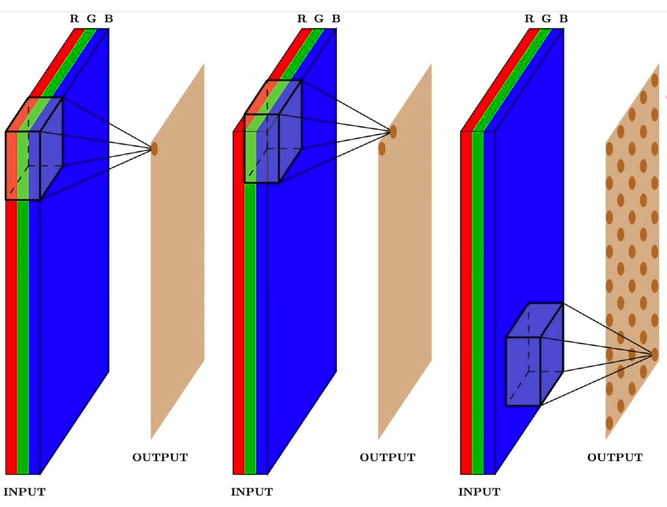

如果我们只是针对一个通道进行卷积，也就是卷积核大小为，我们又叫他depthwise卷积。当长宽都是1时，也就是我们平常说的卷积，大小为，又被我们称为pointwise卷积。通常我们学习的时候我们还会加上padding和stride，一个具体的计算公式是


**反向传播**

一般来说卷积的运算除了滑动窗口遍历计算之外，还有很多加速方法，如FFT、im2col+GEMM(GEneral Matrix Mutiplication)、Winograd。为了方便讲反向传播，我们介绍一下im2col。

譬如考虑矩阵


在卷积核


上做卷积，其im2col展开是(matlab是按列卷积，pytorch unfold结果，也就是按行卷积，我们按照matlab的做法来，这是因为向量化的数学定义是按列的)

```python
def main_im2col():
    ker = np.zeros((1, 1, 3, 4), dtype=float)
    ker[0, 0, 0, :] = [1, 2, 3, 4]
    ker[0, 0, 1, :] = [5, 6, 7, 8]
    ker[0, 0, 2, :] = [9, 10, 11, 12]
    ker = torch.from_numpy(ker)
    print(F.unfold(ker, kernel_size=2))
```


假设我们输出矩阵大小为，核大小为，不考虑padding和stride，那么im2col结果大小为。乘法的时候我们还需要对他进行转置，我们令上述结果的转置为，简写成。虽然这样映射很直观，但我们希望能够把它转换为线性映射，也就是


很明显是一个高维稀疏矩阵，比如对于上述例子我们就有大小，我们可以这么做映射，对于每一个在i行j列的窗口中的第k行l列的元素有映射


向量化后有


只需要将M中对应的坐标填为1即可。回过头来看卷积结果又可以表示为


反向传播时候需要计算和，先计算后者


由于由前层已知，我们只需要计算

即非常简洁的结果即


同理只需要计算


这一步我们需要用到直积，也就是克罗内克积。我们定义


那么有


原式


那么


更一般的，对于多维张量的卷积，我们也是按照向量化的操作。


**采样**

图像的放大缩小可以认为是一种图像的重采样，分为上采样和下采样，也就是放大图像和缩小图像，一般上采样的方法有插值或者转置卷积，我们介绍一下转置卷积，我们除了把卷积看成卷积核在数据上滑动以外，我们还可以把它看成数据在卷积核上滑动，也就是


当然结果可能要颠倒一下。我们希望X尺寸变大，也就是


具体如何计算原图尺寸参数见[论文](https://arxiv.org/pdf/1603.07285.pdf)。下图是卷积核，数据，输出，看到对卷积核的“卷积”。


下采样的方法也很多了，调节padding和stride我们就可以很容易的改变图像大小，还可以用池化或者插值成倍的缩小图像。


**局部连接和共享参数**

卷积最重要的概念就是局部连接和共享参数。局部连接的意思是卷积操作后输出的隐藏层神经元每一个只对应上层的图片中的局部部分，而不是整个数据，共享参数意思是一个卷积核遍历所有窗口计算用的是同一套参数变量，从而减少参数量。再结合我们刚才说的互相关，我们可以把卷积看成局部连接共享参数的全连接，都是加权运算，而全连接实际上就是长宽正好为特征层长宽的卷积，卷积核也就是对通道的加权运算，他可以自由的扩张或者收缩通道。

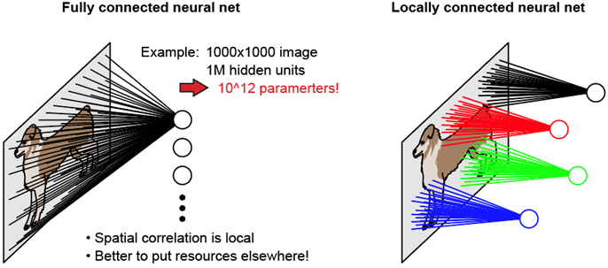


**感受野**

感受野代表的是隐藏层某个神经元在某一层所关系到的区域，越大的感受野表示影响该神经元的数据区域越大。下图是kernel=3，p=1，s=2所得出的特征图。感兴趣的可以参考[网站](https://fomoro.com/research/article/receptive-field-calculator)


我们其实可以看到两个的卷积核和一个卷积核的感受野是一样的，然而参数量卷积需要，而需要参数，因此我们往往利用两个的卷积代替的卷积[6]。

在卷积的变种中，我们会非常常见在相同感受野下减少参数或者同参数增大感受野的方法。比如空洞卷积[7]即


空洞卷积最早用来处理语义分割的精度问题，在原网络思想是通过多层空洞卷积增长叠加然后指数扩展感受野。


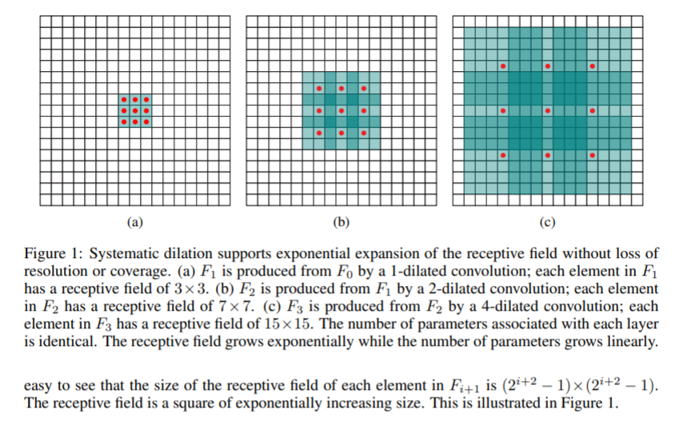

原文提到了一个感受野指数增长的Multi-scale Context Aggregation模块，也就是空洞卷积以2指数次方空洞增加的卷积叠加模块，这里的dilation也就是公式中的l。感受野是一个启发式的概念，我们介绍一个概念有效感受野[8]

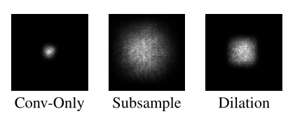

即第p层的特征图像素，那么作者预计算的是

这里0坐标表示的是中心，要计算这个可以设置，且 即可。作者还分析了不同层的分布，并发现发现线性层参数初始化符合高斯或类高斯的形态。

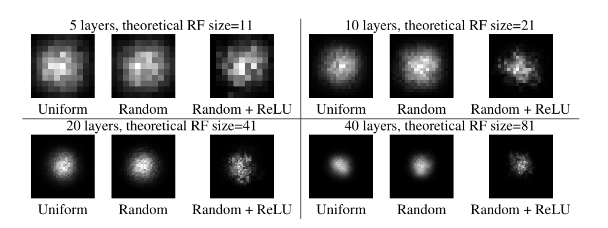


虽然如此，理论感受野仍然是一个设计网络时候的一个参考依据。在理论感受野不变的情况下我们还有很多减少参数或者计算量的方法。

**Bottleneck**[12]

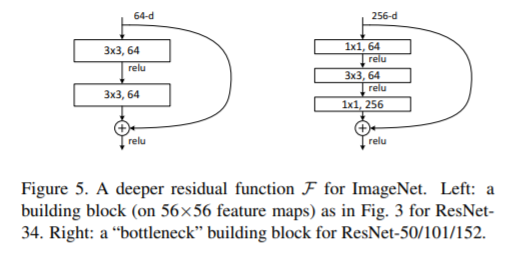

主要用在比较深的网络中维度很大的情况。比如卷积所需参数是，假设卷积结果长宽，则计算量(FLOPs，仅考虑乘法和偏置，可以看torchstat库)是，所以Bottleneck结构能够伸缩地减少计算量。


**非对称卷积**[10]在这里指的是卷积和卷积，其所需参数和计算量公式也就是普通的两个卷积的叠加。假设第一次输出，第二次输出，那么所需参数为，所需计算量为

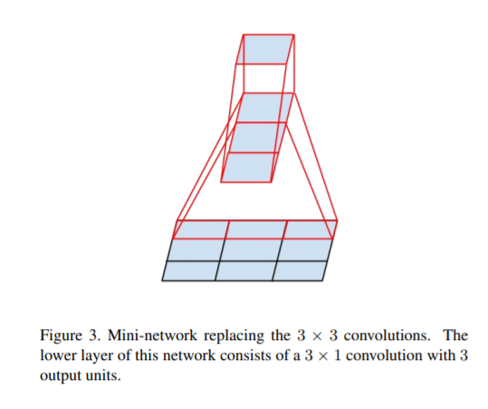


**可分离卷积**[9]


可分离卷积需要参数，计算量

题外话：**Inverted Residual Block**[13]

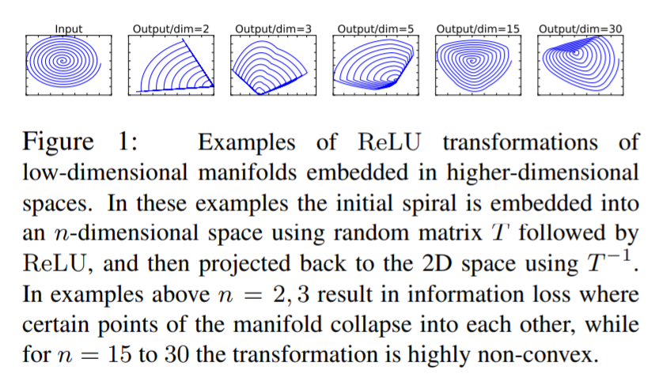

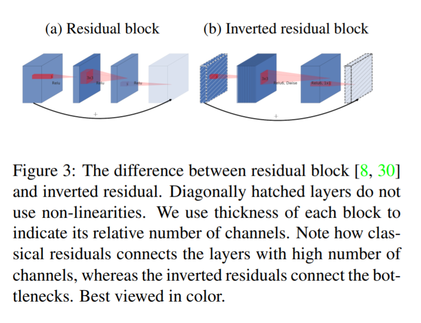

IR结构实际上可以看作一种BottleNeck的变种，主要结论是需要通过变换到一定的特征通道进行ReLU才会防止塌陷(失活)或者过多非线性，因此采用一种扩张收缩的方法。


**分组卷积**[11]是对通道的分组，当分的组数正好等于通道时，即变为depthwise卷积。


分组卷积需要参数，计算量


### 子模块

**Depth:Skip-connection[12]**

梯度消失问题，ResNet设计残差模型


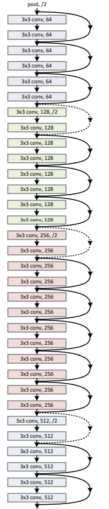


**Dense block[14]**


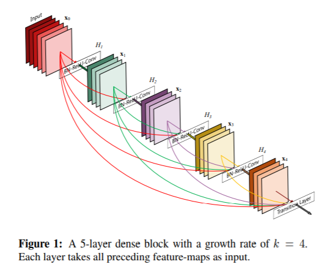

在输出时候直接可以得到前层的输入，相当于


因而进一步解决梯度消失问题。


**Width:Inception**

数据集的variation很大，我们希望一层能利用不同的卷积核提取不同的特征，也就是大卷积核和小卷积核并用

InceptionV1[15]


InceptionV2[16]


除了分解乘纵向的非对称卷积，为了防止编码太高维，Inception给出了个更宽的做法。


InceptionV4[17]

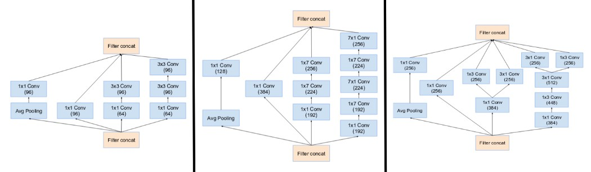

除了非常像V2、V3的卷积模块，还引入了Reduction Blocks，也就是专门的下采样模块


Inception-ResNet[17]

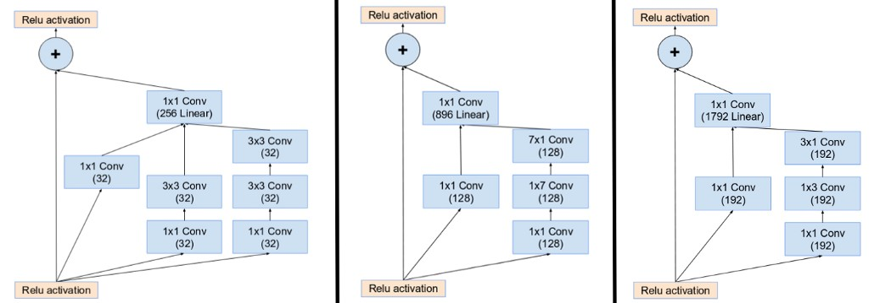

类似InceptionV4的ABC模块设计，输出的时候使用卷积归约到同一个维度，下采样模块几乎类似

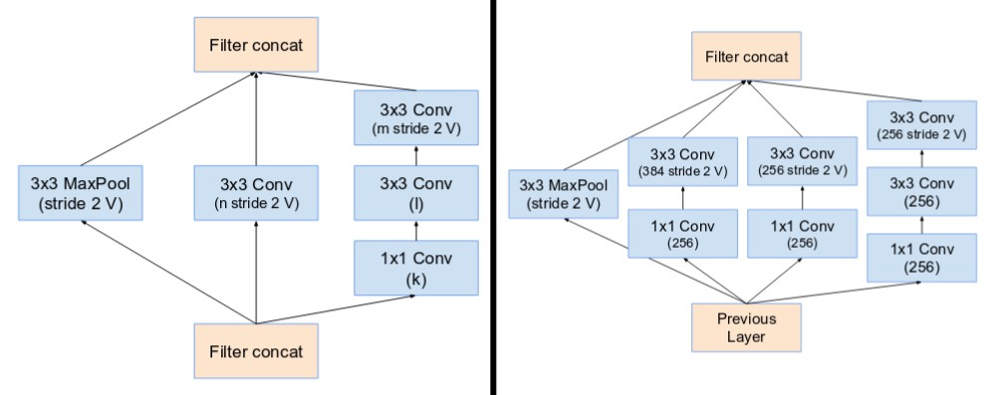


**PolyNet**[18]

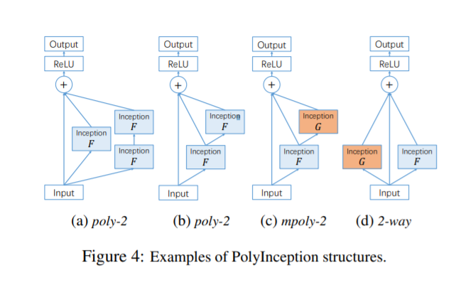

也就是、、，同理还可衍生出和。


**ResNeXt Block** [19]

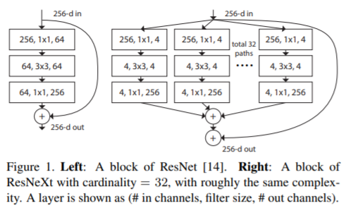

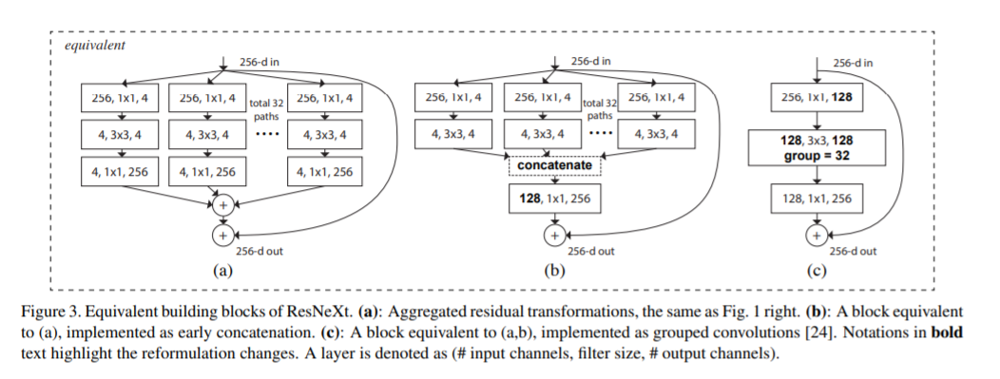


**Shuffle** [20]

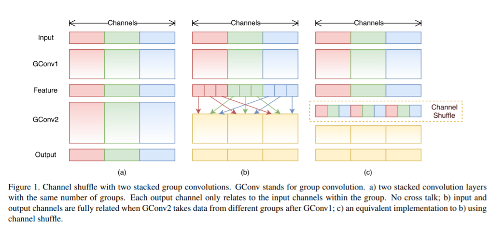

Stack特征层，转置再向量化


**Weighing: Non-Local** [21]


j不是卷积核中的点，而是所有点，其中f表示i和j之间的关系，C是归一化函数。f函数类似核函数，有多种取法如


实际上取归一化函数，那么，也就是

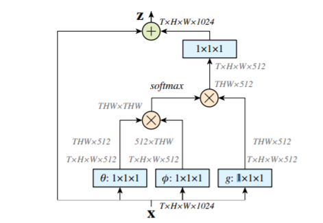

这就是self-attention。还有


括号表示连接。


**Squeeze and Excitation** [22]

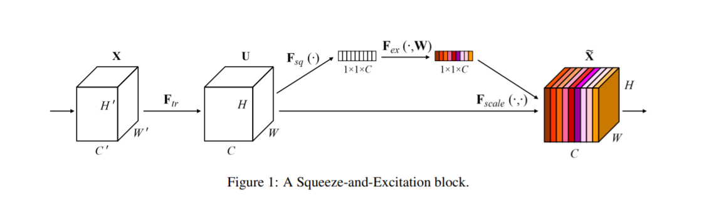


### 目标函数


### 骨干网络搭建

ImageNet任务图像分类

训练集：1,000,000张图片+标签
验证集：50,000张图片+标签
测试集：100,000张图片

[精度-ImageNet](https://paperswithcode.com/sota/image-classification-on-imagenet) [模型](https://github.com/Cadene/pretrained-models.pytorch)

| Model                                                        | Acc@1  | Acc@5  |
| ------------------------------------------------------------ | ------ | ------ |
| SENet154                                                     | 81.32  | 95.53  |
| [SENet154](https://github.com/Cadene/pretrained-models.pytorch#senet) | 81.304 | 95.498 |
| PolyNet                                                      | 81.29  | 95.75  |
| [PolyNet](https://github.com/Cadene/pretrained-models.pytorch#polynet) | 81.002 | 95.624 |
| InceptionResNetV2                                            | 80.4   | 95.3   |
| InceptionV4                                                  | 80.2   | 95.3   |
| [SE-ResNeXt101_32x4d](https://github.com/Cadene/pretrained-models.pytorch#senet) | 80.236 | 95.028 |
| SE-ResNeXt101_32x4d                                          | 80.19  | 95.04  |
| [InceptionResNetV2](https://github.com/Cadene/pretrained-models.pytorch#inception) | 80.170 | 95.234 |
| [InceptionV4](https://github.com/Cadene/pretrained-models.pytorch#inception) | 80.062 | 94.926 |
| [DualPathNet107_5k](https://github.com/Cadene/pretrained-models.pytorch#dualpathnetworks) | 79.746 | 94.684 |
| ResNeXt101_64x4d                                             | 79.6   | 94.7   |
| [SE-ResNeXt50_32x4d](https://github.com/Cadene/pretrained-models.pytorch#senet) | 79.076 | 94.434 |
| SE-ResNeXt50_32x4d                                           | 79.03  | 94.46  |
| [Xception](https://github.com/Cadene/pretrained-models.pytorch#xception) | 79.000 | 94.500 |
| [ResNeXt101_64x4d](https://github.com/Cadene/pretrained-models.pytorch#resnext) | 78.956 | 94.252 |
| [Xception](https://github.com/Cadene/pretrained-models.pytorch#xception) | 78.888 | 94.292 |
| ResNeXt101_32x4d                                             | 78.8   | 94.4   |
| SE-ResNet152                                                 | 78.66  | 94.46  |
| [SE-ResNet152](https://github.com/Cadene/pretrained-models.pytorch#senet) | 78.658 | 94.374 |
| ResNet152                                                    | 78.428 | 94.110 |
| [SE-ResNet101](https://github.com/Cadene/pretrained-models.pytorch#senet) | 78.396 | 94.258 |
| SE-ResNet101                                                 | 78.25  | 94.28  |
| [ResNeXt101_32x4d](https://github.com/Cadene/pretrained-models.pytorch#resnext) | 78.188 | 93.886 |
| FBResNet152                                                  | 77.84  | 93.84  |
| SE-ResNet50                                                  | 77.63  | 93.64  |
| [SE-ResNet50](https://github.com/Cadene/pretrained-models.pytorch#senet) | 77.636 | 93.752 |
| [DenseNet161](https://github.com/Cadene/pretrained-models.pytorch#torchvision) | 77.560 | 93.798 |
| [ResNet101](https://github.com/Cadene/pretrained-models.pytorch#torchvision) | 77.438 | 93.672 |
| [FBResNet152](https://github.com/Cadene/pretrained-models.pytorch#facebook-resnet) | 77.386 | 93.594 |
| [InceptionV3](https://github.com/Cadene/pretrained-models.pytorch#inception) | 77.294 | 93.454 |
| [DenseNet201](https://github.com/Cadene/pretrained-models.pytorch#torchvision) | 77.152 | 93.548 |
| [CaffeResnet101](https://github.com/Cadene/pretrained-models.pytorch#caffe-resnet) | 76.400 | 92.900 |
| [CaffeResnet101](https://github.com/Cadene/pretrained-models.pytorch#caffe-resnet) | 76.200 | 92.766 |
| [DenseNet169](https://github.com/Cadene/pretrained-models.pytorch#torchvision) | 76.026 | 92.992 |
| [ResNet50](https://github.com/Cadene/pretrained-models.pytorch#torchvision) | 76.002 | 92.980 |
| [DenseNet121](https://github.com/Cadene/pretrained-models.pytorch#torchvision) | 74.646 | 92.136 |
| [VGG19_BN](https://github.com/Cadene/pretrained-models.pytorch#torchvision) | 74.266 | 92.066 |
| [ResNet34](https://github.com/Cadene/pretrained-models.pytorch#torchvision) | 73.554 | 91.456 |
| [BNInception](https://github.com/Cadene/pretrained-models.pytorch#bninception) | 73.524 | 91.562 |
| [VGG16_BN](https://github.com/Cadene/pretrained-models.pytorch#torchvision) | 73.518 | 91.608 |
| [VGG19](https://github.com/Cadene/pretrained-models.pytorch#torchvision) | 72.080 | 90.822 |
| [VGG16](https://github.com/Cadene/pretrained-models.pytorch#torchvision) | 71.636 | 90.354 |
| [VGG13_BN](https://github.com/Cadene/pretrained-models.pytorch#torchvision) | 71.508 | 90.494 |
| [VGG11_BN](https://github.com/Cadene/pretrained-models.pytorch#torchvision) | 70.452 | 89.818 |
| [ResNet18](https://github.com/Cadene/pretrained-models.pytorch#torchvision) | 70.142 | 89.274 |
| [VGG13](https://github.com/Cadene/pretrained-models.pytorch#torchvision) | 69.662 | 89.264 |
| [VGG11](https://github.com/Cadene/pretrained-models.pytorch#torchvision) | 68.970 | 88.746 |
| [Alexnet](https://github.com/Cadene/pretrained-models.pytorch#torchvision) | 56.432 | 79.194 |


[精度-CIFAR10](https://paperswithcode.com/sota/image-classification-on-cifar-10)

[精度-CIFAR100](https://paperswithcode.com/sota/image-classification-on-cifar-100)

数字是有权重的层

**VGG**

```python
cfgs = {
    'A': [64, 'M', 128, 'M', 256, 256, 'M', 512, 512, 'M', 512, 512, 'M'],
    'B': [64, 64, 'M', 128, 128, 'M', 256, 256, 'M', 512, 512, 'M', 512, 512, 'M'],
    'D': [64, 64, 'M', 128, 128, 'M', 256, 256, 256, 'M', 512, 512, 512, 'M', 512, 512, 512, 'M'],
    'E': [64, 64, 'M', 128, 128, 'M', 256, 256, 256, 256, 'M', 512, 512, 512, 512, 'M', 512, 512, 512, 512, 'M'],
}

def make_layers(cfg, batch_norm=False, input_channels=3):
    encoders = []
    layers = []
    for v in cfg:
        if v == 'M':
            layers += [nn.MaxPool2d(kernel_size=2, stride=2)]
            encoders.append(nn.Sequential(*layers))
            layers = []
        else:
            conv2d = nn.Conv2d(input_channels, v, kernel_size=3, padding=1)
            if batch_norm:
                layers += [conv2d, nn.BatchNorm2d(v), nn.ReLU(inplace=True)] # conv->bn->relu
            else:
                layers += [conv2d, nn.ReLU(inplace=True)]
            input_channels = v
    return encoders
```


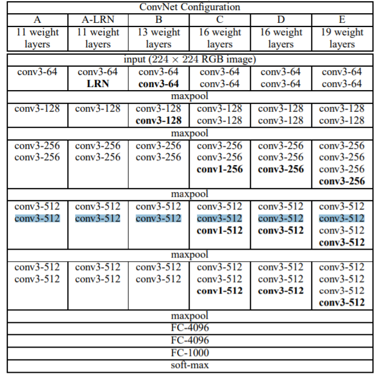


**ResNet**

```python
def _make_layer(self, block, planes, blocks, stride=1, dilate=False):
        norm_layer = self._norm_layer
        downsample = None
        previous_dilation = self.dilation
        if dilate:
            self.dilation *= stride
            stride = 1
        if stride != 1 or self.inplanes != planes * block.expansion:
            downsample = nn.Sequential(
                conv1x1(self.inplanes, planes * block.expansion, stride),
                norm_layer(planes * block.expansion),
            )

        layers = []
        layers.append(block(self.inplanes, planes, stride, downsample, self.groups,
                            self.base_width, previous_dilation, norm_layer))
        self.inplanes = planes * block.expansion
        for _ in range(1, blocks):
            layers.append(block(self.inplanes, planes, groups=self.groups,
                                base_width=self.base_width, dilation=self.dilation,
                                norm_layer=norm_layer))

        return nn.Sequential(*layers)
```


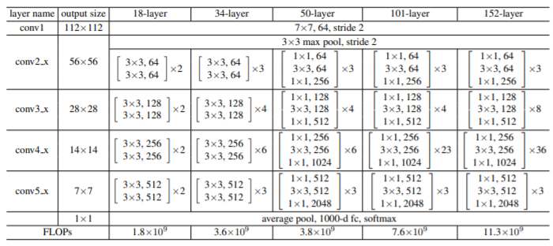


**Xception**


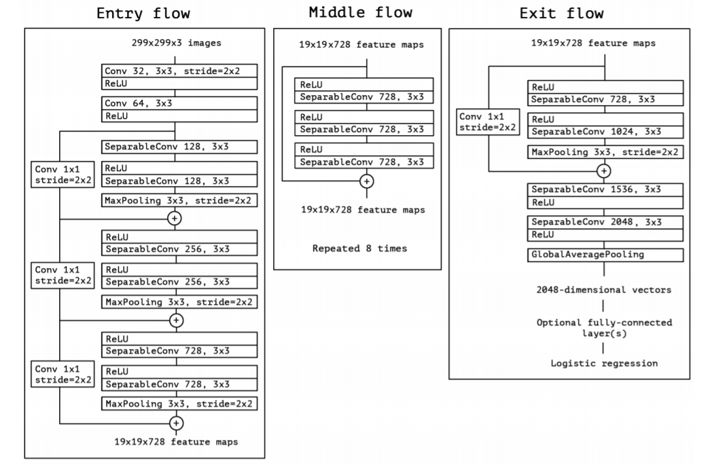

### 语义分割

Encoder-Decoder结构，逐像素的分类，IoU=overlap/union

FCN[23]

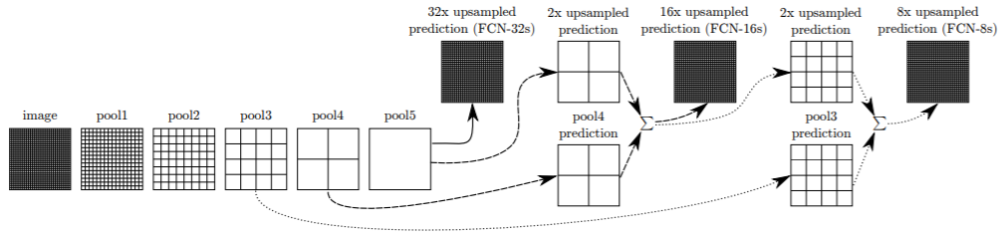

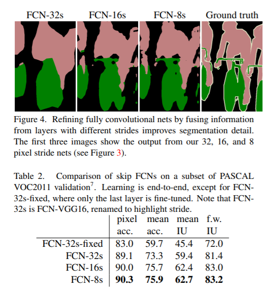


UNet[24]


DeeplabV3+[25]

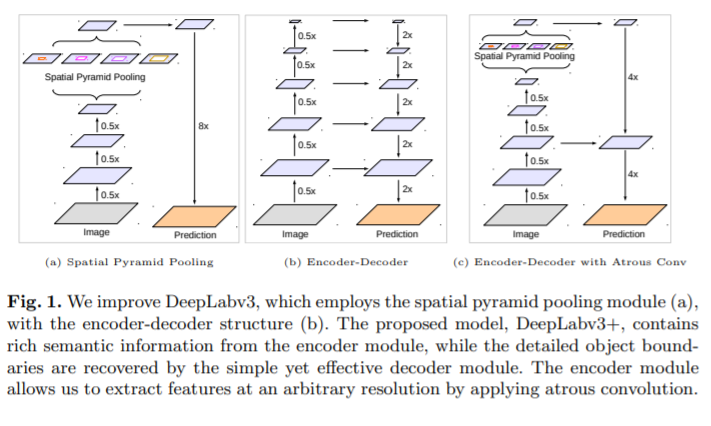

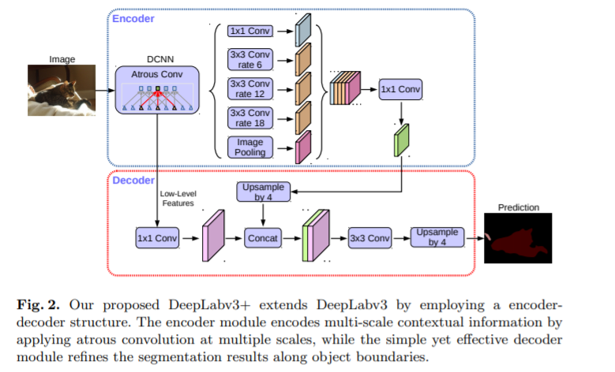


### 图卷积[26]


### 参考

[1] [https://playground.tensorflow.org/](https://playground.tensorflow.org/)

[2] [Gradient-Based Learning Applied to Document Recognition](http://yann.lecun.com/exdb/publis/pdf/lecun-01a.pdf)

[3] 模式识别. 吴建鑫著

[4] [finite difference](https://en.wikipedia.org/wiki/Finite_difference)

[5] [pytorch conv2d](https://pytorch.org/docs/stable/generated/torch.nn.Conv2d.html#torch.nn.Conv2d)

[6] [vgg](https://arxiv.org/abs/1409.1556)

[7] [Multi-Scale Context Aggregation by Dilated Convolutions](https://arxiv.org/pdf/1511.07122.pdf)

[8] Understanding the Effective Receptive Field in Deep Convolutional Neural Networks

[9] [MobileNet](https://arxiv.org/pdf/1704.04861.pdf)

[10] [Inception V3](https://arxiv.org/pdf/1512.00567.pdf)

[11] [AlexNet](https://papers.nips.cc/paper/4824-imagenet-classification-with-deep-convolutional-neural-networks.pdf)

[12] [ResNet](https://arxiv.org/pdf/1512.03385.pdf)

[13] [MobileNetv2](https://arxiv.org/pdf/1801.04381.pdf)

[14] [DenseNet](https://arxiv.org/pdf/1608.06993.pdf)

[15] [InceptionV1](https://arxiv.org/pdf/1409.4842v1.pdf)

[16] [InceptionV2](https://arxiv.org/pdf/1512.00567v3.pdf)

[17] [InceptionV4](https://arxiv.org/pdf/1602.07261.pdf)

[18] [PolyNet](https://arxiv.org/pdf/1611.05725.pdf)

[19] [ResNext](https://arxiv.org/pdf/1611.05431.pdf)

[20] [ShuffleNet](https://arxiv.org/pdf/1707.01083.pdf)

[21] [Non-local Neural Network](https://arxiv.org/pdf/1711.07971.pdf)

[22] [SENet](https://arxiv.org/pdf/1709.01507.pdf)

[23] [FCN](https://arxiv.org/pdf/1411.4038.pdf)

[24] [UNet](https://arxiv.org/pdf/1505.04597.pdf)

[25] [DeeplabV3+](https://arxiv.org/pdf/1802.02611.pdf)

[26] [Geometric deep learning]()
