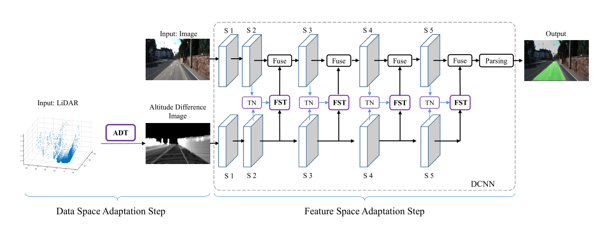
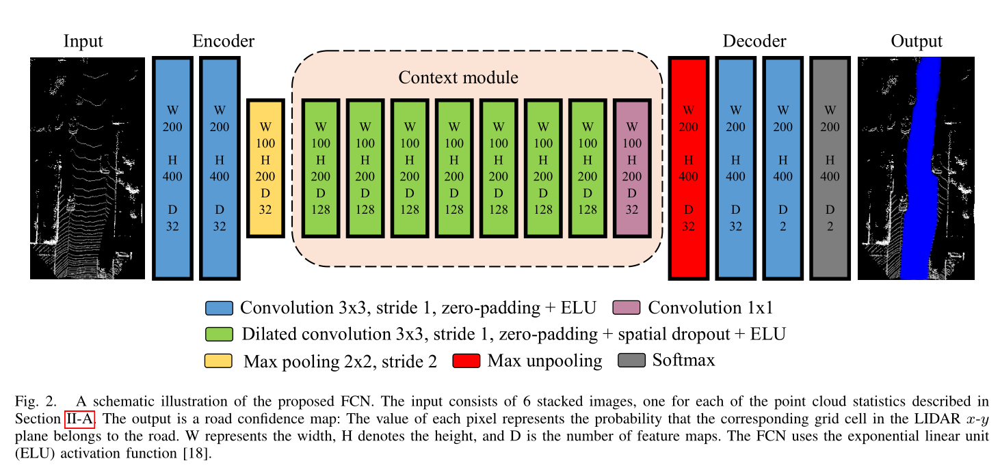

## Lidar Fusion

#### PLARD

LiDAR数据和RGB图像明显不是同维度的，PLARD首先将LiDAR数据投影在xy轴上转成2D图片，通过高度平均化得到一张带有高度的2D图片，之后加入线性变换网络，然后和vis融合（线性变换的时候其实就有融合了），融合方法按论文讲同Pyramid方法。即

#### LidCamNet

同样将LiDAR转换为2D数据，ReLU换成ELU，采用cross-fuse方法。即

#### LoDNN

结合了LiDAR俯视图和FCN进行分割。主要将俯视LiDAR数据输入网络，对结果投射到road上并取得class做loss。网络结构类同Deeplab v2。

