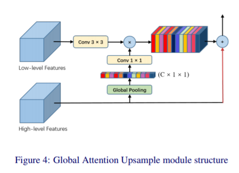
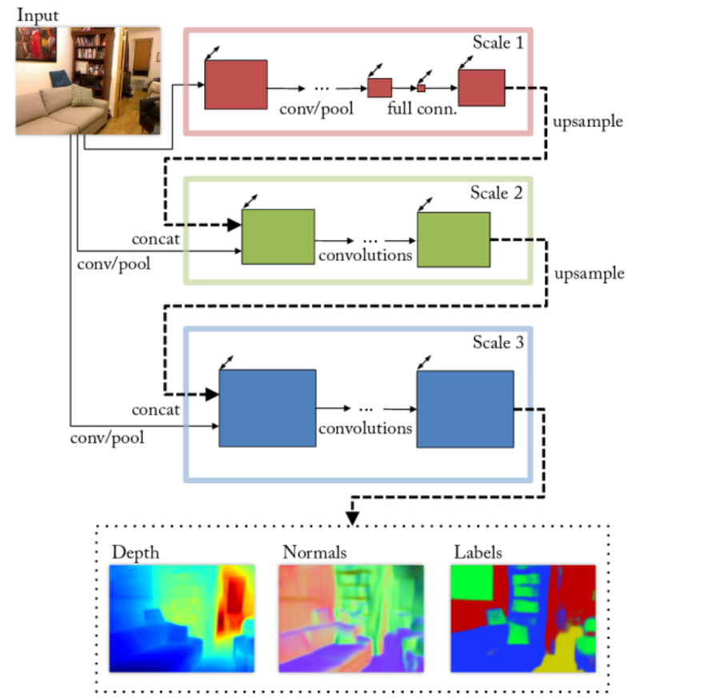
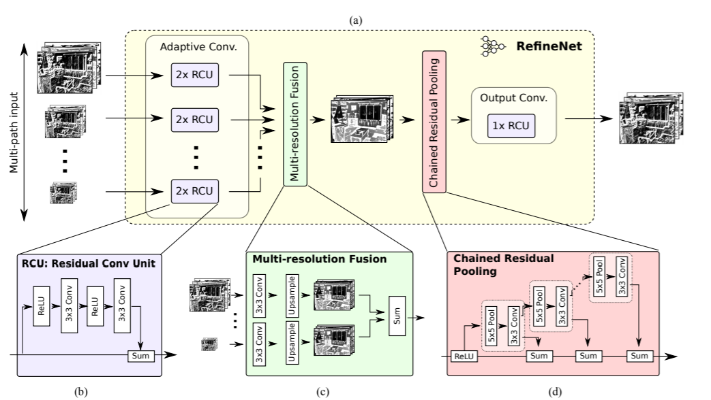
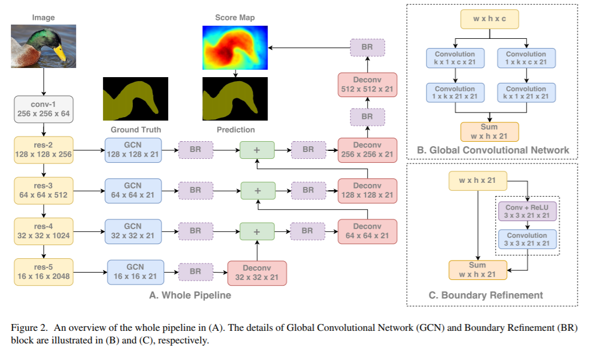
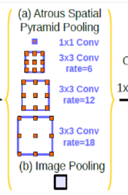

这里主要是讲语义分割，尤其指FCN以来的各种网络结构变化。

### 奠基：FCN

FCN有两个非常重要的结构：转置卷积放大图像、skip输入上采样图像。可以看到由于没有全连接层，输入可以是任意大小的图片。FCN的loss定义在最后一层所有pixel的loss和，每个pixel使用softmax loss。上采样图像时concat时候如果大小不一对大的crop。

FCN前部用的是AlexNet的部分，在其之后将全连接换成转置卷积，将其上采样至(H\*W\*(classes + 1))大小。跳级部分是将不同阶段的feature map卷积后上采样累次叠加，目的是让更细致的feature map融入结果

### Decoder变体

SegNet系列主要是上采样的方法和网络结构不同（这里上采样就把数值填回原来的位置），一般情况下FCN的decoder只是修改经典ImageNet网络的全连接层。

### 空洞卷积

主要是解决pooling的信息丢失问题。当然空洞卷积本身可能会忽略一些细致的的物体，因此还出现了一系列的空洞卷积的变体，比如锯齿状的空洞卷积。

### CRF运用

CRF是判别式无向图模型，也就是对条件分布的建模，和MRF不同的便在这点上。直观来说CRF加入了附近节点的信息，在线性链式CRF中条件概率被定义为

其中t为转移特征函数，累加可以看作当序列符合某种模式时分值最高，s为状态特征函数，代表观测值本身预测的可能性。Z用于归一化。

而在语义分割中构建的[全连接CRF](https://arxiv.org/abs/1210.5644)中的条件概率为

(其实在负号后面叫做Gibbs Energy) 其中$\phi_u$来自FCN的输出，$\phi_p$二元势函数描述像素点和像素点之间的关系，包括了距离和颜色，由于一点是和其他全点比较，因此叫做全连接。论文中给出了二元势函数的定义和近似计算。

### Attention

attention在语义分割中可以看作加入一层非线性，比pooling、ReLU等减少参数（因为直接向目标函数拟合）。比如GAU

### 多尺度预测

即创造几个不一样的网络分支，输出融合不同阶段的feature map

### 特征融合

比如跳级，融合其他结构信息，比如RefineNet，ParseNet

这里RefineNet链式池化如图，链式池化的目的是提取背景语义信息。需要注意的是 stride=1，最后输出的feature map尺寸不变。最后，为每个池化并卷积输出的feature map分配一个**可学习的weight**，与input进行加权融合。

### ASPP

其实就是SPP的空洞卷积版本

### Auxiliary Loss

前层的输出作为一部分loss加在后面。

