一个非常小的R挖掘综述

## 获取数据

获取  数据

```R
> library(readxl)
> data <- read_excel("data/xxx.xlsx")
> View(data)
```

获取  数据（转换得到，方便解决一些以前版本文件ANSI编码问题）

```R
> library(readr)
> data <- read_csv("data/xxx.csv")
> View(data)
```

可以看到4份数据以以下形式呈现

| 身高（cm） | 臂展（cm） | 脚长（cm） | 腿长（cm） | 体重（kg） |
| ---------- | ---------- | ---------- | ---------- | ---------- |
| 178.0      | 166.0      | 26.0       | 106        | 70.5       |
| 171.0      | 172.0      | 25.5       | 95         | 57.0       |

为了使用方便重命名为

| height | armSpan | footLength | legLength | weight |
| ---------- | ---------- | ---------- | ---------- | ---------- |
| 178.0      | 166.0      | 26.0       | 106        | 70.5       |
| 171.0      | 172.0      | 25.5       | 95         | 57.0       |


## 基本信息与统计量

### 位置的度量

> 这里的统计量包括最小值、最大值、第一、第三四分位数、中位数、均值

利用R中的函数
```R
> summary(data)
```

可以看到数据每一列的信息

这里不给出（隐私保护）


这里也可以用`quantile`、`mean`、`median`等函数，比如

```R
> quntile(girls2015$height)
```

 可以得到

| 分位数 | 0%   | 25%  | 50%  | 75%  | 100% |
| ------ | ---- | ---- | ---- | ---- | ---- |
| 数值   | 153  | 163  | 165  | 170  | 174  |

<br/>

从`summary`可以看到没有缺失值，但也可以很快的看到有异常值（譬如2015男生脚长项有100cm，是不符合常理的），有数据格式不一的值（2015女生的脚长单位为mm）等

统一量纲后

`2015女生`

这里不给出（隐私保护）

**粗略的结论：**我们从上述的统计量可以估计，2015年男生和2018年男生、2015年女生和2018年女生各类数值差别不大（除了可能的异常值），也就是很可能分布一致，另外所有的数据均为连续值，也就是连续变量中的**区间变量**，下方的分析省略对分类变量以及其他连续变量的考察。


对于位置的考察，也可以通过直方图、核密度估计图来考察，之后的分布估计也会用到。譬如对于2018年男生的身高

```R
> hist(boys2018$height, freq=FALSE)
> lines(density(boys2018$height), col = "red")
```


### 分散程度和分布形状的度量

> 这里方差为 
>
> 偏度为 
>
> 峰度为 

通过函数`var`、`sd`、`skewness`、`kurtosis`分别求得方差、标准差、偏度、峰度，这里由于不通过这些数据对数据预处理，不列出全部数据。譬如对2015年男生

```R
> apply(boys2015, 2, var)
```

`2015男生`

|      | height | armSpan | footLength | legLength | weight |
| ---- | ------ | ------- | ---------- | --------- | ------ |
| 方差 | 39.26  | 1012.37 | 68.27      | 138.64    | 95.73  |

<br>

可以看到2015年男生的臂展方差非常大，符合之前的观察，即存在异常值


对于分散程度的考察，可以利用茎叶图、箱型图，这里我们针对在位置度量中观察到的异常数据（大部分为2015年的男生数据）画出对应的茎叶图和箱型图(这里只列出一部分)

茎叶图利用

```R
> stem(boys2015$xxx)
```


`2015男生臂展茎叶图`

```
这里不给出（隐私保护）
```

箱型图则利用

```
boxplot(boys2015$xxx)
```

`2015男生臂展箱型图`
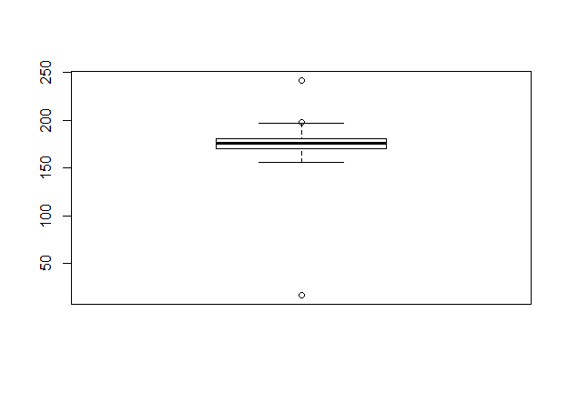


可以看到不同的方法的出的直观结果基本一致，尤其是对于2015男生的**脚长、臂展、腿长**，其数据异常值可以很直观的获取，需要进行异常值的去除

`一般情况下的数据清洗还需要重复数据检测或者数据变换，这里由于是连续变量且没有重复数据，不需要`


## 异常值去除

### 单属性outlier

针对单值则以2015男生的**脚长**为例


#### [箱线图截断]()

> 比较经典的方法，即剔除单值  与  之外的值，其中 

```R
> filboys2015 <- boys2015 %>% filter((footLength<(quantile(footLength, 0.75)+1.5*(quantile(footLength, 0.75)-quantile(footLength, 0.25))))&(footLength>(quantile(footLength, 0.25)-1.5*(quantile(footLength, 0.75)-quantile(footLength, 0.25)))))
```

可以通过`summary`函数看到更新后的结果

|            | 最小值 | 第一四分位数 | 中位数 | 第三四分位数 | 最大值 | 平均值 |
| ---------- | ------ | ------------ | ------ | ------------ | ------ | ------ |
| footLength | 23     | 25           | 26     | 27           | 29     | 25.76  |


#### [Pauta Criterion]()

> 比较经典的方法，即  原则，剔除单值  之外的数据，要求样本至少为10

```R
> filboys2015 <- boys2015 %>% filter((footLength<(mean(footLength)+3*sd(footLength)))&(footLength>(mean(footLength)-3*sd(footLength))))
```
可以通过`summary`函数看到更新后的结果

|              | 最小值 | 第一四分位数 | 中位数 | 第三四分位数 | 最大值 | 平均值 |
| ------------ | ------ | ------- | ---------- | --------- | ------ | ------ |
| footLength       | 21    | 25      | 26         | 27        | 30     | 25.7 |


#### [Grubbs Criterion]()

> 默认检测的单值是**正态分布**，利用假设检验进行单值剔除，实际上就是检验与与均值的差异，类似的还有[Dixon]()检验等
>
> 设 
>
> 拒绝域   其中显著性水平  ，  为总数量， 为自己定义的显著性

```R
> grubbs.test(boys2015$footLength)
```

得到结果

```
	Grubbs test for one outlier

data:  boys2015$footLength
G = 8.885000, U = 0.037419, p-value < 2.2e-16
alternative hypothesis: highest value 100 is an outlier
```

可见检测出了异常值


### 多属性outlier

#### [箱线图截断]()

> 实际上就是将两个或多个以上的箱线图以逻辑与或者逻辑或的方式组合，过滤方式类同于单属性

```R
> df<-data.frame(boys2015$legLength,boys2015$armSpan)
> tmp1<-which(boys2015$legLength %in% boxplot.stats(boys2015$legLength)$out) 
> tmp2<-which(boys2015$armSpan %in% boxplot.stats(boys2015$armSpan)$out)
> u1<-union(tmp1,tmp2)
> plot(df) 
> points(df[u1,],col="red",pch="x",cex=2) # 标出异常值点
```

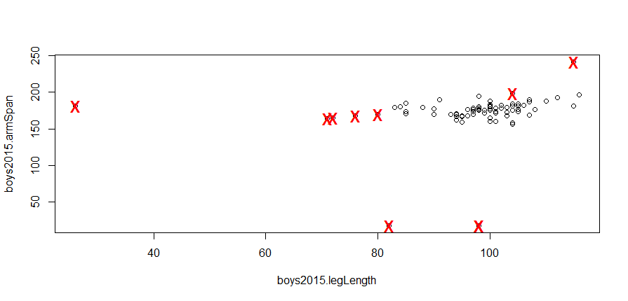


#### [基于距离的剔除]()

> 这里距离使用[Mahalanobis Distance]()，当然也可以使用[Euclidean Distance]()、[余弦距离]()等，具体见[聚类分析]()

> [Mahalanobis Distance]()主要计算的是样本之间的协方差距离，可以定义为两个服从同一分布并且其协方差矩阵为Σ的随机变量之间的差异程度，这里的剔除是基于分布的，具体算法详见[论文](https://e-archivo.uc3m.es/bitstream/handle/10016/15548/multivariate_prieto_TECHNOMETRICS_2001_ps.pdf?sequence=1)
>
> 对于[Mahalanobis Distance]()， 其中  为全部  样本的协方差矩阵

```R
> res <-aq.plot(boys2015)
> which(res$outliers==T)
```


`四个图有不同的意思，我们顺时针编号图，图1为原始数据，图2为Chi方分布下Mahalanobis Distance排序图，蓝色竖线为阈值即某分位数，图3和图4实际上取得是不同分位数下的异常值情况`

异常值编号

```
[1]  4  5 12 13 14 21 27 30 40 55 57 81 82 83
```


#### [Local Outlier Factor]()

>LOF思想即基于距离的剔除，通过计算局部密度设置阈值去除异常值，以下给出定义

| LOF Algorithm                                                |
| ------------------------------------------------------------ |
| 定义步骤：<br>1.    为两点之间的距离，可以是[Mahalanobis Distance]()等<br>2.  其中至少有k个点  满足 ，至多有k-1个点  满足  ，即第k距离点<br>3.  为第k距离以内的所有点<br> 4.  <br>5. 局部密度  <br>6.  即p的邻域点的局部可达密度与点p的局部可达密度之比的平均数，如果这个比值越接近1，说明p的其邻域点密度差不多<br> |

```R
> out.scores<-lofactor(boys2015,k=10) # 计算每个样本LOF
> plot(density(out.scores)) # 画出密度图
> out<-order(out.scores,decreasing=TRUE)[1:5] # 筛选前5个可能异常值
> out
```

得到

```
[1]  5 57 14 82 83
```

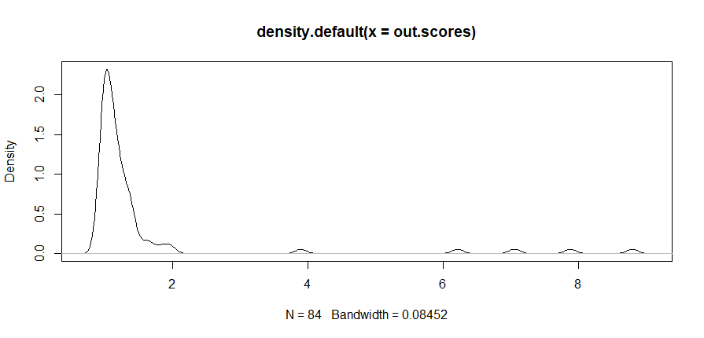

当然也可以在PCA结果图上绘制

```R
> n<-nrow(boys2015)
> labels<-1:n
> labels[-out]<-"."
> biplot(prcomp(boys2015),cex=0.8,xlabs=labels)
```

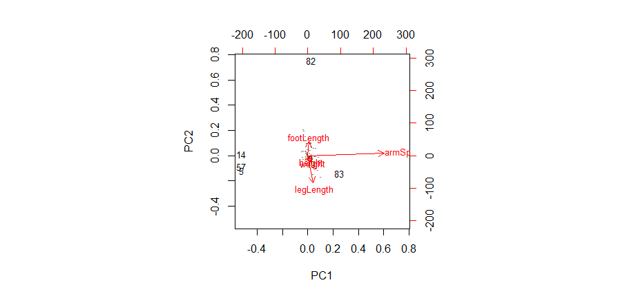

PCA详见[主成分分析](#主成分分析)


#### [聚类]()

> 这里用的是Kmean，详见[聚类分析](#聚类分析)，这里的距离直接使用平方差

```R
> kmeans.result<-kmeans(boys2015,centers=3)
> kmeans.result$centers
> centers <- kmeans.result$centers[kmeans.result$cluster, ]
> distances<-sqrt(rowSums((boys2015-centers)^2))
> out<-order(distances,decreasing=TRUE)[1:5]
> out 
> boys2015[out,]
```

可以看到结果

```
    height  armSpan footLength legLength   weight
1 181.0938 185.1875   26.62500 103.37500 75.37500
2 177.0000  17.0000   25.66667  92.66667 67.66667
3 172.8163 171.1020   26.62245  93.42857 63.73469

[1] 82 83 12 27 55

   height armSpan footLength legLength weight
82    177     181        100        26     78
83    184     242         24       115     90
12    170     164         24        71     51
27    172     156         22       104     82
55    169     165         23        72     51
```

在此数据集上，对于Kmean的结果来说，剔除效果直观上没有LOF来得好


**以下这个方法为补充**

#### [Isolation Forest]()

> 从训练数据中随机选择若干个点样本点作为subsample，通过递归构建多个iTree组合成Forest，对每个样本x计算其平均遍历的高度，并设定阈值，小于阈值高度的样本最早被**孤立**，极有可能是异常值

iTree构建方法：

| Isolation Tree Algorithm                                     |
| ------------------------------------------------------------ |
| *（详见[周志华]()老师论文）*<br>算法输入：现在的数据 X、现在的树高度 e、树高度限制 l<br>算法输出：一颗iTree<br>算法大致流程：随机选择一个属性的一个值，对这个属性进行左右划分（类似快排），递归构造左子女和右子女，直到传入净数据只有一条或者树高度 e 到了限制 l |


**结果**：对于2015年的数据我们用最简单的**箱线图截断**方法，对2015年男生数据的全部属性进行检测，剔除了臂展、腿长的整行异常值

可得到2015年男生数据的`summary`

这里不给出（隐私保护）


## 缺失值处理

我们的数据是没有缺失值的，所以为了补充这一块的方法只能生造缺失值… 给臂展和腿长各造5个缺失值

```R
> nonBoys2015 <- filboys2015
> nonBoys2015[sample(1:nrow(nonBoys2015),5),"armSpan"]<-NA
> nonBoys2015[sample(1:nrow(nonBoys2015),5),"legLength"]<-NA
```


查看缺失情况

```R
> md.pattern(nonBoys2015)
> aggr(filboys2015csv,prop=T,numbers=T)
```

```
   height footLength weight armSpan legLength   
70      1          1      1       1         1  0
5       1          1      1       1         0  1
5       1          1      1       0         1  1
        0          0      0       5         5 10
```


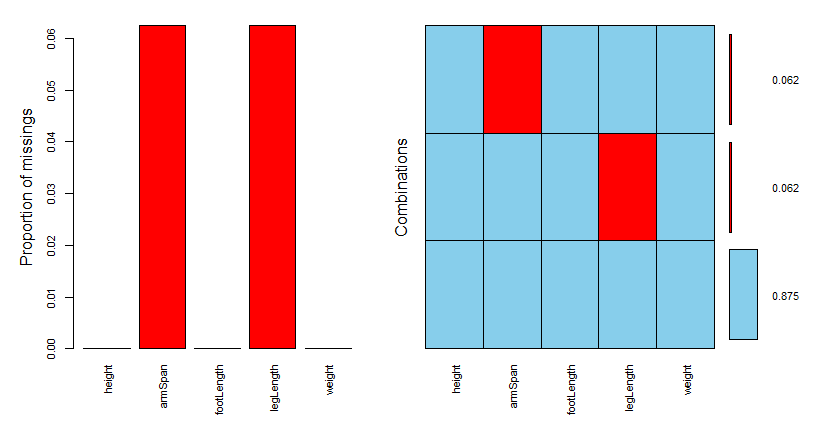


`缺失值处理可以直接删除，也可以用极大似然法，但更多的是使用插补法，因此下面介绍的全部都是插补法`

### [均值/中位数填充]()

> 直接填中位数和均值，或者其他可能的统计量

比如对于均值插补
```R
> tmpNonBoys2015 <- nonBoys2015
> tmpNonBoys2015$armSpan=impute(tmpNonBoys2015$armSpan, mean)
> tmpNonBoys2015$legLength=impute(tmpNonBoys2015$legLength, mean)
```

对于均值，我们比较和真实值的差别，比如臂展

```R
> actuals<-filboys2015$armSpan[is.na(nonBoys2015$armSpan)]
> predicteds1<-rep(mean(nonBoys2015$armSpan,na.rm=TRUE),length(actuals))
> regr.eval(actuals,predicteds1)
```

```
        mae         mse        rmse        mape 
 6.89866667 83.87537778  9.15835017  0.03744818 
```

其中，mae为平均绝对误差；mse为均方误差；rmse为均方根误差；mape为平均绝对百分误差


### [基于距离的插补]()

> 这里指的是kNN插值

| kNN Algorithm                                                |
| ------------------------------------------------------------ |
| 1. 定义距离， 距离可以是[Mahalanobis Distance]()等<br>2. 计算缺失数据其他属性构成向量和所有样本的距离 <br>3. 快速排序得到最近的k个距离<br>4. 反距离加权插值：设  则插入值为  其中  为缺失所在属性的每行值 |

kNN参数用函数默认

```R
> tmpNonBoys2015 <- data.frame(nonBoys2015)
> knnOutput<-knnImputation(tmpNonBoys2015)
> predicts<-knnOutput[is.na(nonBoys2015$armSpan),"armSpan"]
> regr.eval(actuals,predicts)
```

```
        mae         mse        rmse        mape 
 4.11180323 32.17874356  5.67263110  0.02212056 
```

可以看到对于臂展来说误差都有所下降


### [Regression]()

> 利用回归函数则自身属性作为因变量，其余变量作为自变量，通过其特征来进行回归预测，其中可以寻找和自身变量有强相关关系的变量进行线性回归预测，或者提取特征后利用决策树回归方法来预测。
>
> 一般方法有[线性回归]()、[逻辑回归](http://localhost:9000/login)、[决策树(CART等)]()、[Random Forest]()，具体做法见下[Model Analyse & Evaluation](#Model-Analyse-&-Evaluation)，这里我们使用回归树

```R
> anova_mod<-rpart(armSpan~.-height, data=nonBoys2015[!is.na(nonBoys2015$armSpan),], na.action=na.omit, method="anova") 
> armSpan_pred<-predict(anova_mod, nonBoys2015[is.na(nonBoys2015$armSpan),])
> regr.eval(actuals, armSpan_pred)
```

```
        mae         mse        rmse        mape 
 5.54722222 49.36275386  7.02586321  0.03012357 
```

这里是取height作为回归因变量，可以看到效果没有kNN填补来得好


### [多重插补]()

> 多重插补方法比较复杂，这里不给出具体算法。大致流程就是对每个缺失值构造m个填补值（回归方法或者MLE等），产生了m个数据集，对m个数据集再进行方法处理，得到m个结果，对这m个结果再进行整合（pool），然后进行分布估计。这里的回归模型使用[Random Forest]()


```R
> miceMod<-mice(nonBoys2015[,], method="rf")
> miceOutput<-complete(miceMod)
> armSpan_pred<-miceOutput[is.na(nonBoys2015$armSpan),"armSpan"]
> regr.eval(armSpan_actu,armSpan_pred)
```

```
        mae         mse        rmse        mape 
 7.00000000 83.80000000  9.15423399  0.03800034 
```

可以看到效果仍然没有kNN来得好


其他方法还有[Bag Imputation]()、[Expectation Maximization]()等

**结果：**实际上我们原本数据并没有缺失，这里只是简单比较一下方法之间的异同，我们使用原本过滤的数据进行下一步分析


## 分布估计检验（参数估计与假设检验）

现在我们得到的数据是清洗过的数据，需要进一步的分析，我们先进行对2015年男生数据的分析辅以2018年男生数据以解决先前提出的问题。

### 单总体估计检验

单元分析以**2015年男生腿长**为例，画出其直方密度图、经验分布图、QQ图

```R
> hist(filboys2015$legLength, freq = FALSE)
> lines(density(filboys2015$legLength), col = "blue")
```


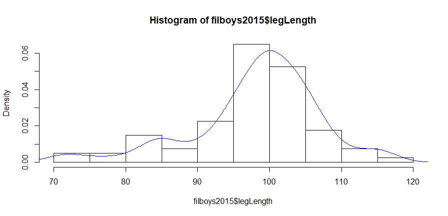

```R
> plot(ecdf(filboys2015$legLength),verticals = TRUE, do.p = FALSE)
```


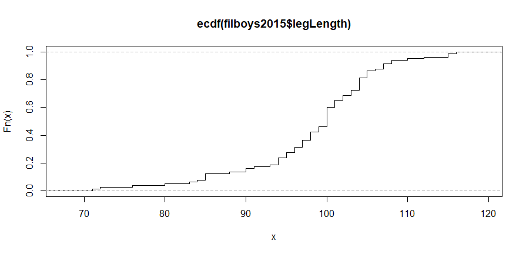

```R
> qqnorm(filboys2015$legLength)
> qqline(filboys2015$legLength)
```


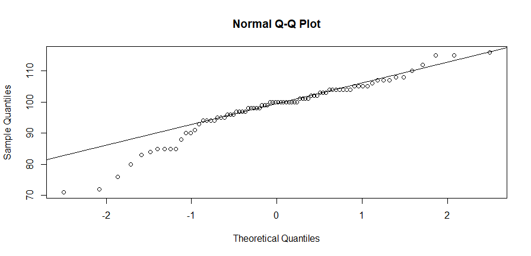


虽然和正态分布有差距，但我们依然先进行参数的估计

#### 矩估计

矩估计   与   

易得到   与   


#### 极大似然估计

我们设总体符合正态分布 ，对应似然函数为


即


求导后可以解得    与  ，进一步可以证明似然函数的二阶Hessa矩阵


为


即为负定矩阵

因而解得    与  为最大解。

易得到   与   


#### 区间估计

均值  的区间估计：

我们假设  未知，因此可以得到区间  ，其中已经求得  ， 和 

```R
> tmp<-sd(filboys2015$legLength)/sqrt(80)*qt(1-0.05/2,80-1); df<-80-1
> xb<-mean(filboys2015$legLength)
> data.frame(mean=xb, df=df, a=xb-tmp, b=xb+tmp)
```

因此区间为 


方差  的区间估计：

我们假设  未知，因此可以得到区间 ，其中已经求得   和 

```R
> interval_var1<-function(x, mu=Inf, alpha=0.05){
+     n<-length(x)
+     if (mu<Inf){
+         S2 <- sum((x-mu)^2)/n; df <- n
+     }
+     else{
+         S2 <- var(x); df <- n-1
+     }
+     a<-df*S2/qchisq(1-alpha/2,df)
+     b<-df*S2/qchisq(alpha/2,df)
+     data.frame(var=S2, df=df, a=a, b=b)
+ }
> 
> 
> interval_var1(filboys2015$legLength)
```

因此区间为 


#### 参数假设

[  男生腿长均值  ]()  [  男生腿长均值  ]()

> 方法类似于参数估计，引入了p-value的计算

```R
> P_value<-function(cdf, x, paramet=numeric(0), side=0, n){
+     n<-length(paramet)
+     P<-switch(n+1,
+               cdf(x),
+               cdf(x, paramet),
+               cdf(x, paramet[1], paramet[2]),
+               cdf(x, paramet[1], paramet[2], paramet[3])
+     )
+     if(side<0){return(P)}
+     else if(side>0){return(1-P)}
+     else{
+         if(P<1/2){return(2*P)}
+         else{return(2*(1-P))}
+     }
+ }

> mean.test1<-function(x, mu=0, sigma=-1, side=0){
+     n<-length(x); xb<-mean(x)
+     if (sigma>0){
+         z<-(xb-mu)/(sigma/sqrt(n))
+         P<-P_value(pnorm, z, side=side)
+         data.frame(mean=xb, df=n, Z=z, P_value=P)
+     }
+     else{
+         t<-(xb-mu)/(sd(x)/sqrt(n))
+         P<-P_value(pt, t, paramet=n-1, side=side)
+         data.frame(mean=xb, df=n-1, T=t, P_value=P)
+     }
+ }
> mean.test1(filboys2015$legLength, mu=mean(filboys2015$legLength))
```

得到 ，接受原假设

`实际上这样做没有意义，因为假设检验使用的假设分布的均值就是总体均值，所以p-value一定为1`


#### 非参假设

[ 男生腿长符合正态分布  ，其中   且  ]()  [ 男生腿长不符合正态分布 ，其中  ]()

  检验：

记  有拒绝域 

```
> A<-table(cut(filboys2015$legLength, br=c(0,70,80,90,100,110,116)))
> p<-pnorm(c(70,80,90,100,110,117), mean(filboys2015$legLength), sd(filboys2015$legLength))
> p<-c(p[1], p[2]-p[1], p[3]-p[2], p[4]-p[3], p[5]-p[4], 1-p[5])
> chisq.test(A,p=p)
```

其中分段可以从程序代码中看到，得到

```
X-squared = 7.1257, df = 5, p-value = 0.2115
```

，故原假设成立


 检验：

```R
> ks.test(jitter(filboys2015$legLength),"pnorm",mean(filboys2015$legLength),sd(filboys2015$legLength))
```

其中数值中有重复值，因此用`jitter`函数做小扰动，总结果得到

```
D = 0.12576, p-value = 0.1461
alternative hypothesis: two-sided
```

，故原假设成立


### 双总体估计检验

我们取**2018年男生腿长**作为另外一个总体，画出其直方密度图、经验分布图、QQ图

```R
> hist(boys2018$legLength, freq = FALSE)
> lines(density(boys2018$legLength), col = "blue")
```


```R
> plot(ecdf(boys2018$legLength),verticals = TRUE, do.p = FALSE)
```

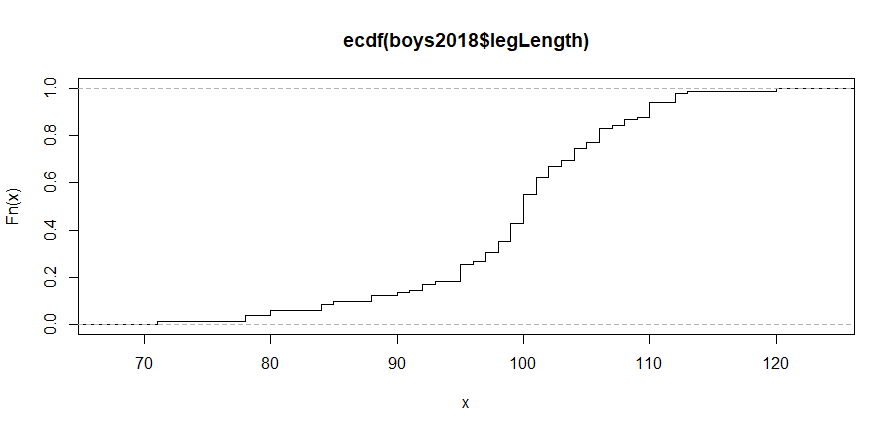

```R
> qqnorm(boys2018$legLength)
> qqline(boys2018$legLength)
```

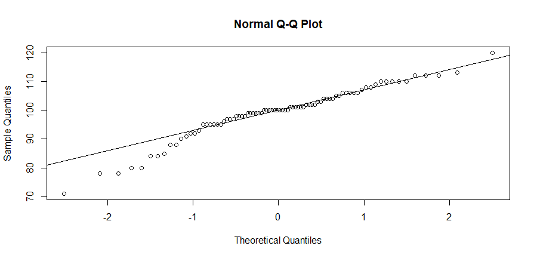

可以看到2018年男生腿长数据也近似正态分布，并且数据分布很类似于2015年的男生数据

#### 区间估计

我们估计  的参数区间，注意R中对两个样本数不同且方差未知的独立样本的计算，其中


近似使用 


```R
interval_estimate2<-function(x, y,
	sigma=c(-1,-1), var.equal=FALSE, alpha=0.05){
	n1<-length(x); n2<-length(y)
	xb<-mean(x); yb<-mean(y)
	if (all(sigma>=0)){
		tmp<-qnorm(1-alpha/2)*sqrt(sigma[1]^2/n1+sigma[2]^2/n2)
		df<-n1+n2
	}
	else{
		if (var.equal == TRUE){
			Sw<-((n1-1)*var(x)+(n2-1)*var(y))/(n1+n2-2)
			tmp<-sqrt(Sw*(1/n1+1/n2))*qt(1-alpha/2,n1+n2-2)
			df<-n1+n2-2
		}
		else{
			S1<-var(x); S2<-var(y)
			nu<-(S1/n1+S2/n2)^2/(S1^2/n1^2/(n1-1)+S2^2/n2^2/(n2-1))
			tmp<-qt(1-alpha/2, nu)*sqrt(S1/n1+S2/n2)
			df<-nu
		}
	}
	data.frame(mean=xb-yb, df=df, a=xb-yb-tmp, b=xb-yb+tmp)
}
> interval_estimate2(boys2018$legLength,filboys2015$legLength)
```

得到

```
  mean       df        a        b
1 1.067073 159.8948 -1.66276 3.796906
```

即区间 


我们估计  的区间，其中置信区间 

```R
> interval_var2<-function(x,y,
		mu=c(Inf, Inf), alpha=0.05){
	n1<-length(x); n2<-length(y)
	if (all(mu<Inf)){
		Sx2<-1/n1*sum((x-mu[1])^2); Sy2<-1/n2*sum((y-mu[2])^2)
		df1<-n1; df2<-n2
	}
	else{
		Sx2<-var(x); Sy2<-var(y); df1<-n1-1; df2<-n2-1
	}
	r<-Sx2/Sy2
	a<-r/qf(1-alpha/2,df1,df2)
	b<-r/qf(alpha/2,df1,df2)
	data.frame(rate=r, df1=df1, df2=df2, a=a, b=b)
}
> interval_var2(boys2018$legLength,filboys2015$legLength)
```

得到

```
       rate df1 df2         a        b
1 0.9983889  81  79 0.6416813 1.551476
```

即区间 


#### 参数假设

[ 男生腿长均值  ]()  [ 男生腿长均值  ]()

> 方法类似于参数估计，引入了p-value的计算，这里没有使用配对，如果需要使用配对可以使用`t.test`并在参数置`paired=True`，也可以手写

```R
> mean.test2<-function(x, y,
+                      sigma=c(-1, -1), var.equal=FALSE, side=0){
+     n1<-length(x); n2<-length(y)
+     xb<-mean(x); yb<-mean(y)
+     if (all(sigma>0)){
+         z<-(xb-yb)/sqrt(sigma[1]^2/n1+sigma[2]^2/n2)
+         P<-P_value(pnorm, z, side=side)
+         data.frame(mean=xb-yb, df=n1+n2, Z=z, P_value=P)
+     }
+     else{
+         if (var.equal == TRUE){
+             Sw<-sqrt(((n1-1)*var(x)+(n2-1)*var(y))/(n1+n2-2))
+             t<-(xb-yb)/(Sw*sqrt(1/n1+1/n2))
+             nu<-n1+n2-2
+         }
+         else{
+             S1<-var(x); S2<-var(y)
+             nu<-(S1/n1+S2/n2)^2/(S1^2/n1^2/(n1-1)+S2^2/n2^2/(n2-1))
+             t<-(xb-yb)/sqrt(S1/n1+S2/n2)
+         }
+         P<-P_value(pt, t, paramet=nu, side=side)
+         data.frame(mean=xb-yb, df=nu, T=t, P_value=P)
+     }
+ }
> mean.test2(boys2018$legLength,filboys2015$legLength)
```

得到

```
      mean       df         T   P_value
1 1.067073 159.8948 0.7719795 0.4412661
```

得到 ，接受原假设


[ 男生腿长均值  ]()  [ 男生腿长均值  ]()

> 方法类似于参数估计，引入了p-value的计算

```R
> var.test2<-function(x, y, mu=c(Inf, Inf), side=0){
+     n1<-length(x); n2<-length(y)
+     if (all(mu<Inf)){
+         Sx2<-sum((x-mu[1])^2)/n1; Sy2<-sum((y-mu[2])^2)/n2
+         df1=n1; df2=n2
+     }
+     else{
+         Sx2<-var(x); Sy2<-var(y); df1=n1-1; df2=n2-1
+     } 
+     r<-Sx2/Sy2
+     P<-P_value(pf, r, paramet=c(df1, df2), side=side)
+     data.frame(rate=r, df1=df1, df2=df2, F=r, P_value=P)
+ }
> 
> var.test2(boys2018$legLength,filboys2015$legLength)
```

得到结果

```
       rate df1 df2         F   P_value
1 0.9983889  81  79 0.9983889 0.9935202
```

得到 ，接受原假设


#### 非参假设

>这里主要指[双总体K.S.检验]()
假设两年男生腿长的分布函数为  与 

[ 分布函数  ]()  [ 分布函数  ]()

```R
> ks.test(boys2018$legLength,filboys2015$legLength)
```

```R
D = 0.094207, p-value = 0.865
alternative hypothesis: two-sided
```

得到 ，接受原假设


> 当然也可以用 [Wilcoxon秩检验]()

```R
> wilcox.test(boys2018$legLength,filboys2015$legLength,alternative="less",exact=FALSE,correct=FALSE)
```

得到

```
W = 3526, p-value = 0.7955
alternative hypothesis: true location shift is less than 0
```

得到 ，接受原假设


#### 独立性检验

`独立性检验分散在不同模块里，一般情况下的独立性检验有连续型变量之间的，实际就是相关分析，连续型和分类变量之间的，也就是方差分析，还有分类变量之间的一般使用chi-square test，而这里没有两个以上的分类变量，因此不做分类变量的独立性检验`


### 多元估计检验

我们取2018年清洗后的男生数据进行分析

`实际上这一块十分重要，对于数据的分析仅从一元来看是片面的`

#### 协方差矩阵估计

定义资料阵


定义向量  有


我们容易得到似然函数


由  和  和  可以求得极值  与 

在这里我们使用`MASS`包中的估计函数，因为他的做法更加的稳健，详细可以参考`MASS`[文档](https://cran.r-project.org/web/packages/MASS/MASS.pdf)

```R
> cov.rob(filboys2015)
```

```
$center
    height    armSpan footLength  legLength     weight 
 176.26562  175.70312   25.82031   99.17188   67.37500 

$cov
              height  armSpan footLength legLength    weight
height     22.515625 26.22297   4.159598 17.001240 19.438492
armSpan    26.222966 45.51364   5.850570 16.972470 23.906746
footLength  4.159598  5.85057   2.193390  1.888517  5.727183
legLength  17.001240 16.97247   1.888517 40.493800 14.791667
weight     19.438492 23.90675   5.727183 14.791667 78.365079

$msg
[1] "16 singular samples of size 6 out of 3000"

$crit
[1] 30.99061

$best
 [1]  2  3  9 13 14 15 16 21 22 23 24 30 32 33 34 35 36 37 39 40 42 44 45 46 47 48
[27] 49 50 52 56 57 58 59 63 65 67 69 70 71 74 75 76 77

$n.obs
[1] 80
```

可在`cov`栏得到协方差矩阵的估计


#### 正态检验

`多元假设检验有很多方法，因为多元可以构造出许多分布比如Wishart分布或者Hoteling分布等，还可以做空间符号和秩检验，这里作为TODO项`

这里使用[Shapiro-Wilk]()正态检验法

```R
> mshapiro.test(t(filboys2015))
```

得到

```
	Shapiro-Wilk normality test

data:  Z
W = 0.61171, p-value = 3.167e-13
```

可见拒绝原假设，也就是说符合多元正态分布

另外可以画出QQ图

```R
> center<-colMeans(filboys2015)
> n<-nrow(filboys2015)
> p<-ncol(filboys2015)
> cov<-cov(filboys2015)
> d<-mahalanobis(filboys2015, center, cov)
> coord<-qqplot(qchisq(ppoints(n),df=p), d, main="QQ Plot Assessing Multivariate Normality", ylab="Mahalanobis D2")
> abline(a=0, b=1)
```


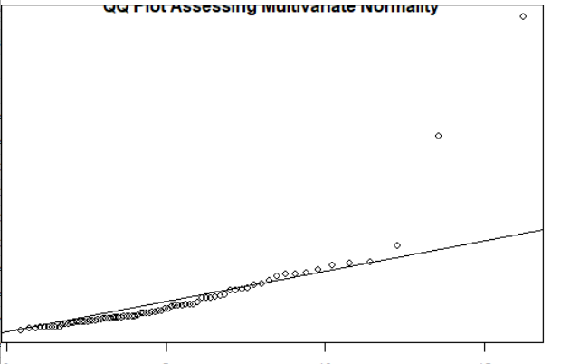


**结论**：对其他数据也经过检验，我们可以近似认为总体数据属于正态分布


## 相关分析

### 一元线性相关分析

> 这里以2018年男生腿长数据和2018年男生身高为例

画出散点图有

```R
> plot(filboys2018$legLength, filboys2018$height)
```

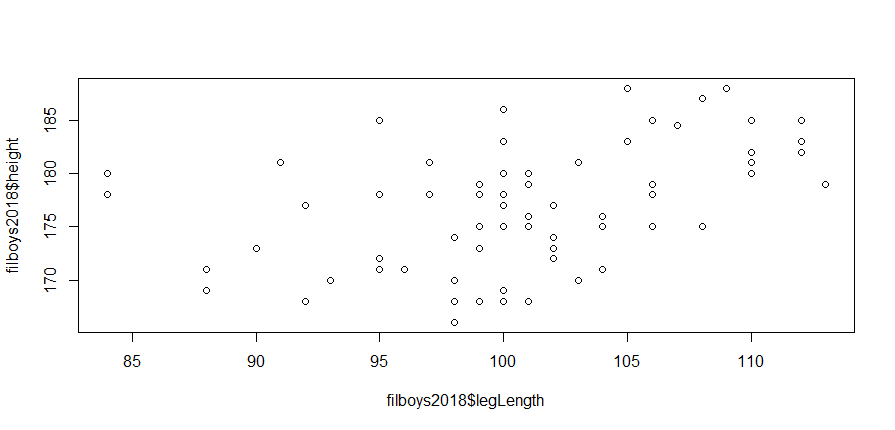

可以看到腿长和身高有比较弱的正相关关系


对于数据，容易得到对于回归方程  的估计值即


并且有


我们使用

```R
> lm.sol<-lm(filboys2018$height ~ 1+filboys2018$legLength)
> summary(lm.sol)
```

可以得到

```
Residuals:
    Min      1Q  Median      3Q     Max 
-9.7477 -3.3405 -0.4951  3.3768 10.3760 

Coefficients:
                       Estimate Std. Error t value Pr(>|t|)    
(Intercept)           139.04026    9.19274  15.125  < 2e-16 ***
filboys2018$legLength   0.37457    0.09101   4.116 0.000104 ***
---
Signif. codes:  0 ‘***’ 0.001 ‘**’ 0.01 ‘*’ 0.05 ‘.’ 0.1 ‘ ’ 1

Residual standard error: 4.979 on 70 degrees of freedom
Multiple R-squared:  0.1948,	Adjusted R-squared:  0.1833 
F-statistic: 16.94 on 1 and 70 DF,  p-value: 0.0001039
```

可以得到  且 
也可以进行区间估计，容易证明得到性质


```R
> beta.int<-function(fm,alpha=0.05){
	A<-summary(fm)$coefficients
	df<-fm$df.residual
	left<-A[,1]-A[,2]*qt(1-alpha/2, df)
	right<-A[,1]+A[,2]*qt(1-alpha/2, df)
	rowname<-dimnames(A)[[1]]
	colname<-c("Estimate", "Left", "Right")
	matrix(c(A[,1], left, right), ncol=3,
	dimnames = list(rowname, colname ))
}
> beta.int(lm.sol)
```

可以得到

```
                        Estimate        Left       Right
(Intercept)           139.0402615 120.7059189 157.3746041
filboys2018$legLength   0.3745662   0.1930588   0.5560735
```

故  区间 [120.71, 157.37] ， 区间 [0.19, 0.56]


进一步检验   显著性，记  的估计量   在  原假设下有


实际上上面的结果已经把对应的p-value求了出来，并且对于T检验和F检验都有  故拒绝原假设，也就是 

进一步我们画出其图像有

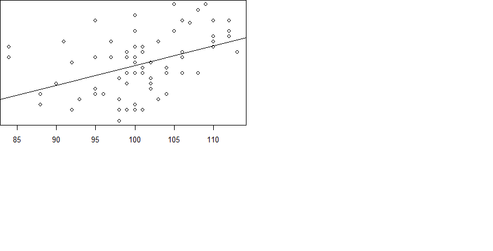


### 多元线性相关分析

> 这里以2018年男生数据为例

我们首先画出散点图和热图

```R
> plot(filboys2018)
> corrgram(filboys2018,order=TRUE,lower.panel=panel.shade)
```


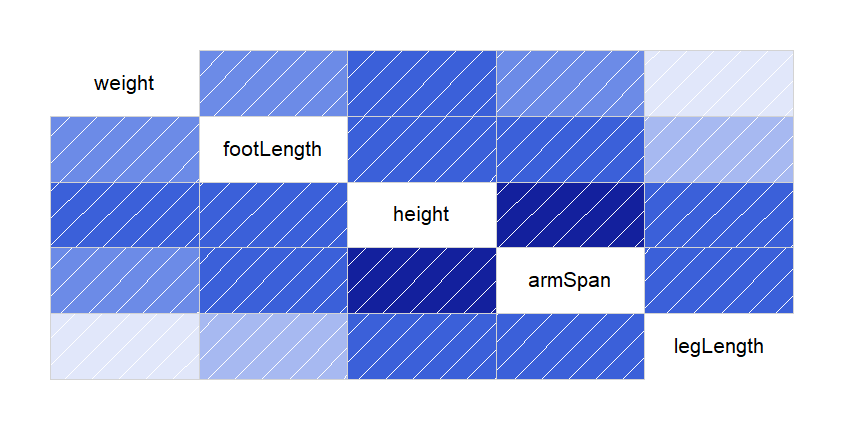

可以看到height和大多数变量有关


对于回归方程  ，其中  且 

可以求得


记  且  为  对角线上元素有


进一步对回归系数和方程做检验，我们有性质：
当原假设为  时


当原假设为  时


```R
> lm.sol<-lm(height ~ armSpan+footLength+legLength, data=filboys2018)
> summary(lm.sol)
```

可以得到

```
Call:
lm(formula = height ~ armSpan + footLength + legLength, data = filboys2018)

Residuals:
    Min      1Q  Median      3Q     Max 
-8.6309 -2.1178  0.1168  2.3009  8.3289 

Coefficients:
            Estimate Std. Error t value Pr(>|t|)    
(Intercept) 66.67289   11.85242   5.625 3.79e-07 ***
armSpan      0.47164    0.07977   5.913 1.21e-07 ***
footLength   0.78728    0.39956   1.970   0.0529 .  
legLength    0.06728    0.07937   0.848   0.3996    
---
Signif. codes:  0 ‘***’ 0.001 ‘**’ 0.01 ‘*’ 0.05 ‘.’ 0.1 ‘ ’ 1

Residual standard error: 3.701 on 68 degrees of freedom
Multiple R-squared:  0.5678,	Adjusted R-squared:  0.5487 
F-statistic: 29.78 on 3 and 68 DF,  p-value: 2.083e-12
```

可以看到  和  显著性高并且明显高过  和 

因此得到回归关系 

此外可以估计  的区间

```R
> beta.int(lm.sol)
```

```
               Estimate        Left      Right
(Intercept) 66.67289203 43.02176522 90.3240188
armSpan      0.47164214  0.31246859  0.6308157
footLength   0.78728123 -0.01001885  1.5845813
legLength    0.06727684 -0.09111215  0.2256658
```

即  区间为 ，  区间为 ，  区间为 ，  区间为 

此外，我们再给出其他的统计

```R
> anova(lm.sol) # 协方差分析
> vcov(lm.sol) # 协方差矩阵
> AIC(lm.sol) # AIC值
```

```
Analysis of Variance Table

Response: height
           Df  Sum Sq Mean Sq F value    Pr(>F)    
armSpan     1 1160.72 1160.72 84.7260 1.444e-13 ***
footLength  1   53.19   53.19  3.8824   0.05287 .  
legLength   1    9.84    9.84  0.7184   0.39964    
Residuals  68  931.58   13.70                      
---
Signif. codes:  0 ‘***’ 0.001 ‘**’ 0.01 ‘*’ 0.05 ‘.’ 0.1 ‘ ’ 1

            (Intercept)      armSpan    footLength     legLength
(Intercept) 140.4797522 -0.473894443 -1.792107e+00 -1.050663e-01
armSpan      -0.4738944  0.006362852 -1.325108e-02 -3.011777e-03
footLength   -1.7921065 -0.013251077  1.596444e-01  5.659089e-07
legLength    -0.1050663 -0.003011777  5.659089e-07  6.300283e-03

[1] 398.6626
```


除了基于整体的假设，我们可以利用逐步回归来确定方程
>逐步回归顾名思义就是将变量根据显著性一步一步剔除，利用的是AIC，剔除变量直至AIC无法减小。剔除有向前剔除和向后剔除

 其中p为变量个数，L为似然函数，这是从信息熵引申而来的，AIC越小越先被选入 。

```R
>  lm.step<-step(lm.sol)
```
可以得到
```
Start:  AIC=192.34
height ~ armSpan + footLength + legLength

             Df Sum of Sq     RSS    AIC
- legLength   1      9.84  941.42 191.09
<none>                     931.58 192.34
- footLength  1     53.19  984.77 194.33
- armSpan     1    478.94 1410.52 220.20

Step:  AIC=191.09
height ~ armSpan + footLength

             Df Sum of Sq     RSS    AIC
<none>                     941.42 191.09
- footLength  1     53.19  994.61 193.05
- armSpan     1    706.31 1647.73 229.40
```


### 线性相关分析诊断

#### 残差诊断
>这里利用多元线性分析中的例子进行分析

我们由上可以知道


令  ，很容易得到


```
> y.res<-residuals(lm.sol)
> shapiro.test(y.res)
```

得到

```
	Shapiro-Wilk normality test

data:  y.res
W = 0.99194, p-value = 0.93
```

残差满足正态分布


我们画出残差图有

```
> y.res<-resid(lm.sol); y.fit<-predict(lm.sol)
> plot(y.res~y.fit)
```

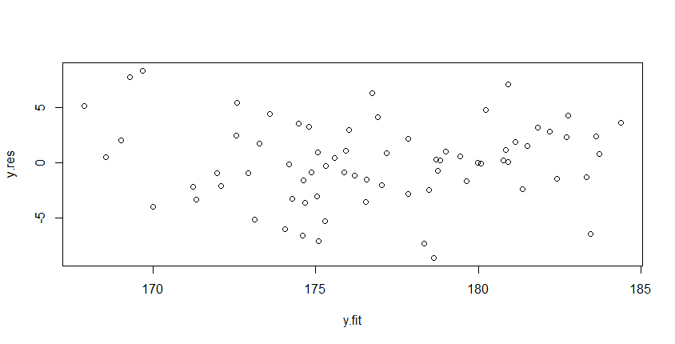

可以看到残差散落均匀，我们画出残差图的残差拟合图，qq图，标准化的残差拟合图，cook统计量

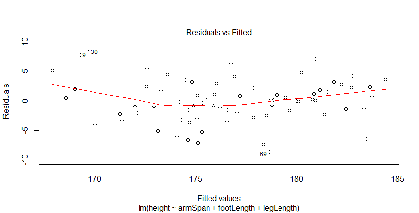

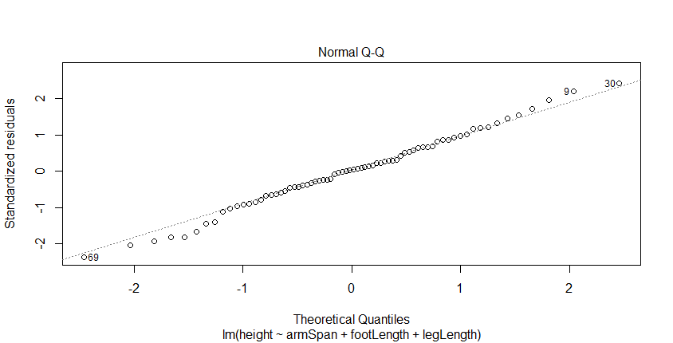

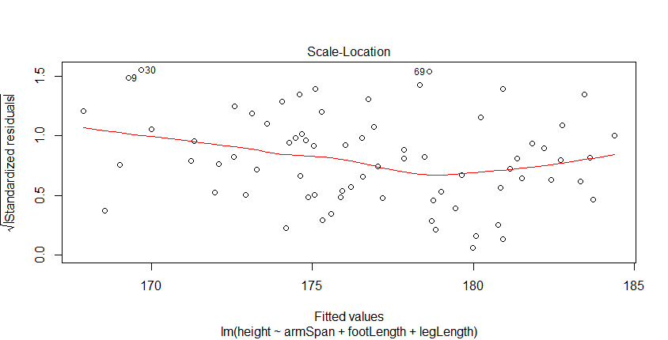

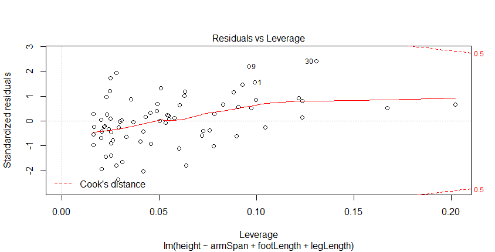

#### 影响分析

> 实际上这里也是[异常值剔除]()

**Leverage**

由于  可以将  作为  的波动情况，`hatvalues`方法正是源此，其定义高影响力有 

```R
> x<-hatvalues(lm.sol)
> hat(x)
```

得到hat值

```
 [1] 0.03246480 0.02286559 0.02521203 0.01882099 0.01656375 0.01570633 0.02236702
 [8] 0.02310991 0.02996563 0.02460854 0.01443147 0.02070820 0.02321306 0.02124561
[15] 0.02488378 0.22497581 0.01414895 0.01410585 0.01673542 0.01430929 0.02912389
[22] 0.01411938 0.01389593 0.05926596 0.03089287 0.01895241 0.01410693 0.05695030
[29] 0.03301396 0.06932189 0.02436087 0.05915690 0.02142940 0.02626729 0.01390682
[36] 0.01480688 0.02902800 0.01740637 0.02614754 0.01389072 0.01542304 0.01458261
[43] 0.02412903 0.01436137 0.02302298 0.01447584 0.02605434 0.01492020 0.13630301
[50] 0.01570781 0.02744483 0.02593631 0.01997261 0.02907229 0.02529973 0.02134384
[57] 0.01980937 0.02292906 0.03729968 0.02292093 0.02354883 0.01393528 0.02599842
[64] 0.01792652 0.02431693 0.01393677 0.02046278 0.01615501 0.02084545 0.02877880
[71] 0.01780844 0.01879157
```

**DFFITS**

利用自定义的样本方差来判断样本的影响力即


影响力较大的数符合


```R
> p<-1; n<-nrow(filboys2018); d<-dffits(lm.sol)
> cf<-1:n; cf[d>2*sqrt((p+1)/n)]
```

```
[1]  1  9 28 30 31 51 56
```


**Cook’s Distance**

可以定义 Distance


```R
> influencePlot(lm.sol)
```


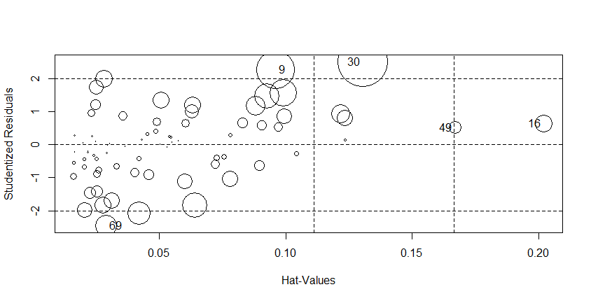

在这里圆的大小和Cook距离是成正比的，**Bonferroni** 检测异常值

```R
> outlierTest(lm.sol)
```

```
No Studentized residuals with Bonferonni p < 0.05
Largest |rstudent|:
   rstudent unadjusted p-value Bonferonni p
30 2.505368           0.014669           NA
```

符合直观显示

**COVRATIO**

covratio比较的是去除某值之后协方差的变化，下标意味着剔除了第几个


距离1越远越有影响，可以查看所有的covratio

```R
> covratio(lm.sol)
```

```
        1         2         3         4         5         6         7         8 
1.0205162 1.0384683 1.0809780 1.0702756 1.1206153 0.8633260 1.0515415 0.9123826 
        9        10        11        12        13        14        15        16 
0.8739045 0.9589024 1.0667193 1.0888370 0.9976883 1.1271570 1.0822366 1.2970969 
       17        18        19        20        21        22        23        24 
1.1173772 1.0494906 1.1333311 1.0856048 1.0206446 1.1026310 1.1193516 1.2092618 
       25        26        27        28        29        30        31        32 
1.1561789 1.1457841 1.0069911 1.1483356 1.1295030 0.8530834 1.0743253 1.1647340 
       33        34        35        36        37        38        39        40 
0.8967857 1.0826309 1.1183581 1.0582992 1.0733011 1.1012301 1.0539441 1.1226727 
       41        42        43        44        45        46        47        48 
1.1072233 0.9316177 1.0821070 1.1042513 1.0878861 1.0424372 1.1449065 1.1048471 
       49        50        51        52        53        54        55        56 
1.2544314 1.0956020 1.0306151 0.8640927 1.0945977 1.0594028 1.1387814 0.8686899 
       57        58        59        60        61        62        63        64 
0.9279613 1.0756474 1.1795263 0.9678344 1.0804296 1.1204158 1.0709459 1.1384828 
       65        66        67        68        69        70        71        72 
1.0278919 1.1251657 1.0934691 1.0604063 0.7748261 1.0754330 1.0521803 1.0806991
```


以上方法可以用一种方法实现

```R
> influence.measures(lm.sol)
```

```
Influence measures of
	 lm(formula = height ~ armSpan + footLength + legLength, data = filboys2018) :

      dfb.1_  dfb.armS  dfb.ftLn  dfb.lgLn     dffit cov.r   cook.d    hat inf
1   0.153203 -0.454206  0.177074  0.352125  0.518241 1.021 6.57e-02 0.0990    
2  -0.067713  0.010720  0.000187  0.075453 -0.143681 1.038 5.18e-03 0.0253    
3  -0.011145  0.015269 -0.012647  0.004523 -0.034569 1.081 3.03e-04 0.0216    
4   0.086735 -0.030125 -0.041673 -0.026106 -0.120124 1.070 3.64e-03 0.0331    
5  -0.062679  0.100083 -0.097573  0.039236 -0.162178 1.121 6.64e-03 0.0721    
6   0.113390 -0.084601 -0.228839  0.262055 -0.434164 0.863 4.49e-02 0.0420    
7   0.012665 -0.004093  0.042277 -0.071151 -0.126745 1.052 4.04e-03 0.0262    
8  -0.003148 -0.126067  0.047302  0.176131  0.277642 0.912 1.87e-02 0.0249    
9   0.593325  0.003878 -0.515210 -0.205769  0.738002 0.874 1.28e-01 0.0960   *
10 -0.066153  0.105667  0.013462 -0.114208 -0.220441 0.959 1.20e-02 0.0225    
11 -0.211022  0.149732  0.009749  0.043968  0.260312 1.067 1.69e-02 0.0630    
12 -0.029930  0.008321  0.009274  0.016129 -0.043707 1.089 4.84e-04 0.0292    
13  0.106719 -0.117463  0.021726  0.027860  0.192909 0.998 9.24e-03 0.0247    
14 -0.139181  0.102537  0.093597 -0.090028  0.199258 1.127 1.00e-02 0.0829    
15  0.009203 -0.018288  0.003761  0.012253 -0.031214 1.082 2.47e-04 0.0221    
16 -0.039753  0.069558  0.163114 -0.268914  0.326159 1.297 2.68e-02 0.2022   *
17 -0.000236  0.000173 -0.000307  0.000464  0.000768 1.117 1.50e-07 0.0504    
18 -0.234735  0.144499  0.113994 -0.060234 -0.281486 1.049 1.97e-02 0.0603    
19  0.075181  0.016545 -0.070727 -0.051811 -0.111358 1.133 3.14e-03 0.0726    
20  0.099822 -0.033986 -0.100312  0.045635  0.153999 1.086 5.98e-03 0.0490    
21 -0.005245  0.039922 -0.026141 -0.034798 -0.123612 1.021 3.82e-03 0.0162    
22 -0.109363  0.017998  0.029551  0.096497  0.160531 1.103 6.50e-03 0.0604    
23 -0.043782  0.021997  0.018023  0.004435  0.051855 1.119 6.82e-04 0.0547    
24  0.029193 -0.032179  0.023430 -0.016075  0.051056 1.209 6.61e-04 0.1235   *
25 -0.085070 -0.068976  0.109181  0.109732  0.171893 1.156 7.47e-03 0.0972    
26 -0.004357  0.063808 -0.060211 -0.025955  0.081485 1.146 1.68e-03 0.0783    
27 -0.148465 -0.081731  0.123064  0.213348  0.308181 1.007 2.35e-02 0.0508    
28  0.116831  0.185327 -0.310924 -0.090782  0.344575 1.148 2.97e-02 0.1218    
29  0.027373 -0.115849 -0.064274  0.251353  0.281478 1.130 1.99e-02 0.0997    
30  0.478662 -0.311871  0.361161 -0.610496  0.971400 0.853 2.19e-01 0.1307   *
31  0.035778  0.246258 -0.142356 -0.293597  0.361662 1.074 3.25e-02 0.0882    
32 -0.101726  0.267069 -0.077062 -0.212954  0.302203 1.165 2.30e-02 0.1234    
33 -0.094990  0.218049 -0.116839 -0.103104 -0.310805 0.897 2.33e-02 0.0278    
34 -0.002116  0.003519 -0.000820 -0.001689  0.006482 1.083 1.07e-05 0.0201    
35  0.004661  0.037999 -0.027518 -0.036563  0.054804 1.118 7.61e-04 0.0542    
36 -0.146555  0.062307  0.008779  0.090436 -0.200453 1.058 1.01e-02 0.0459    
37  0.006094 -0.012257  0.010409  0.000917  0.037061 1.073 3.48e-04 0.0163    
38 -0.003036  0.007607 -0.003664 -0.004450 -0.009782 1.101 2.43e-05 0.0366    
39  0.035644  0.013142 -0.036844 -0.032712 -0.097058 1.054 2.37e-03 0.0202    
40 -0.007304  0.009136  0.004197 -0.010198  0.015604 1.123 6.18e-05 0.0551    
41 -0.010672 -0.002349 -0.002820  0.024579  0.032673 1.107 2.71e-04 0.0431    
42  0.333640 -0.368412 -0.034821  0.184896 -0.479735 0.932 5.56e-02 0.0640    
43  0.010384 -0.024675  0.013890  0.011652  0.039401 1.082 3.94e-04 0.0233    
44 -0.049489  0.072146 -0.003657 -0.045867  0.092271 1.104 2.15e-03 0.0486    
45 -0.003440  0.008077 -0.001487 -0.006625  0.013142 1.088 4.38e-05 0.0251    
46 -0.230210  0.002358  0.198664  0.088465  0.308218 1.042 2.36e-02 0.0633    
47  0.149996 -0.029986 -0.123065 -0.007009  0.178788 1.145 8.07e-03 0.0908    
48 -0.032298  0.016034 -0.014440  0.040410  0.068623 1.105 1.19e-03 0.0453    
49  0.020432 -0.182418  0.186029  0.053406  0.228851 1.254 1.32e-02 0.1672   *
50 -0.004981  0.034725  0.011780 -0.071539 -0.089087 1.096 2.01e-03 0.0419    
51  0.364947 -0.303386  0.082127 -0.104352  0.468815 1.031 5.40e-02 0.0927    
52 -0.128106 -0.025662  0.143796  0.036477 -0.285764 0.864 1.96e-02 0.0205    
53 -0.002181  0.001201  0.001241 -0.000360  0.003213 1.095 2.62e-06 0.0307    
54 -0.003656 -0.019178  0.024890  0.003403 -0.070467 1.059 1.25e-03 0.0162    
55 -0.129313  0.010032  0.159192 -0.035615 -0.195983 1.139 9.69e-03 0.0896    
56 -0.218650  0.157594  0.018485  0.036469  0.336814 0.869 2.72e-02 0.0280    
57 -0.109722  0.219488 -0.122529 -0.075481 -0.300936 0.928 2.20e-02 0.0310    
58  0.031193 -0.021445  0.012147 -0.027155 -0.071787 1.076 1.30e-03 0.0252    
59 -0.050761  0.009907  0.072246 -0.037229 -0.092566 1.180 2.17e-03 0.1044   *
60 -0.157231  0.090379  0.051906 -0.001820 -0.227370 0.968 1.27e-02 0.0252    
61 -0.003780  0.027509 -0.011880 -0.029470 -0.051539 1.080 6.73e-04 0.0242    
62 -0.006992 -0.007816  0.017070  0.001496 -0.019922 1.120 1.01e-04 0.0534    
63 -0.033110  0.003832  0.027861  0.003547 -0.063085 1.071 1.01e-03 0.0204    
64  0.062160 -0.053599  0.035028 -0.045735 -0.107667 1.138 2.94e-03 0.0758    
65  0.077772  0.011417 -0.061517 -0.049618  0.147657 1.028 5.46e-03 0.0230    
66  0.008682  0.006052 -0.024037  0.008309  0.029182 1.125 2.16e-04 0.0578    
67  0.002480 -0.001357 -0.002054  0.001195 -0.004365 1.093 4.83e-06 0.0297    
68 -0.024136  0.128230 -0.099960 -0.065782 -0.172082 1.060 7.44e-03 0.0404    
69  0.097134 -0.267474  0.044572  0.251918 -0.423303 0.775 4.17e-02 0.0289   *
70 -0.005540  0.007584 -0.008493  0.004333 -0.030539 1.075 2.36e-04 0.0166    
71 -0.125583  0.059331  0.047847  0.025878  0.166513 1.052 6.96e-03 0.0356    
72 -0.064880 -0.062859 -0.048025  0.261460 -0.299161 1.081 2.24e-02 0.0779 
```


#### 多重共线性

**条件数**

对正则化后的  ，设  的一个特征值为， 为其特征向量，长度为1，且 


容易得到


定义Kappa条件数


直观上可以看到如果比值较高则共线性程度很大

```R
> x<-as.matrix(filboys2018[,1:3])
> xx=crossprod(x)
> kappa(xx)
```

```
[1] 38838.06
```

可见共线性程度大


**VIF**

定义**方差膨胀因子** 


 表示解释变量j对其他解释变量进行回归的决定系数，当VIF比较大的时候则存在共线性

```R
> vif(lm.sol)
```

```
   armSpan footLength  legLength 
  1.664246   1.287671   1.376563 
```

共线性程度一般

### 岭回归与Lasso回归

`这是为了解决多重共线性而出现的`

由于共线性会让  估计值变大，这里引入惩罚项，对于岭回归


或者


```R
> lm.soridge<-lm.ridge(height ~ armSpan + footLength + legLength, data = filboys2018)
> summary(lm.soridge)
```
```
       Length Class  Mode   
coef   3      -none- numeric
scales 3      -none- numeric
Inter  1      -none- numeric
lambda 1      -none- numeric
ym     1      -none- numeric
xm     3      -none- numeric
GCV    1      -none- numeric
kHKB   1      -none- numeric
kLW    1      -none- numeric
```
画出岭迹图
```R
> plot(lm.ridge(height ~ .,data = filboys2018[,1:4],lambda=seq(0,100,10)))
```

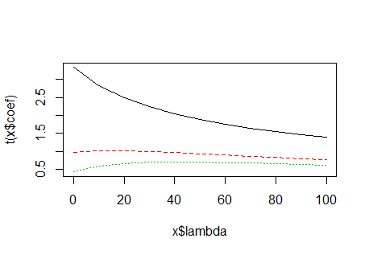

可以看到变量随系数的变化，两个变量表现比较平稳，只有一个变量迅速趋于平稳，在图中共线性情况一般


对于Lasso回归

或者


```
> boysMatrix<- as.matrix(filboys2018)
> laa<-lars(x=boysMatrix[,2:4],y=boysMatrix[,1])
> laa
```

```

Call:
lars(x = boysMatrix[, 2:4], y = boysMatrix[, 1])
R-squared: 0.568 
Sequence of LASSO moves:
     armSpan footLength legLength
Var        1          2         3
Step       1          2         3
```

```R
> summary(laa)
```

```
LARS/LASSO
Call: lars(x = boysMatrix[, 2:4], y = boysMatrix[, 1])
  Df     Rss      Cp
0  1 2155.33 87.3268
1  2 1143.14 15.4428
2  3  984.10  5.8337
3  4  931.58  4.0000
```

Cp是对共线性的诊断，这边显示共线性较小，画出Lasso图

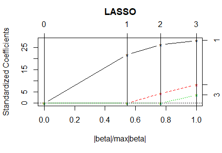

### 多项式回归

> 这里只讨论一元多项回归，取2018年男生身高和腿长数据


我们做2次多项式的回归有

```R
> lm.sol<-lm(filboys2018$height~1+filboys2018$legLength+I(filboys2018$legLength^2),data=filboys2018)
> summary(lm.sol)
```

````
Call:
lm(formula = filboys2018$height ~ 1 + filboys2018$legLength + 
    I(filboys2018$legLength^2), data = filboys2018)

Residuals:
    Min      1Q  Median      3Q     Max 
-8.6482 -3.2001 -0.6611  3.6058 10.9484 

Coefficients:
                             Estimate Std. Error t value Pr(>|t|)    
(Intercept)                411.398736  96.067660   4.282 5.86e-05 ***
filboys2018$legLength       -5.113082   1.929518  -2.650  0.00997 ** 
I(filboys2018$legLength^2)   0.027523   0.009668   2.847  0.00581 ** 
---
Signif. codes:  0 ‘***’ 0.001 ‘**’ 0.01 ‘*’ 0.05 ‘.’ 0.1 ‘ ’ 1

Residual standard error: 4.744 on 69 degrees of freedom
Multiple R-squared:  0.2795,	Adjusted R-squared:  0.2586 
F-statistic: 13.38 on 2 and 69 DF,  p-value: 1.227e-05
````

```R
> xfit<-seq(85,120,len=72)
> yfit<-predict(lm.sol, data.frame(x=xfit))
> lines(xfit, yfit)
```


实际效果并不理想

### 广义线性回归

一般关系有

|       | 连接函数             | 逆连接函数（回归）                           | 典型误差函数 |
| ----- | -------------------- | -------------------------------------------- | ------------ |
| 恒等  |       |                               | 正态         |
| 对数  |     |                          | Poisson      |
| Logit |  |  | 二项         |
| 逆    |  |                        | Gamma        |

这里只介绍逻辑回归

#### 逻辑回归

对于二分类变量概率  有


做logit变换有


我们将2018年男女作为分类变量，赋予男为1，女为0（也可以男为0，女为1），连接数据得到 `classFil2018` 数据，新增的分类数据名为 `c`

首先利用身高进行一元逻辑回归

```
> glm.sol<-glm(c~height, family=binomial, data=classFil2018)
> summary(glm.sol)
```

```
Call:
glm(formula = c ~ height, family = binomial, data = classFil2018)

Deviance Residuals: 
    Min       1Q   Median       3Q      Max  
-2.6189  -0.3614   0.0810   0.4034   1.9376  

Coefficients:
             Estimate Std. Error z value Pr(>|z|)    
(Intercept) -78.78965   15.20016  -5.183 2.18e-07 ***
height        0.46433    0.08953   5.186 2.15e-07 ***
---
Signif. codes:  0 ‘***’ 0.001 ‘**’ 0.01 ‘*’ 0.05 ‘.’ 0.1 ‘ ’ 1

(Dispersion parameter for binomial family taken to be 1)

    Null deviance: 157.807  on 117  degrees of freedom
Residual deviance:  70.022  on 116  degrees of freedom
AIC: 74.022

Number of Fisher Scoring iterations: 6
```

可见有强显著性，画出相应的图


接下来进行多元的分析，我们输入所有的元素

```R
> glm.sol<-glm(c~height+armSpan+footLength+legLength+weight, family=binomial, data=classFil2018)
> summary(glm.sol)
```

```

Call:
glm(formula = c ~ height + armSpan + footLength + legLength + 
    weight, family = binomial, data = classFil2018)

Deviance Residuals: 
     Min        1Q    Median        3Q       Max  
-1.98396  -0.26262   0.02957   0.23785   2.10860  

Coefficients:
             Estimate Std. Error z value Pr(>|z|)    
(Intercept) -74.94164   17.48016  -4.287 1.81e-05 ***
height        0.30241    0.13547   2.232   0.0256 *  
armSpan       0.13348    0.10685   1.249   0.2116    
footLength    0.93599    0.46622   2.008   0.0447 *  
legLength    -0.25732    0.10514  -2.447   0.0144 *  
weight        0.06362    0.06289   1.012   0.3117    
---
Signif. codes:  0 ‘***’ 0.001 ‘**’ 0.01 ‘*’ 0.05 ‘.’ 0.1 ‘ ’ 1

(Dispersion parameter for binomial family taken to be 1)

    Null deviance: 157.807  on 117  degrees of freedom
Residual deviance:  45.815  on 112  degrees of freedom
AIC: 57.815

Number of Fisher Scoring iterations: 7
```

存在不显著的变量

```
> glm.new<-step(glm.sol)
> summary(glm.new)
```

```
Start:  AIC=57.81
c ~ height + armSpan + footLength + legLength + weight

             Df Deviance    AIC
- weight      1   46.980 56.980
- armSpan     1   47.489 57.489
<none>            45.815 57.815
- footLength  1   50.297 60.297
- height      1   51.890 61.890
- legLength   1   53.449 63.449

Step:  AIC=56.98
c ~ height + armSpan + footLength + legLength

             Df Deviance    AIC
- armSpan     1   48.814 56.814
<none>            46.980 56.980
- footLength  1   54.529 62.529
- legLength   1   54.783 62.783
- height      1   56.670 64.670

Step:  AIC=56.81
c ~ height + footLength + legLength

             Df Deviance    AIC
<none>            48.814 56.814
- legLength   1   55.030 61.030
- footLength  1   60.642 66.642
- height      1   75.722 81.722


Call:
glm(formula = c ~ height + footLength + legLength, family = binomial, 
    data = classFil2018)

Deviance Residuals: 
     Min        1Q    Median        3Q       Max  
-1.91929  -0.24236   0.03492   0.18853   2.22940  

Coefficients:
            Estimate Std. Error z value Pr(>|z|)    
(Intercept) -82.5004    16.8164  -4.906  9.3e-07 ***
height        0.4328     0.1131   3.827  0.00013 ***
footLength    1.2795     0.4220   3.032  0.00243 ** 
legLength    -0.2244     0.1010  -2.222  0.02629 *  
---
Signif. codes:  0 ‘***’ 0.001 ‘**’ 0.01 ‘*’ 0.05 ‘.’ 0.1 ‘ ’ 1

(Dispersion parameter for binomial family taken to be 1)

    Null deviance: 157.807  on 117  degrees of freedom
Residual deviance:  48.814  on 114  degrees of freedom
AIC: 56.814

Number of Fisher Scoring iterations: 7
```

进一步提高回归效果


#### 逻辑回归诊断

我们可以首先使用线性回归中的诊断

```R
> influence.measures(glm.new)
```

```
Influence measures of
	 glm(formula = c ~ height + footLength + legLength, family = binomial,      data = classFil2018) :

       dfb.1_  dfb.hght  dfb.ftLn  dfb.lgLn     dffit cov.r   cook.d      hat
1   -3.04e-02  1.77e-02  1.66e-02  3.03e-04  3.48e-02 1.048 6.58e-05 1.43e-02
2   -3.50e-02  3.76e-02  6.48e-02 -7.80e-02  1.04e-01 1.066 6.02e-04 3.75e-02
3   -2.05e-02  1.63e-02  2.29e-02 -1.98e-02  3.31e-02 1.047 5.98e-05 1.38e-02
4   -7.21e-03  3.68e-03  5.88e-03 -9.37e-04  8.46e-03 1.040 3.87e-06 4.74e-03
5   -1.36e-02  8.99e-03  3.51e-02 -3.00e-02  4.44e-02 1.060 1.07e-04 2.50e-02
6   -1.19e-02  4.21e-03  2.69e-02 -1.53e-02  3.02e-02 1.052 4.94e-05 1.74e-02
7   -1.12e-01  3.55e-02  6.35e-02  5.70e-02  1.67e-01 1.065 1.59e-03 4.64e-02
8   -4.36e-03  3.84e-03  1.39e-03 -1.43e-03  4.67e-03 1.039 1.18e-06 2.85e-03
9   -5.56e-02  1.60e-01 -6.95e-02 -1.39e-01  1.93e-01 1.160 2.05e-03 1.16e-01
10  -6.12e-02 -1.92e-01  2.89e-01  1.83e-01  4.72e-01 1.050 1.48e-02 8.89e-02
11  -4.87e-04  3.83e-04  1.87e-04 -1.08e-04  5.01e-04 1.036 1.36e-08 4.20e-04
12  -4.34e-02  6.62e-02  4.50e-02 -9.79e-02  1.18e-01 1.065 7.79e-04 3.92e-02
13  -1.24e-02  1.33e-02  5.44e-03 -1.00e-02  1.61e-02 1.043 1.40e-05 7.78e-03
14  -4.56e-05  3.91e-05  3.15e-05 -3.06e-05  5.40e-05 1.036 1.57e-10 5.56e-05
15  -8.84e-03  7.97e-03  5.52e-03 -6.00e-03  1.09e-02 1.041 6.44e-06 5.46e-03
16  -1.44e-05  1.64e-05  1.51e-05 -2.25e-05  2.65e-05 1.036 3.80e-11 3.63e-05
17  -6.18e-02  3.67e-02  9.14e-03  2.46e-02  7.71e-02 1.067 3.26e-04 3.46e-02
18   4.69e-01 -4.00e-01 -1.18e-01  1.17e-01  6.26e-01 0.743 6.46e-02 3.47e-02
19  -2.61e-03  9.74e-04  2.33e-03  1.30e-04  3.18e-03 1.038 5.47e-07 2.34e-03
20  -1.41e-01  2.34e-01 -1.31e-01 -7.15e-02  3.15e-01 1.071 5.99e-03 7.43e-02
21  -5.60e-02  1.55e-02  7.50e-02 -1.12e-02  9.50e-02 1.056 5.01e-04 2.97e-02
22  -2.90e-03  1.75e-03  1.31e-03  1.98e-04  3.10e-03 1.038 5.18e-07 2.23e-03
23  -6.65e-04  4.56e-04  4.11e-04 -1.76e-04  7.11e-04 1.036 2.73e-08 5.53e-04
24  -9.98e-03  1.50e-02  3.02e-02 -4.24e-02  4.99e-02 1.068 1.35e-04 3.26e-02
25  -1.90e-03  7.94e-04  1.45e-03  1.89e-04  2.21e-03 1.038 2.65e-07 1.72e-03
26  -2.34e-02  3.14e-02 -3.11e-03 -1.73e-02  3.32e-02 1.052 5.99e-05 1.73e-02
27  -1.89e-03  1.25e-03  8.82e-04 -1.31e-04  1.98e-03 1.037 2.11e-07 1.42e-03
28  -1.11e-01  2.71e-01 -1.62e-01 -1.63e-01  3.22e-01 1.197 5.86e-03 1.52e-01
29  -2.60e-01  9.86e-02 -5.66e-02  3.09e-01  4.81e-01 1.219 1.36e-02 1.81e-01
30  -3.09e-04  4.66e-04  2.37e-04 -6.13e-04  6.63e-04 1.037 2.37e-08 7.37e-04
31  -1.45e-03  2.20e-03  3.45e-04 -2.11e-03  2.51e-03 1.038 3.41e-07 2.24e-03
32  -2.44e-04  2.94e-04  8.83e-05 -2.43e-04  3.30e-04 1.036 5.88e-09 3.20e-04
33  -1.39e-02 -2.77e-01  4.64e-01  8.76e-02  5.83e-01 1.128 2.18e-02 1.44e-01
34  -7.75e-03  6.95e-03  4.22e-03 -4.56e-03  9.12e-03 1.040 4.49e-06 4.70e-03
35  -9.37e-03  1.32e-02  2.64e-03 -1.20e-02  1.52e-02 1.044 1.26e-05 9.04e-03
36   2.52e-03  6.19e-02  1.64e-01 -2.84e-01  3.51e-01 1.122 7.27e-03 1.09e-01
37  -1.23e-02  1.05e-02  8.69e-03 -8.28e-03  1.56e-02 1.042 1.31e-05 7.19e-03
38  -4.43e-02  2.00e-02  4.85e-02 -1.28e-02  6.50e-02 1.052 2.33e-04 2.16e-02
39  -2.25e-02  9.94e-03  2.18e-02 -3.38e-03  2.93e-02 1.047 4.66e-05 1.27e-02
40  -5.19e-04  4.87e-04  3.86e-04 -4.54e-04  6.80e-04 1.036 2.50e-08 5.53e-04
41  -3.59e-02  1.85e-02  1.32e-02  1.14e-02  4.27e-02 1.054 9.93e-05 2.06e-02
42  -6.24e-03  3.54e-03  6.38e-03 -2.80e-03  8.15e-03 1.040 3.59e-06 4.54e-03
43  -2.07e-02  1.52e-02  1.65e-02 -1.11e-02  2.63e-02 1.045 3.77e-05 1.06e-02
44  -8.41e-04  8.13e-04  4.25e-04 -5.77e-04  9.90e-04 1.037 5.30e-08 7.49e-04
45  -5.10e-03  5.01e-03  2.90e-03 -3.96e-03  6.41e-03 1.039 2.22e-06 3.65e-03
46  -1.75e-04  1.21e-04  1.07e-04 -4.84e-05  1.86e-04 1.036 1.86e-09 1.68e-04
47   1.38e-01  5.20e-01 -6.61e-01 -5.31e-01  1.05e+00 1.044 9.23e-02 1.73e-01
48  -1.80e-02  1.16e-02  5.17e-03  2.75e-03  2.00e-02 1.046 2.16e-05 1.09e-02
49  -2.68e-03  1.03e-03  4.08e-03 -1.63e-03  4.47e-03 1.039 1.08e-06 3.25e-03
50  -1.58e-01  1.29e-02  8.19e-02  1.60e-01  2.86e-01 1.094 4.80e-03 8.29e-02
51  -1.50e-02  2.78e-02  1.28e-02 -4.08e-02  4.38e-02 1.060 1.04e-04 2.56e-02
52   1.06e-01 -2.29e-01  2.66e-01  1.87e-03  5.01e-01 0.978 1.90e-02 6.54e-02
53  -1.87e-03  1.38e-03  1.31e-03 -8.40e-04  2.12e-03 1.037 2.43e-07 1.40e-03
54  -4.51e-02  3.58e-02  3.02e-02 -2.29e-02  5.92e-02 1.048 1.93e-04 1.83e-02
55   3.69e-01 -8.72e-02 -6.29e-01  2.10e-01  7.55e-01 0.693 1.20e-01 4.13e-02
56  -3.72e-04  3.49e-04  1.16e-04 -1.62e-04  3.99e-04 1.036 8.61e-09 3.45e-04
57  -2.06e-02 -2.02e-01  4.05e-01  1.36e-02  4.89e-01 1.122 1.49e-02 1.28e-01
58  -3.04e-02  1.77e-02  1.66e-02  3.03e-04  3.48e-02 1.048 6.58e-05 1.43e-02
59   2.56e-01 -8.36e-02 -7.44e-01  5.07e-01  9.22e-01 0.696 1.81e-01 5.84e-02
60   8.43e-02 -1.60e-01  2.61e-01 -8.88e-02  4.67e-01 0.999 1.57e-02 6.72e-02
61  -4.99e-02  2.05e-02  4.48e-02 -6.91e-04  6.73e-02 1.053 2.49e-04 2.27e-02
62  -1.25e-01  2.19e-01 -1.03e-01 -1.01e-01  2.77e-01 1.076 4.54e-03 7.09e-02
63  -7.10e-02  7.48e-02  4.73e-02 -6.97e-02  1.27e-01 1.048 9.17e-04 2.96e-02
64  -2.75e-02  1.53e-02  7.10e-03  9.63e-03  3.25e-02 1.053 5.74e-05 1.81e-02
65  -1.41e-02  1.85e-02  3.42e-03 -1.51e-02  2.10e-02 1.046 2.39e-05 1.09e-02
66  -1.96e-01  2.55e-01 -2.01e-01  5.26e-02  4.21e-01 1.090 1.10e-02 1.01e-01
67  -1.75e-03  1.35e-03  1.37e-03 -1.03e-03  2.11e-03 1.037 2.41e-07 1.41e-03
68  -4.59e-02 -1.97e-03  8.67e-02 -6.93e-03  9.76e-02 1.067 5.26e-04 3.77e-02
69  -4.48e-02  1.30e-04  1.33e-01 -5.85e-02  1.55e-01 1.075 1.35e-03 5.11e-02
70  -1.87e-02  1.49e-02  1.77e-02 -1.50e-02  2.70e-02 1.045 3.95e-05 1.13e-02
71  -8.00e-04  6.26e-04  3.99e-04 -2.63e-04  8.45e-04 1.036 3.86e-08 6.39e-04
72  -6.57e-03  9.46e-03  1.23e-02 -1.95e-02  2.20e-02 1.051 2.63e-05 1.56e-02
73   3.15e-01 -1.92e-01 -1.77e-01  6.37e-03 -5.48e-01 0.797 3.92e-02 3.35e-02
74   4.26e-02  1.01e-01 -2.41e-01 -3.23e-02 -4.85e-01 0.913 2.07e-02 4.52e-02
75   5.68e-01 -5.04e-01  2.24e-01 -2.29e-01 -9.07e-01 0.797 1.17e-01 7.56e-02
76   4.71e-01 -3.16e-01  2.43e-01 -4.47e-01 -9.34e-01 0.903 9.21e-02 1.07e-01
77  -4.08e-02  8.22e-02  2.11e-03 -1.03e-01 -3.37e-01 0.974 8.12e-03 3.82e-02
78  -5.16e-02  1.31e-01  2.74e-02 -1.96e-01 -2.14e-01 1.108 2.59e-03 8.22e-02
79  -1.10e-01 -2.28e-01 -2.52e-01  8.56e-01 -1.02e+00 0.933 1.06e-01 1.29e-01
80  -9.84e-02  1.08e-01  4.08e-02 -9.28e-02 -2.65e-01 1.011 4.51e-03 3.77e-02
81   1.22e-01 -4.52e-01  1.94e-01  4.43e-01 -7.15e-01 0.893 5.14e-02 7.30e-02
82  -7.66e-02  9.46e-02  7.63e-02 -1.35e-01 -1.91e-01 1.056 2.13e-03 4.51e-02
83  -7.66e-02  9.46e-02  7.63e-02 -1.35e-01 -1.91e-01 1.056 2.13e-03 4.51e-02
84  -8.25e-02  9.42e-02  5.52e-02 -1.02e-01 -1.58e-01 1.053 1.43e-03 3.79e-02
85  -1.07e-01  9.30e-02  6.47e-02 -7.00e-02 -1.86e-01 1.038 2.05e-03 3.49e-02
86  -8.25e-02  9.42e-02  5.52e-02 -1.02e-01 -1.58e-01 1.053 1.43e-03 3.79e-02
87  -1.30e-01  9.52e-02  4.59e-02 -1.68e-02 -1.93e-01 1.039 2.20e-03 3.67e-02
88  -1.34e-01  9.99e-02  2.86e-02 -1.42e-03 -1.82e-01 1.048 1.93e-03 3.94e-02
89  -3.77e-02  4.33e-02  5.72e-03 -2.64e-02 -4.88e-02 1.053 1.30e-04 1.99e-02
90  -4.59e-02  5.02e-02  5.85e-03 -2.61e-02 -5.74e-02 1.054 1.81e-04 2.20e-02
91  -1.74e-01  1.09e-01 -1.39e-02  9.34e-02 -2.46e-01 1.096 3.50e-03 7.85e-02
92  -2.49e-02  2.49e-02 -1.69e-03 -4.74e-03 -2.89e-02 1.051 4.54e-05 1.58e-02
93  -7.21e-02  5.47e-02  3.25e-02 -1.91e-02 -8.63e-02 1.052 4.14e-04 2.51e-02
94  -5.82e-02  4.99e-02  8.22e-02 -8.47e-02 -1.30e-01 1.062 9.47e-04 3.86e-02
95  -6.41e-02  4.87e-02  4.19e-02 -3.07e-02 -8.30e-02 1.051 3.82e-04 2.40e-02
96  -1.09e-01  5.20e-02  6.45e-02  1.31e-02 -1.44e-01 1.055 1.18e-03 3.68e-02
97  -1.04e-01  5.44e-02  4.76e-02  1.84e-02 -1.31e-01 1.059 9.63e-04 3.69e-02
98  -2.75e-02  2.73e-02  1.33e-02 -2.04e-02 -3.50e-02 1.048 6.68e-05 1.42e-02
99  -2.72e-02  2.59e-02  1.06e-02 -1.53e-02 -3.22e-02 1.047 5.64e-05 1.32e-02
100 -3.49e-02  2.75e-02  5.45e-03 -4.81e-04 -3.83e-02 1.051 7.98e-05 1.77e-02
101 -1.11e-02  9.61e-03  2.21e-04 -1.71e-04 -1.23e-02 1.044 8.14e-06 8.17e-03
102 -4.15e-02  3.49e-02  2.50e-02 -2.39e-02 -5.19e-02 1.049 1.47e-04 1.79e-02
103 -3.30e-02  2.48e-02  1.73e-02 -1.05e-02 -3.73e-02 1.047 7.58e-05 1.43e-02
104 -2.43e-02  1.93e-02  1.02e-02 -7.21e-03 -2.65e-02 1.046 3.82e-05 1.14e-02
105 -4.00e-02  2.51e-02  6.65e-02 -5.07e-02 -8.64e-02 1.062 4.12e-04 3.23e-02
106 -5.51e-02  2.47e-02  7.43e-02 -3.31e-02 -9.38e-02 1.057 4.88e-04 3.02e-02
107 -1.73e-01 -5.76e-03  1.14e-01  1.77e-01 -3.03e-01 1.130 5.29e-03 1.08e-01
108 -5.42e-02  2.69e-02  4.08e-02 -3.90e-03 -6.66e-02 1.053 2.44e-04 2.28e-02
109 -2.30e-02  1.73e-02  1.45e-02 -9.92e-03 -2.67e-02 1.045 3.86e-05 1.11e-02
110 -6.62e-02  2.84e-02  3.34e-02  2.08e-02 -8.08e-02 1.063 3.60e-04 3.20e-02
111 -2.02e-02  1.46e-02  8.49e-03 -3.24e-03 -2.16e-02 1.045 2.52e-05 1.00e-02
    inf
1      
2      
3      
4      
5      
6      
7      
8      
9     *
10     
11     
12     
13     
14     
15     
16     
17     
18    *
19     
20     
21     
22     
23     
24     
25     
26     
27     
28    *
29    *
30     
31     
32     
33    *
34     
35     
36    *
37     
38     
39     
40     
41     
42     
43     
44     
45     
46     
47    *
48     
49     
50     
51     
52     
53     
54     
55    *
56     
57    *
58     
59    *
60     
61     
62     
63     
64     
65     
66     
67     
68     
69     
70     
71     
72     
73    *
74     
75    *
76    *
77     
78    *
79    *
80     
81    *
82     
83     
84     
85     
86     
87     
88     
89     
90     
91     
92     
93     
94     
95     
96     
97     
98     
99     
100    
101    
102    
103    
104    
105    
106    
107   *
108    
109    
110    
111    
```

可以看到一些异常值


**Wald检验**

类似t检验，他定义Wald统计量为


其中 SE 表示系数标准误差，这个统计量符合  分布

```
> regTermTest(glm.new)
```


**二元图**

在多元逻辑回归中，我们可以转化为一元回归，类似上面的做法，这里使用外部分箱函数`actual_pred_plot`

```R
> glm.sol<-glm(c~height, family=binomial, data=classFil2018)
> pre<-predict(glm.sol, data.frame(height = classFil2018$height))
> tmp <- classFil2018
> tmp$pre <- pre
> actual_pred_plot  (var.by= as.character("height"),
+                    var.response='c',
+                    data=tmp,
+                    var.predict.current='pre',
+                    var.predict.reference=NULL,
+                    var.split=NULL,
+                    var.by.buckets=NULL,
+                    sort.factor=FALSE,
+                    errorbars=FALSE,
+                    subset.to=FALSE,
+                    barline.ratio=1,
+                    title="Actual vs. Predicted",
+                    make.plot=TRUE
+ )
```

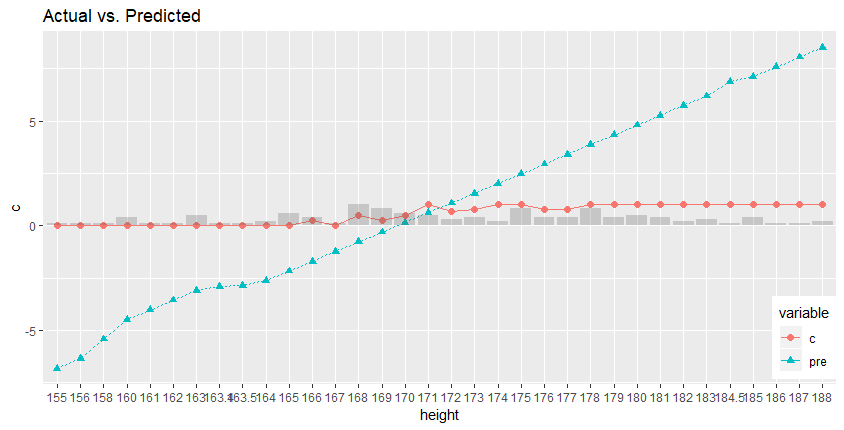

可以更清楚的看到预测和实际的区别


## 方差分析

`这里我们利用男女分类变量进行方差分析，实际上从业务角度这样做不是很合适，这里不会作为特征工程的依据`

### 单因素
定义


等价假设

[  ]()  [  不全为0 ]()

考虑统计量   和  和  

我们有


```R
> fil2018<-rbind(filboys2018,filgirls2018)
> legLengthData<-data.frame(
+     X=fil2018$legLength,
+     A=factor(c(rep(1,72),rep(2,46)))
+ )
> legLengthData.aov<-aov(X ~ A, data=legLengthData)
> legLengthData.aov
```

得到

```
Call:
   aov(formula = X ~ A, data = legLengthData)

Terms:
                       A Residuals
Sum of Squares   163.007  3842.857
Deg. of Freedom        1       116

Residual standard error: 5.7557
Estimated effects may be unbalanced
```

#### 多重比较

`实际上这里就两个`

**t检验**

 ```R
> pairwise.t.test(legLengthData$X, legLengthData$A, p.adjust.method = "none")
 ```

得到

```
	Pairwise comparisons using t tests with pooled SD 

data:  legLengthData$X and legLengthData$A 

  1    
2 0.028

P value adjustment method: none 
```

拒绝原假设


#### 方差齐性检验

> 这里是检验方差是否相同

```R
> bartlett.test(legLengthData$X~legLengthData$A, data=legLengthData)
```

得到

```
	Bartlett test of homogeneity of variances

data:  legLengthData$X by legLengthData$A
Bartlett's K-squared = 8.1132, df = 1, p-value = 0.004394
```

因而方差并不一致


#### Kruskal-Wallis 秩和检验

```
> kruskal.test(legLengthData$X,legLengthData$A)
```

```
	Kruskal-Wallis rank sum test

data:  legLengthData$X and legLengthData$A
Kruskal-Wallis chi-squared = 5.6342, df = 1, p-value = 0.01761
```

可见依然拒绝前面F检验的假设（因为就两个变量，因此可以用这个方法，而实际上这个方法是[Wilcoxon秩检验]()的广义版本）


### 双因素

由于原数据无法生成多个的分类变量，我们无法进行多因素分析。

对于一般双因素一样使用`aov`函数，譬如

```R
> tree<-data.frame(
	Y=c(23, 25, 21, 14, 15, 20, 17, 11, 26, 21,
		16, 19, 13, 16, 24, 20, 21, 18, 27, 24,
		28, 30, 19, 17, 22, 26, 24, 21, 25, 26,
		19, 18, 19, 20, 25, 26, 26, 28, 29, 23,
		18, 15, 23, 18, 10, 21, 25, 12, 12, 22,
		19, 23, 22, 14, 13, 22, 13, 12, 22, 19),
	A=gl(3,20,60),
	B=gl(4,5,60)
	)
> tree.aov <- aov(Y ~ A+B+A:B, data=tree)
```

这里`gl`函数意思是生成因素，其中第一个参数是因素个数，第二个参数是因数对应的水平数量

有结果

```
Df Sum Sq Mean Sq F value Pr(>F)
A 2 352.53 176.27 8.9589 0.000494 ***
B 3 87.52 29.17 1.4827 0.231077
A:B 6 71.73 11.96 0.6077 0.722890
Residuals 48 944.40 19.67
```

即A有显著性

`此外协方差分析已在前面给出`


## 判别分析

> 这里的判别分析只举二分类，给出三个经典的判别分析

### 距离判别

考虑Mahalanobis Distance，现在假设有两个协方差一致的分布令


其中 ，我们有判别函数


实际计算中我们用


如果方差不同，则w(x)估计直接带入不同分布的离差阵。其中

```R
> discriminiant.distance <- function
+ (TrnX1, TrnX2, TstX = NULL, var.equal = FALSE){
+     if (is.null(TstX) == TRUE) TstX <- rbind(TrnX1,TrnX2)
+     if (is.vector(TstX) == TRUE) TstX <- t(as.matrix(TstX))
+     else if (is.matrix(TstX) != TRUE)
+         TstX <- as.matrix(TstX)
+     if (is.matrix(TrnX1) != TRUE) TrnX1 <- as.matrix(TrnX1)
+     if (is.matrix(TrnX2) != TRUE) TrnX2 <- as.matrix(TrnX2)
+     nx <- nrow(TstX)
+     blong <- matrix(rep(0, nx), nrow=1, byrow=TRUE,
+                     dimnames=list("blong", 1:nx))
+     mu1 <- colMeans(TrnX1); mu2 <- colMeans(TrnX2)
+     if (var.equal == TRUE || var.equal == T){
+      S <- var(rbind(TrnX1,TrnX2))
+     w <- mahalanobis(TstX, mu2, S)
+     - mahalanobis(TstX, mu1, S)
+     }
+     else{
+         S1 < -var(TrnX1); S2 <- var(TrnX2)
+         w <- mahalanobis(TstX, mu2, S2)
+         - mahalanobis(TstX, mu1, S1)
+     }
+     for (i in 1:nx){
+         if (w[i] > 0)
+             blong[i] <- 1
+         else
+             blong[i] <- 2
+     }
+     blong
+ }
> discriminiant.distance(filboys2018,filgirls2018, var.equal = TRUE)
```
```
      1 2 3 4 5 6 7 8 9 10 11 12 13 14 15 16 17 18 19 20 21 22 23 24 25 26 27 28 29 30 31 32 33 34 35
blong 1 1 1 1 1 1 1 1 1  1  1  1  1  1  1  1  1  1  1  1  1  1  1  1  1  1  1  1  1  1  1  1  1  1  1
      36 37 38 39 40 41 42 43 44 45 46 47 48 49 50 51 52 53 54 55 56 57 58 59 60 61 62 63 64 65 66 67
blong  1  1  1  1  1  1  1  1  1  1  1  1  1  1  1  1  1  1  1  1  1  1  1  1  1  1  1  1  1  1  1  1
      68 69 70 71 72 73 74 75 76 77 78 79 80 81 82 83 84 85 86 87 88 89 90 91 92 93 94 95 96 97 98 99
blong  1  1  1  1  1  1  1  1  1  1  1  1  1  1  1  1  1  1  1  1  1  1  1  1  1  1  1  1  1  1  1  1
      100 101 102 103 104 105 106 107 108 109 110 111 112 113 114 115 116 117 118
blong   1   1   1   1   1   1   1   1   1   1   1   1   1   1   1   1   1   1   1
```
可以见到没有效果...


### Bayes 判别法

记


其中 2|1 表示1分类被错误分类成2的概率，L代表损失， 即先验分布，令 ，并且符合正态分布 极小化该式等价于


等价于


```R
> discriminiant.bayes <- function
+ (TrnX1, TrnX2, rate = 1, TstX = NULL, var.equal = FALSE){
+     if (is.null(TstX) == TRUE) TstX<-rbind(TrnX1,TrnX2)
+     if (is.vector(TstX) == TRUE) TstX <- t(as.matrix(TstX))
+     else if (is.matrix(TstX) != TRUE)
+         TstX <- as.matrix(TstX);
+ if (is.matrix(TrnX1) != TRUE) TrnX1 <- as.matrix(TrnX1)
+ if (is.matrix(TrnX2) != TRUE) TrnX2 <- as.matrix(TrnX2)
+ nx <- nrow(TstX)
+ blong <- matrix(rep(0, nx), nrow=1, byrow=TRUE,
+                 dimnames=list("blong", 1:nx))
+ mu1 <- colMeans(TrnX1); mu2 <- colMeans(TrnX2)
+ if (var.equal == TRUE || var.equal == T){
+     S <- var(rbind(TrnX1,TrnX2)); beta <- 2*log(rate)
+     w <- mahalanobis(TstX, mu2, S)
+     - mahalanobis(TstX, mu1, S)
+ }
+ else{
+     S1 <- var(TrnX1); S2 <- var(TrnX2)
+     beta <- 2*log(rate) + log(det(S1)/det(S2))
+     w <- mahalanobis(TstX, mu2, S2)
+     - mahalanobis(TstX, mu1, S1)
+ }
+ for (i in 1:nx){
+     if (w[i] > beta)
+         blong[i] <- 1
+     else
+         blong[i] <- 2
+ }
+ blong
+ }
> discriminiant.bayes(filboys2018, filgirls2018, rate=36/6, var.equal=TRUE)

```

```
      1 2 3 4 5 6 7 8 9 10 11 12 13 14 15 16 17 18 19 20 21 22 23 24 25 26 27 28 29 30 31 32 33 34 35 36 37 38 39 40
blong 1 1 2 1 1 1 1 1 1  2  1  2  1  1  1  1  1  2  1  2  2  1  1  1  1  1  1  1  1  1  1  1  1  1  1  1  2  1  1  1
      41 42 43 44 45 46 47 48 49 50 51 52 53 54 55 56 57 58 59 60 61 62 63 64 65 66 67 68 69 70 71 72 73 74 75 76 77
blong  1  1  2  1  1  1  1  1  1  2  1  1  1  1  2  1  1  1  2  2  2  1  1  1  1  1  1  1  1  2  1  1  2  2  1  1  2
      78 79 80 81 82 83 84 85 86 87 88 89 90 91 92 93 94 95 96 97 98 99 100 101 102 103 104 105 106 107 108 109 110
blong  1  1  2  2  1  2  2  2  2  2  2  2  1  1  1  2  2  2  2  2  1  2   2   1   2   2   2   2   2   2   2   2   2
      111 112 113 114 115 116 117 118
blong   2   2   1   2   2   2   2   2
```

注意要调整两个先验损失比值到最优，这里给出一个大致rate，可以看到分类效果有了大幅度提升


### Fisher 判别法

以u(x)作为代替每个x，记


现在要求

因此判别为


考虑 u(x) 为线性函数情况，即令

有


转化为凸问题


可以求得


为了区分在  和  中的变量，构造


有判别


```R
> discriminiant.fisher <- function(TrnX1, TrnX2, TstX = NULL){
+     if (is.null(TstX) == TRUE) TstX <- rbind(TrnX1,TrnX2)
+     if (is.vector(TstX) == TRUE) TstX <- t(as.matrix(TstX))
+     else if (is.matrix(TstX) != TRUE)
+         TstX <- as.matrix(TstX)
+     if (is.matrix(TrnX1) != TRUE) TrnX1 <- as.matrix(TrnX1)
+     if (is.matrix(TrnX2) != TRUE) TrnX2 <- as.matrix(TrnX2)
+     nx <- nrow(TstX)
+     blong <- matrix(rep(0, nx), nrow=1, byrow=TRUE,
+                     dimnames=list("blong", 1:nx))
+     n1 <- nrow(TrnX1); n2 <- nrow(TrnX2)
+     mu1 <- colMeans(TrnX1); mu2 <- colMeans(TrnX2)
+     S <- (n1-1)*var(TrnX1) + (n2-1)*var(TrnX2)
+     mu <- n1/(n1+n2)*mu1 + n2/(n1+n2)*mu2
+     w <- (TstX-rep(1,nx) %o% mu) %*% solve(S, mu2-mu1);
+     for (i in 1:nx){
+         if (w[i] <= 0)
+             blong[i] <- 1
+         else
+             blong[i] <- 2
+     }
+     blong
+ }
> discriminiant.fisher(filboys2018,filgirls2018)
```
```
      1 2 3 4 5 6 7 8 9 10 11 12 13 14 15 16 17 18 19 20 21 22 23 24 25 26 27 28 29 30 31 32 33 34 35 36 37 38 39 40
blong 1 1 1 1 1 1 1 1 1  2  1  1  1  1  1  1  1  2  1  2  1  1  1  1  1  1  1  1  2  1  1  1  1  1  1  1  1  1  1  1
      41 42 43 44 45 46 47 48 49 50 51 52 53 54 55 56 57 58 59 60 61 62 63 64 65 66 67 68 69 70 71 72 73 74 75 76 77
blong  1  1  1  1  1  1  2  1  1  1  1  2  1  1  2  1  2  1  2  2  1  2  1  1  1  1  1  1  1  1  1  1  1  2  1  1  2
      78 79 80 81 82 83 84 85 86 87 88 89 90 91 92 93 94 95 96 97 98 99 100 101 102 103 104 105 106 107 108 109 110
blong  2  2  2  2  2  2  2  2  2  2  2  2  2  2  2  2  2  2  2  2  2  2   2   2   2   2   2   2   2   2   2   2   2
      111 112 113 114 115 116 117 118
blong   2   2   2   2   2   2   2   2
```
可以发现效果很好

`需要注意的是，以上分析都是建立在本身的集合上也就是训练集上`

## 聚类分析


### 距离和相似度

距离有`绝对值距离`，`Euclide距离`，`Minkowski距离`，`Chebyshev距离`，`Lance距离`，`Mahalanobis距离`，`定性变量样本距离`

其中`Minkowski距离`


`Lance距离`


`定性变量样本距离`


其中m1指样本某因素下都为1即匹配的个数，m2即不匹配个数，另外m0为都为0个数

相关系数有`余弦`和`相关系数`

其中`余弦`


### 系统聚类法

> 实际上这里就是定义类别间，点到类别的距离，构成聚类树

`最短距离`


`最长距离法`


`中间距离`
用Mcquitty距离


`类平均法`


`重心法`


`离差平方和法(ward)`


其中W表示离差平方和，M表示K、L合并后的集合

下面利用欧式距离和Mcquitty距离绘制谱系图

```R
> d<-dist(fil2018)
> hc1<-hclust(d, "mcquitty")
> plot(hc1)
```

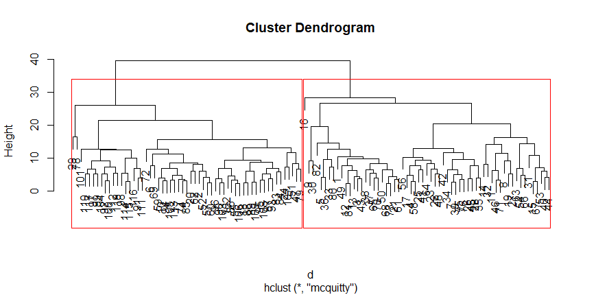

### 动态聚类法

> 这里指Kmean

| K-mean Algorithm                                             |
| ------------------------------------------------------------ |
| 1. 初始化k个类别中心ai<br>2. 对每个样本Xi标记位距离中心aj最近的类别j，即 <br>3. 更新aj为隶属该类别所有值得均值<br>4. 迭代2，3，直到达到终止条件（迭代次数、MSE最小等） |

用它在2018年数据集上进行聚类

```R
> km <- kmeans(scale(fil2018),centers = 2)
```

```
K-means clustering with 2 clusters of sizes 56, 62

Cluster means:
      height    armSpan footLength  legLength     weight
1  0.8085181  0.8143927  0.7943666  0.5233794  0.7105720
2 -0.7302744 -0.7355805 -0.7174924 -0.4727298 -0.6418069

Clustering vector:
  [1] 1 2 1 1 2 1 1 1 2 1 1 2 1 1 1 1 1 2 1 2 1 1 1 2 1 1 1 2 1 2 1 1 1 1 1 2
 [37] 1 1 1 1 1 1 1 1 1 1 2 1 1 1 2 2 1 1 2 1 2 1 2 2 1 2 1 1 1 1 1 1 1 1 1 2
 [73] 1 2 1 1 2 2 2 2 2 2 2 2 2 2 2 2 2 2 2 2 2 2 2 2 2 2 2 2 2 2 2 2 2 2 2 2
[109] 2 2 2 2 2 2 2 2 2 2

Within cluster sum of squares by cluster:
[1] 150.3374 144.0392
 (between_SS / total_SS =  49.7 %)

Available components:

[1] "cluster"      "centers"      "totss"        "withinss"     "tot.withinss"
[6] "betweenss"    "size"         "iter"         "ifault"      
```

我们对clustering的结果分析，运用[Model Analyse & Evaluation](#Model-Analyse-&-Evaluation)评估定义计算得到

```
> modelroc <- roc(classFil2018$c,km$cluster)
> plot(modelroc, print.auc=TRUE, auc.polygon=TRUE, grid=c(0.1, 0.2),
+      grid.col=c("green", "red"), max.auc.polygon=TRUE,
+      auc.polygon.col="skyblue", print.thres=TRUE)
```

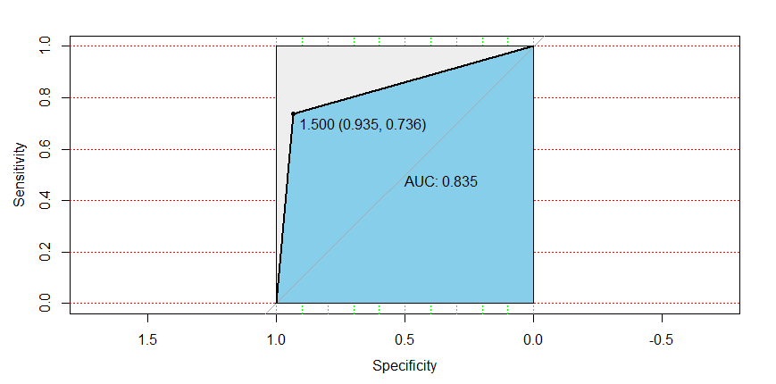

面积占0.835即AUC为0.835，效果不错

## 主成分分析


且特征值 ，Q第 i 列即ai，则  即为主成分

我们容易得到 ，并且  和 ，此外 ，因此主成分可以看作一种贡献率，即


即对Xj的贡献率

总体数据归一化后还有


一般来说不会取所有的特征值，而会取前k名来降维，可以看作是n维向量投影到k维特征向量构成的空间，也可以看作是投影k维空间让**方差最大化**

我们可以取第一主轴进行投影，设该主轴单维向量 

转化为凸问题


求导后可以得到


主成分的估计可以从R或S分解得到

我们分析2018年男生数据的主成分有

```R
> student.pr <- princomp(filboys2018, cor = TRUE)
> summary(student.pr, loadings=TRUE)
```

```
Importance of components:
                          Comp.1    Comp.2    Comp.3     Comp.4     Comp.5
Standard deviation     1.6779599 0.9786991 0.7704042 0.62476182 0.49269547
Proportion of Variance 0.5631099 0.1915704 0.1187045 0.07806547 0.04854976
Cumulative Proportion  0.5631099 0.7546802 0.8733848 0.95145024 1.00000000

Loadings:
           Comp.1 Comp.2 Comp.3 Comp.4 Comp.5
height     -0.528         0.262  0.315  0.743
armSpan    -0.516 -0.190  0.121  0.535 -0.630
footLength -0.415  0.263 -0.867              
legLength  -0.354 -0.735        -0.579       
weight     -0.397  0.596  0.405 -0.524 -0.221
```

`Proportion of Variance`指方差贡献率，`Cumulative Proportion`将其累加了起来

````R
> predict(student.pr)
````

````
           Comp.1      Comp.2       Comp.3       Comp.4       Comp.5
 [1,]  0.17453006 -0.13413693 -0.132515800 -1.295101592  1.020301985
 [2,]  1.74982067 -0.02823945 -0.586333908  0.520712654 -0.195495411
 [3,]  0.87604580  0.12672015 -0.537484418  0.062848912  0.093557077
 [4,] -1.37377318 -0.56366086 -0.622659241  0.159649096 -0.265971691
 [5,]  1.63967529  1.19907331 -1.006739777 -0.424668997 -0.007844825
 [6,]  0.87982394 -0.17424538 -1.663347523  0.965049979 -0.618151020
 [7,]  0.32151522 -1.42602248 -0.299931423  0.219014049 -0.157092700
 [8,] -1.39433411  0.48366786  0.754957280 -0.872132637  0.622994147
 [9,]  1.81318380  1.16697401  2.166023691 -0.226957587  0.634817698
[10,]  1.10339003 -0.62411930 -0.387028973 -0.483944160 -0.526571907
[11,] -3.37100907 -0.24125106  0.445204808  0.171373815  0.136073490
[12,]  1.71496737  0.30175951  0.034790092  0.123209069 -0.034877503
[13,]  0.70666287  0.04018691  0.012253856  0.025692721  0.781479358
[14,] -3.20897924  1.54589888 -0.035447437  0.210683740 -0.142731632
[15,] -0.83474281  0.64600364  0.432908559 -0.110885173 -0.423545400
[16,] -1.16785417  3.83306647 -0.332409496  0.348550600 -0.191457050
[17,] -1.09313892 -1.33808605  0.434094555 -0.102694741 -0.058171659
[18,]  2.95627277 -0.33199199  0.231082018 -0.646702289 -0.351093880
[19,] -2.85637515  0.30406053 -0.479334756 -1.112046588 -0.365535598
[20,]  1.64115812 -0.89659264  0.659977740  0.092883582  0.479698642
[21,]  0.36585408 -0.16169799 -0.365424948 -0.348048285 -0.392567565
[22,] -2.74349953 -0.80324372  0.016425444 -0.296966612  0.211718973
[23,] -2.52462675 -0.49845443 -0.534252667  0.522672864  0.081330360
[24,]  2.91066389  1.37852524 -1.103814244 -0.071474647  0.528638037
[25,] -2.09988085 -1.09536995 -1.293982756 -0.295159530  0.648005283
[26,] -0.32462089 -0.37472900  1.201450174  0.873226528 -0.226483646
[27,] -2.68828474  0.18923123  0.361217098 -1.050815416  0.418809622
[28,]  1.22622565 -0.57644468  1.798071287  0.991908004  0.129496070
[29,] -0.03082468 -2.14242594  0.211282682 -0.508256530  0.726693450
[30,]  1.36974851  2.79967556  0.067879379  0.147038008  1.096898409
[31,] -0.09655247  1.30959228  1.137557966  1.018324559  0.090782285
[32,] -1.98917259  1.28207513  1.080347879  1.126259715 -0.295742635
[33,]  0.94390648  0.41698015 -0.415413875 -1.182396902 -0.857411982
[34,] -0.23013731 -0.59822409 -0.291857317  0.854691353  0.136412084
[35,]  0.43569856  0.14803275  0.519151338  1.096059242 -0.047767703
[36,]  2.19107809  1.14864202  0.094154281 -0.453600610 -0.482397313
[37,]  0.16244069  0.10975109 -0.189397015 -0.013752091  0.234326899
[38,]  0.46679811  0.22892847 -0.231472115 -0.891179973  0.096470691
[39,] -0.04234541 -0.91880256 -0.907852593  0.342674841 -0.023400179
[40,] -1.38816048  0.94280260 -0.198684006  0.666985438 -0.195580467
[41,] -0.82043648 -1.61945814 -0.250408795  0.104623807  0.297904946
[42,] -1.34772434 -0.21910879 -0.608665235  0.754696563 -1.007557336
[43,]  0.56034946 -0.26975445 -0.486683386 -0.035656393  0.397139973
[44,] -1.72455116  0.44954315  0.279297142  0.693717832 -0.107642299
[45,] -0.45642803  0.13385445  0.052679154  0.590776857 -0.056538170
[46,] -3.08409925  0.05743128 -0.494906698 -0.095112793  0.529774055
[47,]  3.39309311 -0.81170764  0.744154830  0.523134081  0.526439899
[48,] -1.73687518 -0.93539523  0.411395686 -0.217729949  0.020546230
[49,]  0.42743454  0.64145613 -1.925293391 -0.816680819  0.867849538
[50,]  0.05308791 -1.00604989  0.033303065 -0.686763489 -0.093921845
[51,]  3.16974279  0.32495862 -0.642261735  0.591972438  1.284633220
[52,]  1.71535980 -0.46724379 -0.220026747  0.003146501 -0.853959194
[53,] -1.55476587  0.08355068 -0.340214024  0.256873841 -0.063556119
[54,] -0.46511939  0.87222580  0.844516348 -0.904570925 -0.713935219
[55,]  2.89349983 -1.30813316  0.841788289  0.096077752 -0.158603837
[56,] -1.87342713 -0.73879144  0.009349315  0.991310320  1.021866021
[57,]  1.61788573 -0.26155642 -0.989331981 -0.447927896 -0.466626486
[58,] -0.85899255 -0.63170846  0.059711077 -0.074715856 -0.285144634
[59,]  2.11383100 -1.34120197  1.252071399 -0.459766354 -0.128779873
[60,]  2.10462776 -0.30886003 -0.330609922 -0.154946321 -0.475926534
[61,]  0.22012078 -0.48039529 -0.373895554 -0.377197077  0.020937073
[62,]  1.25740831 -0.94387092  0.763320227  0.637529169 -0.059377069
[63,]  0.38163782  0.96708920  0.946004123 -1.003769342 -0.600465881
[64,] -1.93909469 -1.70727863  0.216709252  0.342127710 -0.268463014
[65,]  0.42857752  0.58558563  0.758187084  0.018258410  0.306919382
[66,] -0.27662982  0.43232680  2.052094778 -1.271158989 -0.590907658
[67,] -1.53284400  0.78872855 -0.112143765 -0.122993984 -0.234853579
[68,]  0.71331318 -0.14140556 -0.960510405 -0.571721493 -0.087179577
[69,]  0.76147048 -0.23099369 -0.678121017  0.549613748 -1.117826655
[70,]  0.24241289  0.46743487 -0.112975256 -0.261018742 -0.133764184
[71,] -2.50924304  0.15933759  0.175186899 -0.056005723  0.190344771
[72,]  1.93523039  0.78548144 -0.957166597  1.251152705 -0.267938733
````

第一主成分较大的一般所有项都很大

用图表更加直观

```R
> biplot(student.pr)
```


## 因子分析

定义


其中f为公共因子， 且  定义类同线性回归，上式也可以写成


可以推出 ， ，令有 

可以将 作为公共变量对的影响，令  有

其中  可以作为因子F的度量

### 主成分法

> 方法和主成分分析相同

```R
> scaleBoys2018<-scale(filboys2018,center = TRUE, scale = TRUE)
> factor.analy1<-function(S, m){
+     p<-nrow(S); diag_S<-diag(S); sum_rank<-sum(diag_S)
+     rowname<-paste("X", 1:p, sep="")
+     colname<-paste("Factor", 1:m, sep="")
+     A<-matrix(0, nrow=p, ncol=m,
+               dimnames=list(rowname, colname))
+     eig<-eigen(S)
+     for (i in 1:m)
+         A[,i]<-sqrt(eig$values[i])*eig$vectors[,i]
+     h<-diag(A%*%t(A))
+     rowname<-c("SS loadings","Proportion Var","Cumulative Var")
+     B<-matrix(0, nrow=3, ncol=m,
+               dimnames=list(rowname, colname))
+     for (i in 1:m){
+         B[1,i]<-sum(A[,i]^2)
+         B[2,i]<-B[1,i]/sum_rank
+         B[3,i]<-sum(B[1,1:i])/sum_rank
+     }
+     method<-c("Principal Component Method")
+     list(method=method, loadings=A,
+          var=cbind(common=h, spcific=diag_S-h), B=B)
+ }
> fa<-factor.analy1(cor(scaleBoys2018),m=2)
> fa
```

```
$method
[1] "Principal Component Method"

$loadings
      Factor1    Factor2
X1 -0.8864698  0.0223708
X2 -0.8653281 -0.1855111
X3 -0.6964148  0.2572174
X4 -0.5935332 -0.7189724
X5 -0.6660726  0.5829707

$var
      common   spcific
X1 0.7863292 0.2136708
X2 0.7832071 0.2167929
X3 0.5511543 0.4488457
X4 0.8692029 0.1307971
X5 0.7835076 0.2164924

$B
                 Factor1   Factor2
SS loadings    2.8155494 0.9578518
Proportion Var 0.5631099 0.1915704
Cumulative Var 0.5631099 0.7546802
```

只取前两个因子可以看到累计方差(即 )只到了0.75，大致可以说明前两个因子贡献为0.75，新生成的协方差阵应该和原来的差别较小

```R
> E<- cor(filboys2018)-fa$loadings %*% t(fa$loadings)-diag(fa$var[,2])
> sum(E^2)
```
```
[1] 0.2054579
```
可见结果一般

### 主因子法

对标准化后的数据，令

为修正后的R，也可以用方差

```R
> factor.analy2<-function(R, m, d){
+     p<-nrow(R); diag_R<-diag(R); sum_rank<-sum(diag_R)
+     rowname<-paste("X", 1:p, sep="")
+     colname<-paste("Factor", 1:m, sep="")
+     A<-matrix(0, nrow=p, ncol=m,
+               dimnames=list(rowname, colname))
+     kmax=20; k<-1; h <- diag_R-d
+     repeat{
+         diag(R)<- h; h1<-h; eig<-eigen(R)
+         for (i in 1:m)
+             A[,i]<-sqrt(eig$values[i])*eig$vectors[,i]
+         h<-diag(A %*% t(A))
+         if ((sqrt(sum((h-h1)^2))<1e-4)|k==kmax) break
+         k<-k+1
+     }
+ rowname<-c("SS loadings","Proportion Var","Cumulative Var")
+ B<-matrix(0, nrow=3, ncol=m,
+           dimnames=list(rowname, colname))
+ for (i in 1:m){
+     B[1,i]<-sum(A[,i]^2)
+     B[2,i]<-B[1,i]/sum_rank
+     B[3,i]<-sum(B[1,1:i])/sum_rank
+ }
+ method<-c("Principal Factor Method")
+ list(method=method, loadings=A,
+      var=cbind(common=h,spcific=diag_R-h),B=B,iterative=k)
+ }
> d<-c(0.123, 0.112, 0.155, 0.116, 0.073)
> fa<-factor.analy2(cor(scaleBoys2018), m=2, d); fa
```

```
$method
[1] "Principal Factor Method"

$loadings
      Factor1     Factor2
X1 -0.8706010  0.03492217
X2 -0.8439718 -0.18236881
X3 -0.5721500  0.11626285
X4 -0.5250690 -0.47339608
X5 -0.6181748  0.49428846

$var
      common   spcific
X1 0.7591656 0.2408344
X2 0.7455468 0.2544532
X3 0.3408727 0.6591273
X4 0.4998013 0.5001987
X5 0.6264611 0.3735389

$B
                 Factor1   Factor2
SS loadings    2.4554277 0.5164199
Proportion Var 0.4910855 0.1032840
Cumulative Var 0.4910855 0.5943695

$iterative
[1] 20
```

```R
> E<- cor(scaleBoys2018)-fa$loadings %*% t(fa$loadings)-diag(fa$var[,2])
> sum(E^2)
```

```
[1] 0.001347586
```

### 极大似然法

设  且  且 ，即


记  可以得到


并设置约束

具体算法解由迭代法计算

```R
> factor.analy3<-function(S, m, d){
+     p<-nrow(S); diag_S<-diag(S); sum_rank<-sum(diag_S)
+     rowname<-paste("X", 1:p, sep="")
+ colname<-paste("Factor", 1:m, sep="")
+ A<-matrix(0, nrow=p, ncol=m,
+           dimnames=list(rowname, colname))
+ kmax=20; k<-1
+ repeat{
+     d1<-d; d2<-1/sqrt(d); eig<-eigen(S * (d2 %o% d2))
+     for (i in 1:m)
+         A[,i]<-sqrt(eig$values[i]-1)*eig$vectors[,i]
+     A<-diag(sqrt(d)) %*% A
+     d<-diag(S-A%*%t(A))
+     if ((sqrt(sum((d-d1)^2))<1e-4)|k==kmax) break
+     k<-k+1
+ }
+ rowname<-c("SS loadings","Proportion Var","Cumulative Var")
+ B<-matrix(0, nrow=3, ncol=m,
+           dimnames=list(rowname, colname))
+ for (i in 1:m){
+     B[1,i]<-sum(A[,i]^2)
+     B[2,i]<-B[1,i]/sum_rank
+     B[3,i]<-sum(B[1,1:i])/sum_rank
+ }
+ method<-c("Maximum Likelihood Method")
+ list(method=method, loadings=A,
+      var=cbind(common=diag_S-d, spcific=d),B=B,iterative=k)
+ }
> fa<-factor.analy3(cor(scaleBoys2018), m=2, d); fa
```

```
$method
[1] "Maximum Likelihood Method"

$loadings
       Factor1     Factor2
[1,] 0.8230378  0.23603418
[2,] 0.7653671  0.44357989
[3,] 0.5633648  0.08505277
[4,] 0.3910765  0.50104399
[5,] 0.8124306 -0.45102567

$var
              common   spcific
height     0.7331034 0.2668966
armSpan    0.7825500 0.2174500
footLength 0.3246139 0.6753861
legLength  0.4039859 0.5960141
weight     0.8634677 0.1365323

$B
                 Factor1   Factor2
SS loadings    2.3935423 0.7141785
Proportion Var 0.4787085 0.1428357
Cumulative Var 0.4787085 0.6215442

$iterative
[1] 20
```

```R
> E<- cor(scaleBoys2018)-fa$loadings %*% t(fa$loadings)-diag(fa$var[,2])
> sum(E^2)
```

```
[1] 0.0005410666
```

可见损失比较小

### 方差最大化正交旋转

为了变量更好的解释性，令 


且  ，，对A来说，列方差越大，F结构越趋于简单，我们定义  其方差为


 因此对于不同的m，取正交矩阵  做  的旋转，使  最大，解法略

```R
> fa<-factor.analy1(cor(scaleBoys2018), m=2)
> vm1<-varimax(fa$loadings, normalize = F); vm1
```

```
$loadings

Loadings:
   Factor1 Factor2
X1 -0.695  -0.550 
X2 -0.546  -0.697 
X3 -0.700  -0.248 
X4         -0.932 
X5 -0.885         

               Factor1 Factor2
SS loadings      2.054   1.720
Proportion Var   0.411   0.344
Cumulative Var   0.411   0.755

$rotmat
           [,1]      [,2]
[1,]  0.7680910 0.6403407
[2,] -0.6403407 0.7680910
```

当然也可以用`factanal`

```R
> fa<-factanal(factors=2, covmat=cor(scaleBoys2018)); fa
```

````
Call:
factanal(factors = 2, covmat = cor(scaleBoys2018))

Uniquenesses:
    height    armSpan footLength  legLength     weight 
     0.263      0.218      0.672      0.587      0.190 

Loadings:
           Factor1 Factor2
height     0.654   0.556  
armSpan    0.796   0.385  
footLength 0.382   0.427  
legLength  0.642          
weight             0.894  

               Factor1 Factor2
SS loadings      1.628   1.441
Proportion Var   0.326   0.288
Cumulative Var   0.326   0.614

The degrees of freedom for the model is 1 and the fit was 6e-04 
````

每个因子实际上占有的属性成分多，所以比较难进行对因子的归类，可以大致认为两个因子都说明了人的体态

### 因子得分

我们得到因子矩阵后可以反过来评估每个样本的分数，现在对因子矩阵进行估计

#### 最小二乘法

令加权最小二乘


求导后


又称为 Bartlett 方法

#### 回归法

令得分函数


容易求得


故


采取回归法

```R
> fa<-factanal(~., factors=2, data=filboys2018, scores="regression")
> plot(fa$scores[, 1:2], type="n")
> text(fa$scores[,1], fa$scores[,2])
```

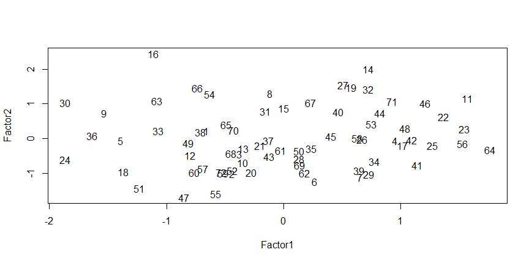

我们已经知道二号因子比较大说明体重身高都很大，而16号体重91.5kg，升高180cm，是很厚实的一个人

## 典型相关分析

对于两组变量与，我们希望能够找到a和b能够


记  有


设Lagrange函数


求导可解得 ，有  和  另一方面可求得约束  和 

现计算典型变量，对 的第k特征 和特征向量 有 


 这里记  为典型相关系数， 与  为典型变量

这里我们用2018年标准化的男生数据前四项（各两项）做分析

```R
> ca<-cancor(scaleBoys2018[,1:2],scaleBoys2018[,3:4])
> ca
```

```
$cor
[1] 0.6564941 0.1045604

$xcoef
              [,1]       [,2]
height  0.04811195  0.1679480
armSpan 0.07878219 -0.1559316

$ycoef
                 [,1]        [,2]
footLength 0.07325025  0.09816096
legLength  0.07700732 -0.09524204

$xcenter
       height       armSpan 
-5.766992e-16  1.776477e-15 

$ycenter
   footLength     legLength 
 9.321247e-16 -2.444033e-16 
```

可见第一典型变量相关系数为0.65，第二为0.10，这边画出第一典型变量的散点图

```R
> U<-as.matrix(scaleBoys2018[,1:2])%*% ca$xcoef
> V<-as.matrix(scaleBoys2018[,3:4])%*% ca$ycoef
> plot(U[,1], V[,1], xlab="U1", ylab="V1")
```

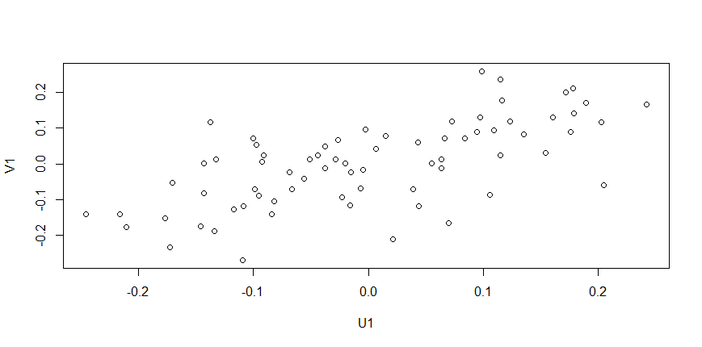

符合一定的相关关系

## Model Analyse
> 先给出比较简单的分类模型分析，以后再补充

`这里我们统一使用监督模型做二分类，首先对模型定义评估标准，这里只是给出分类下的一个评估标准`

我们定义所有的模型使用留出法，即2018年的数据作为训练集，2015年的数据作为测试集

`注意：测试集的分类不是很均匀，实际上可能会因为大部分都预测另外一个类仍有很高的分数`

我们将记

| 定义 | 解释             |
| ---- | ---------------- |
| TP   | 正类预测为正类数 |
| FN   | 正类预测为负类数 |
| FP   | 负类预测为正类数 |
| TN   | 负类预测为负类数 |

精确率定义为  ，召回率定义为  ，F1-score为 

评估会辅以 ROC 曲线，其中横轴为  ，纵轴为  ，一般来说ROC曲线面积越大效果越好，这里不做代价敏感错误率的检验

`选用合适的对于连续变量的有监督二分类模型，实际上这样模型和模型组合很多很多很多很多`

### 逻辑回归

> 基本模型同上，这里进行进一步的分析

```R
> pre<-predict(glm.sol, data.frame(height=classFil2015$height,footLength=classFil2015$footLength,legLength=classFil2015$legLength))
> ypred<-1*(pre>0.5)
> modelroc <- roc(classFil2015$c,ypred)
> plot(modelroc, print.auc=TRUE, auc.polygon=TRUE, grid=c(0.1, 0.2),
+      grid.col=c("green", "red"), max.auc.polygon=TRUE,
+      auc.polygon.col="skyblue", print.thres=TRUE)
```


AUC达到0.91，说明分类效果很好


### K近邻

> 基本算法思想：
>
> 1）计算测试数据与各个训练数据之间的距离，距离基本为聚类使用的距离
>
> 2）按照距离的递增关系进行排序
>
> 3）选取距离最小的K个点
>
> 4）确定前K个点所在类别的出现频率
>
> 5）返回前K个点中出现频率最高的类别作为测试数据的预测分类

`KNN实现一般使用kd树，这里不给出实现`

```R
> model.kknn<-kknn(c~.,classFil2018,classFil2015,distance=5) # 默认欧式距离
> fit <- fitted(model.kknn)
> pred<-1*(fit>0.5)
> modelroc <- roc(classFil2015$c,pred)
> plot(modelroc, print.auc=TRUE, auc.polygon=TRUE, grid=c(0.1, 0.2),
+            grid.col=c("green", "red"), max.auc.polygon=TRUE,
+            auc.polygon.col="skyblue", print.thres=TRUE)
```

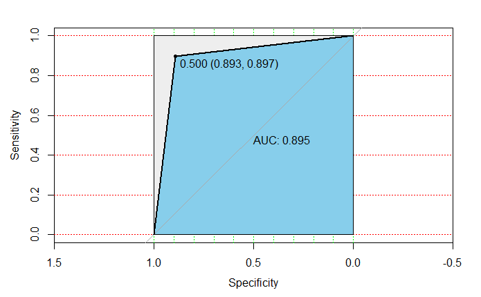

AUC达到0.895，可见分类效果很好


### 决策树

`这块内容也非常多，除了经典的决策树，还有提升树诸如GBDT等，集成比如Random Forest，延伸暂略`

首先先给出几个决策的标准

**信息增益**

假设第k类所占比例pk，定义信息熵

其表示数据纯度，记集合

a为某一属性的所有取值，定义增益率为


其中  代表在点t左侧或右侧的样本，即以某一属性进行多次二分，计算增益率最大的作为划分节点

**增益率**

用以减少取值数目的影响，定义为

其中离散属性定义为

这里  可以用和上面  改为连续值，实际上也可以用分箱将连续值离散化，即将属性分成 |V|个

**基尼指数**

其代表了一个总体中随机抽两个样本不一致的概率，基尼值定义为

因而基尼指数离散形式为


一般的决策树算法：
1. 从根节点开始，对节点计算所有可能的特征的信息增益，选择最佳特征作为节点的划分特征；
2. 由该特征的不同取值建立子节点；
3. 再对子节点递归地调用以上方法，构建决策树；
4. 到所有特征的信息增益都很小或者没有特征可以选择为止，得到最终的决策树

`决策树还包含剪枝处理,可以用prune进行剪枝`

#### C5.0

以信息增益率为标准

```
> credit_model<-C5.0(x = classFil2018[,1:5],y = as.factor(classFil2018$c))
> credit_pred<-predict(object = credit_model,newdata = classFil2015[,1:5])
> credit<-as.numeric(credit_pred)
> modelroc <- roc(classFil2015$c,credit)
> plot(modelroc, print.auc=TRUE, auc.polygon=TRUE, grid=c(0.1, 0.2),
+                    grid.col=c("green", "red"), max.auc.polygon=TRUE,
+                    auc.polygon.col="skyblue", print.thres=TRUE)
```


#### CART

以基尼指数为标准

```R
> dtree<-rpart(c~.,data=classFil2018,method="class", parms=list(split="information"))
> predtree<-predict(dtree,newdata=classFil2015[,1:5],type="class")
>  modelroc <- roc(classFil2015$c,as.numeric(predtree))
>  plot(modelroc, print.auc=TRUE, auc.polygon=TRUE, grid=c(0.1, 0.2),
+                            grid.col=c("green", "red"), max.auc.polygon=TRUE,
+                            auc.polygon.col="skyblue", print.thres=TRUE)
```

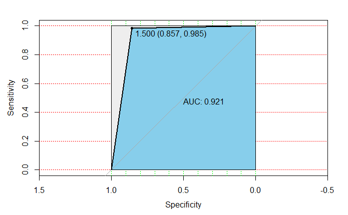

可见决策树分类效果很好

### SVM

> 这里主要指二元SVM

SVM通过把两个类别最接近的点之间的边缘最大化来寻找分割两个类别的最优平面。超平面方程可以定义为

定义二分类模型

则得到Lagrange约束

求偏导可得到


可以得到对偶问题


这个是一个规划问题，可以利用一系列迭代算法譬如SMO解出a

```R
> svm.model<-svm(formula=c~.,data=classFil2018,type="C-classification",kernal="polynomial",gamma=1,cost=100)
> pred<-predict(svm.model,classFil2015[,1:5])
>  modelroc <- roc(classFil2015$c,as.numeric(pred))
>  plot(modelroc, print.auc=TRUE, auc.polygon=TRUE, grid=c(0.1, 0.2),
+                            grid.col=c("green", "red"), max.auc.polygon=TRUE,
+                            auc.polygon.col="skyblue", print.thres=TRUE)
```


SVM在此测试集上效果没有决策树好


## 参考

1. 统计建模与Ｒ软件
2. 机器学习，周志华
3. R语言与机器学习


