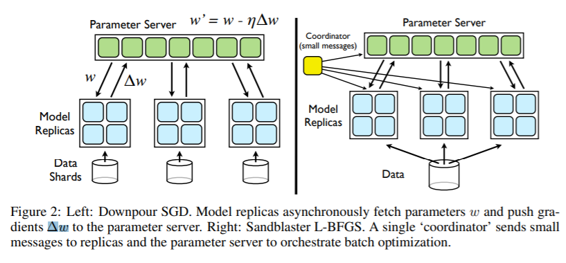

## Distributed Machine Learning Framework


## Partition&Parallelism

### Data Parallelism

Data parallelism focuses on distributing the data across different nodes, which operate on the data in parallel. There are two ways to split data: split samples(**random sampling/shuffling and dividing as mini-batch**) and split dimensions(only used in dimensions that are mutually independent).

### Model Parallelism

#### Linear Model

Linear models like Linear Regression or Logistic Regression have the same size of parameters as the size of dimensions and the dimensions are mutually independent (like what we mention in data parallelism). We can divide the dimensions and use **coordinate descent** method to optimize the model.

#### Neural Network

Divide the model into different parts and allocate the task to different nodes. Every divided node would calculate the output after all of the node’s dependences are calculated then update the parameters and send output to the next node.

**Horizontal Partition**(also can be called **workload parallelism**)


It partitions workload in different layers into different part (not only allocated in GPU). 

**Vertical Partition**

It partitions workload in vertical into different part (e.g. **group convolution**).

**Mixed Partition**


Put horizontal partition and vertical partition together. (e.g. **DistBelief**[1])

**Random Partition**

Explore the optimal partition for neural network, mainly used in model compression.

## Distributed Computing Model

### Data/Model Parallelism

#### MapReduce/AllReduce[2]

A MapReduce framework (or system) is usually composed of three operations (or steps):

1. **Map:** each worker node applies the `map` function to the local data, and writes the output to a temporary storage. A master node ensures that only one copy of the redundant input data is processed.
2. **Shuffle:** worker nodes redistribute data based on the output keys (produced by the `map` function), such that all data belonging to one key is located on the same worker node.
3. **Reduce:** worker nodes now process each group of output data, per key, in parallel.


When synchronizing clusters in MapReduce framework, we can use MPI(Message Passing Interface) like AllReduce.


e.g. **Hadoop**, **Spark**

#### Parameter Server[3]

If one node in MapReduce doesn’t work, the whole system would stop. The parameter server makes all the parameter in one server. The workers only communicate with server and there is no need for workers to communicate with each other.


e.g. **Multiverso**

#### Streaming

Conceptually, a stream is a (potentially never-ending) flow of data records, and a transformation is an operation that takes one or more streams as input, and produces one or more output streams as a result.

e.g. **Flink**

#### Dataflow(Many can be accounted as this)

dataflow programming is a programming paradigm that models a program as a directed graph of the data flowing between operations, thus implementing dataflow principles and architecture. Here we specify this as **dataflow and differentiable programming**, which means that every node in dataflow is responsible only for forward computing but also for backward computing.


e.g. **Pytorch**

### [Concurrent Design Pattern](https://java-design-patterns.com/patterns/)

Many distributed design patterns are borrowed from this.

#### [Master/Worker](https://java-design-patterns.com/patterns/master-worker-pattern/)(can be seen as Map-Reduce)


This pattern can be used when data can be divided into multiple parts, all of which need to go through the same computation to give a result, which need to be aggregated to get the final result.

#### [Async Method Invocation](https://java-design-patterns.com/patterns/async-method-invocation/)

Also see [Asynchronous Communication](#Asynchronous Communication)


e.g. **Future**/**Promise**

#### [Half-Sync/Half-Async](https://java-design-patterns.com/patterns/half-sync-half-async/)

The Half-Sync/Half-Async pattern decouples synchronous I/O from asynchronous I/O in a system to simplify concurrent programming effort without degrading execution efficiency.


### Concurrent Communication Model

#### Actor

Actors are concurrency primitives which can send messages to each other, create new Actors and determine how to respond to the next received message. They keep their own private state without sharing it, so they can affect each other only through messages. Since there is no shared state, there is no need for locks.


e.g. **Akka**

#### CSP

Communicating Sequential Processes (CSP) is a paradigm which is very similar to the Actor model. It’s also based on message-passing without sharing memory. However, CSP and Actors have these 2 key differences:

- Processes in CSP are anonymous, while actors have identities. So, CSP uses explicit channels for message passing, whereas with Actors you send messages directly.
- With CSP the sender cannot transmit a message until the receiver is ready to accept it. Actors can send messages asynchronously.


#### STM

While Actors and CSP are concurrency models which are based on message passing, Software Transactional Memory (STM) is a model which uses shared memory. It’s an alternative to lock-based synchronization. Similarly to DB transactions, these are the main concepts:

1. Values within a transaction can be changed, but these changes are not visible to others until the transaction is committed.
2. Errors that happened in transactions abort them and rollback all the changes.
3. If a transaction can’t be committed due to conflicting changes, it retries until it succeeds.


## Communication

### Method

RPC/HTTP/MQ/Socket/…

### Pace

#### Synchronous Communication

#### BSP

Bulk Synchronous Parallel computer consists of

- components capable of processing and/or memory transactions,
- a network that routes messages between pairs of such components, and
- a hardware facility that allows for the synchronisation of all or a subset of components.

In distributed model, the BSP model can not only be run on multiple processors(CPU, GPU, etc.), but also can be allocated in multiple servers.


e.g. **Pregel**

#### Asynchronous Communication

See [Distributed Machine Learning Algorithms](#Distributed Machine Learning Algorithms)


#### SSP(Stale Synchronous Parallel)


Tackle the difference of pace of worker in asynchronous communication.


## Aggregation

We consider two ways of aggregation of model parameters:

- All parameters/output adding. This is mainly for data parallelism. e.g. MA, ADMM, SSGD, etc.
- Partial parameters/output adding. e.g. ASGD, AADMM, D-PSGD, etc.

See [Distributed Machine Learning Algorithms](#Distributed Machine Learning Algorithms)


## Distributed Machine Learning Algorithms

| Algorithm         | Parallelism | Communication | Aggregation |
| ----------------- | ----------- | ------------- | ----------- |
| SSGD              | data        | sync          | all         |
| MA                | data        | sync          | all         |
| BMUF              | data        | sync          | all         |
| ADMM              | data        | sync          | all         |
| EASGD             | data        | sync          | all         |
| ASGD              | data        | async         | partial     |
| AADMM             | data        | async         | partial     |
| Hogwild!          | data        | async         | partial     |
| Cylades           | data        | async         | partial     |
| D-PSGD            | data        | async         | partial     |
| AdaDelay          | data        | async         | partial     |
| Group Convolution | model       | sync          | all         |
| DistBelief        | model       | async         | partial     |


### Synchronous Algorithm

#### SSGD

```pseudocode
Initialize: parameter w_0, number of workers K, epochs T, learning rates \eta
for t = 0, 1, ..., T - 1:
    Pull w_t
    Random sampling mini-batch data i
    Calculate gradient \Delta f_i(w_t)
    Get all gradients in workers and get \sum \Delta f_i(w_t)
    Update w_{t+1} = w_t - \eta/K \sum \Delta f_i(w_t)
```

This method is suit for big computation of every mini-batch. If the batch is too small it would cost a lot of time to communicate. Also, the optimal batch size of neural network is not determined. If we want to use SSGD for optimization, we should consider the trade-off between time and accuracy.


#### MA

```pseudocode
Initialize: parameter w_0, number of workers K, epochs T, gapping M, learning rates \eta
for t = 0, 1, ..., T - 1:
    Pull w_t
    for m = 0, 1, ... M:
    	Random sampling mini-batch data i_m
    	Calculate gradient \Delta f_i_m(w_t)
    	Update w_t = w_t - \eta \Delta f_i_m(w_t)
    Get all parameters in workers and get 1/K \sum w_t
    Update w_{t+1} = 1/K \sum w_t
```

e.g. **CNTK**


#### BMUF

Adding a global momentum

```
Initialize: parameter w_0, number of workers K, epochs T, gapping M, learning rates \eta, momentum \mu, \delta
for t = 0, 1, ..., T - 1:
    Pull w_t
    for m = 0, 1, ... M:
    	Random sampling mini-batch data i_m
    	Calculate gradient \Delta f_i_m(w_t)
    	Update w_t = w_t - \eta \Delta f_i_m(w_t)
    Get all parameters in workers and get \overline{w} = 1/K \sum w_t
    Compute \Delta_t = \mu \Delta_{t-1} + \delta (\overline{w} - w_t)
    Update  w_{t+1} = w_t + \Delta_t
```


#### ADMM

The problem of data parallelism distributed optimization can be described as:

ADMM introduces a variable z to control the difference among , i.e. converting this problem as a constrained optimization problem


Thus, the optimization problem can be described as

**Worker**:

```
Initialize: parameter w_0^k, \lambda_t^k, number of workers K, epochs T
for t = 0, 1, ..., T - 1:
    Pull z_t
    Update \lambda_{t+1}^k = \lambda_t^k + \rho (w_t^k - z_t)
    Update w_{t+1}^k = argmin_w(\sum^K l^k(w^k) + (\lambda^k_t)^T (w^k-z_t) + \frac{\rho}{2} ||w^k-z_t||_2^2)
    Push w_{t+1}^k, \lambda_{t+1}^k
```

**Master**:

```
Initialize: parameter z_0, number of workers K
while True:
    while True:
    	Waiting w_{t+1}^k, \lambda_{t+1}^k
    	if received from all K workers: break
    Update z_{t+1} =  1/K \sum (w_t^k + \frac{1}{\rho} \lambda_t^k)
```


#### EASGD[4]

The constrained optimization problem in ADMM can be simplified as 

we can take the first-order derivative in the update procedure.

```
Initialize: global parameter w_0, local parameter w_0^k, number of workers K, epochs T, learning rates \eta, constraint ratio \alpha, \beta
for t = 0, 1, ..., T - 1:
   Random sampling mini-batch data i
   Calculate gradient \Delta f_i(w_t)
   Update w_{t+1}^k = w_t^k - \eta \Delta f_i(w_t^k) - \alpha(w_t^k - w_t)
   Get all parameters in workers and get 1/K \sum w_t
   Update global parameter w_{t+1} = (1-\beta)w_t + \beta/K \sum w_t
```

That is, when we update global parameters, we can take consideration of part of former parameters.


### Asynchronous Algorithm

#### ASGD

**Worker**:

```
Initialize: parameter w_0, number of workers K, epochs T, learning rates \eta
for t = 0, 1, ..., T - 1:
    Pull w_t^k
    Random sampling mini-batch data i
    Calculate gradient g_t^k = \Delta f_i(w_t)
    Push g_t^k
```

**Master**(PS):

```
while True:
    while True:
        if received g_t^k:
        break
    Update w = w - \eta g_t^k
```

It’s very easy to get delay in this algorithm. The update formula can also be written as

This would make the training unstable and may produce inaccurate result.


#### AADMM

**Worker**:

```
Initialize: parameter w_0^k, \lambda_t^k, number of workers K, epochs T
for t = 0, 1, ..., T - 1:
    Pull z_t
    Update \lambda_{t+1}^k = \lambda_t^k + \rho (w_t^k - z_t)
    Update w_{t+1}^k = argmin_w(\sum^K l^k(w^k) + (\lambda^k_t)^T (w^k-z_t) + \frac{\rho}{2} ||w^k-z_t||_2^2)
    Push w_{t+1}^k, \lambda_{t+1}^k
```

**Master**(PS):

```
Initialize: parameter z_0, number of workers K, max delay worker K_0, max delay \tau
while True:
    while True:
    	Waiting w_{t+1}^i, \lambda_{t+1}^i
    	if received from worker set \Phi(which contains no less than K_0 workers) and max(\tau_1, \tau_2, ..., \tau_K_0) \le \tau: break
    for i in \Phi:
         \tau_i = 1
    for i not in \Phi:
         \tau_i = \tau_i + 1
    Update z_{t+1} =  1/K \sum_{i \in \Phi} (w_t^i + \frac{1}{\rho} \lambda_t^i)
```


#### Hogwild![5]

```
Initialize: parameter w_0, learning rates \eta
while True:
    Random sampling mini-batch data i, using e representing the parameters related to i
    Calculate gradient g_j = \Delta_j f_i(w_t^j), j \in e
    Update w_t^j = w_t^j - \eta g_j
```

This is a lock-free asynchronous algorithm, which means that we don’t need to get the write permission of w. That’s because we can constraint the sparsity of loss function, i.e.

the smaller |e| and less intersection of e would make less conflicts when updating, and also guarantee the convergence of loss function.


#### Cyclades[6]

A significant benefit of the update partitioning in CYCLADES is that it induces considerable access locality compared to the more unstructured nature of the memory accesses during HOGWILD!


```
Initialize: Gu, T, B
Sample nb = T /B subgraphs G
Cores compute in parallel CCs for sampled subgraphs
for batch i:
    Allocation of C_i to P cores
    for each core in parallel:
        for each allocated component C:
            for each update j (in order) from C:
                x_j = u_j (x_j, f_j)
```

That is, predefine the subgraphs then compute.


#### D-PSGD[7]

This is also a decentralized algorithm like Cyclades etc.

```
Initialize: w_0^k, weight matrix W, learning rate \eta
for t = 0, 1, ..., T - 1:
     Random sampling mini-batch data i
     Calculate gradient g_t^k = \Delta f_i(w_t)
     Pull parameters from neighbors and get w^k_{t+1/2} = \sum_j W_k^j w_t^j
     Update w^k_{t+1} = w^k_{t+1/2} - \eta \Delta f_i(w_t)
```


#### AdaDelay[8]

This algorithm penalizes parameter updates when the nodes have delays. Assume the epoch is t and the delay is , then the step size  is

where

When , the AdaDelay algorithm would become SGD with linear weight decay. In AdaDelay, the c is adaptive, i.e.


the weight average of historical gradient.

There some similar algorithms:

**AsyncAdaGrad**:

**AdaptiveRevision**:


#### Group Convolution[9]


#### DistBelief[1]



## Framework Based on MapReduce

### [Spark](https://spark.apache.org/docs/latest)


#### RDD

The main abstraction Spark provides is a *resilient distributed dataset* (RDD), which is a collection of elements partitioned across the nodes of the cluster that can be operated on in parallel. RDDs are created by starting with a file in the Hadoop file system (or any other Hadoop-supported file system), or an existing Scala collection in the driver program, and transforming it. 

RDDs support two types of operations: *transformations*, which create a new dataset from an existing one, and *actions*, which return a value to the driver program after running a computation on the dataset. For example, `map` is a transformation that passes each dataset element through a function and returns a new RDD representing the results. On the other hand, `reduce` is an action that aggregates all the elements of the RDD using some function and returns the final result to the driver program (although there is also a parallel `reduceByKey` that returns a distributed dataset).

All transformations in Spark are *lazy*, in that they do not compute their results right away. Instead, they just remember the transformations applied to some base dataset (e.g. a file). The transformations are only computed when an action requires a result to be returned to the driver program. This design enables Spark to run more efficiently. For example, we can realize that a dataset created through `map` will be used in a `reduce` and return only the result of the `reduce` to the driver, rather than the larger mapped dataset.


#### Structured Streaming

The key idea in Structured Streaming is to treat a live data stream as a table that is being continuously appended. This leads to a new stream processing model that is very similar to a batch processing model. You will express your streaming computation as standard batch-like query as on a static table, and Spark runs it as an *incremental* query on the *unbounded* input table. Let’s understand this model in more detail.


#### Distributed Components

The SparkContext can connect to several types of *cluster managers* (either Spark’s own standalone cluster manager, Mesos or YARN), which allocate resources across applications. Once connected, Spark acquires *executors* on nodes in the cluster, which are processes that run computations and store data for your application. Next, it sends your application code (defined by JAR or Python files passed to SparkContext) to the executors. Finally, SparkContext sends *tasks* to the executors to run.


## Framework Based on Differentiable Dataflow

### TensorFlow

We mainly focus on TensorFlow2. 

#### GradientTape

TensorFlow provides the `tf.GradientTape` API for automatic differentiation; that is, computing the gradient of a computation with respect to some inputs, usually `tf.Variable`s. TensorFlow "records" relevant operations executed inside the context of a `tf.GradientTape` onto a "tape". TensorFlow then uses that tape to compute the gradients of a "recorded" computation using reverse mode differentiation.

#### Graphs

Graphs are data structures that contain a set of `tf.Operation` objects, which represent units of computation; and `tf.Tensor` objects, which represent the units of data that flow between operations. They are defined in a `tf.Graph` context.


#### Architecture General View

A general view of TensorFlow architecture can be seen as a Client-Master-Worker distributed architecture.


- **Client**
  
  The client creates a session, which sends the graph definition to the distributed master as a `tf.GraphDef` protocol buffer. When the client evaluates a node or nodes in the graph, the evaluation triggers a call to the distributed master to initiate computation.
- **Distributed Master**
  
  - prunes the graph to obtain the subgraph required to evaluate the nodes requested by the client,
  - partitions the graph to obtain graph pieces for each participating device, and
  - caches these pieces so that they may be re-used in subsequent steps.
- **Worker Services**
  
  - handles requests from the master,
  
  - schedules the execution of the kernels for the operations that comprise a local subgraph, and
  
  - mediates direct communication between tasks.
  
  - dispatches kernels to local devices and runs kernels in parallel when possible, for example by using multiple CPU cores or GPU streams.
  
  - Send and Recv operations for each pair of source and destination device types:
  
    - Transfers between local CPU and GPU devices use the `cudaMemcpyAsync()` API to overlap computation and data transfer.
    - Transfers between two local GPUs use peer-to-peer DMA, to avoid an expensive copy via the host CPU.
  
    For transfers between tasks, mainly uses multiple protocols, including:
  
    - gRPC over TCP.(CPU&GPU)
    - RDMA over Converged Ethernet.(GPUs)


One way to enable workers is to allocate one for task and the other one for parameter storing and updating. This particular division of labor between tasks is not required, but is common for distributed training.


#### Between-Graph and In-Graph


For **in-graph replication** (Figure 1(a)), a single client binary constructs one replica on each device (all contained in a massive multi-device graph), each sharing a set of parameters (resources) placed on the client’s own device. That clients master service then coordinates synchronous execution of all replicas: feeding data and fetching outputs. (**Mainly used for one machine with many GPUs**)

For **between-graph replication** (Figure 1(b)), multiple machines run a client binary, each creating a graph with a single replica on a local device, alongside resources on a shared device (i.e. the parameter server model). Because this relies on TensorFlows name resolution to share state, care must be taken to ensure each client creates resources identically.


[1] [DistBelief: Large Scale Distributed Deep Networks](https://static.googleusercontent.com/media/research.google.com/zh-CN//archive/large_deep_networks_nips2012.pdf)

[2] [MPI Reduce and Allreduce](https://mpitutorial.com/tutorials/mpi-reduce-and-allreduce/)

[3] [Multiverso](https://github.com/microsoft/Multiverso)

[4] [EASGD: Deep learning with Elastic Averaging SGD](https://arxiv.org/pdf/1412.6651.pdf)

[5] [Hogwild!: A Lock-Free Approach to Parallelizing Stochastic Gradient Descent](https://papers.nips.cc/paper/4390-hogwild-a-lock-free-approach-to-parallelizing-stochastic-gradient-descent.pdf)

[6] [Cyclades: Conflict-free Asynchronous Machine Learning](https://arxiv.org/pdf/1605.09721.pdf)

[7] [D-PSGD: Can Decentralized Algorithms Outperform Centralized Algorithms? A Case Study for Decentralized Parallel Stochastic Gradient Descent](https://arxiv.org/pdf/1705.09056.pdf)

[8] [AdaDelay: Delay Adaptive Distributed Stochastic Convex Optimization](https://arxiv.org/pdf/1508.05003.pdf)

[9] [Alexnet: ImageNet Classification with Deep Convolutional Neural Networks](https://papers.nips.cc/paper/4824-imagenet-classification-with-deep-convolutional-neural-networks.pdf)