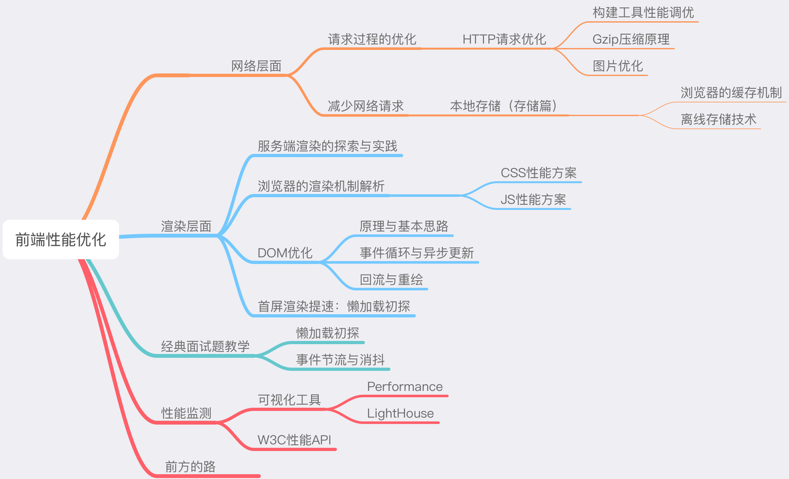

## Image Loading


页面加载简单流程可归纳为：

1. DNS解析
2. TCP连接
3. HTTP请求
4. 服务端处理，HTTP响应返回
5. 拿到目标数据，解析数据并渲染结果，向用户展示结果

优化步骤可归为




使用jquery库情况下进行前端图片加载性能优化

### 懒加载

懒加载即scroll至该区域时，再加载相应的image

```javascript
$("img.lazy").lazyload({effect: "fadeIn"}).removeClass("lazy");
```

### 图像压缩

可以使用nodejs的images库和ffmpeg对图像和视频分别压缩

```javascript
files.forEach(function(file){

	fs.stat(path + '/' + file, function(err, stat){
		if(err){console.log(err); return;}
 		if(stat.isDirectory()){
			// 如果是文件夹遍历
			explorer(path + '/' + file);
		}else{
			// 读出所有的文件
			console.log('文件名:' + path + '/' + file);
			var name = path + '/' + file;
              var extname = pathlib.extname(name);
              var outName = path + '/' + 'min_'+ file;

              if (extname === '.jpg' || extname === '.png'){
              	images(name)
                	.save(outName, {
                		quality : 60 // 压缩60%图像质量
                    });
                } else if (extname === '.mp4' || extname === '.avi') {
                        ffmpeg(name)
                            .videoBitrate(256) // 压缩比特设置
                            .videoCodec('libx264') // 视频编码方式libx264
                            .format('avi')
                            .audioBitrate(64) // 压缩音轨设置
                            .audioChannels(2)
                            .audioCodec('libmp3lame') // 音轨编码方式libmp3lame
                            .on('end', function() {
                                console.log('file has been converted succesfully');
                            })
                            .on('error', function(err) {
                                console.log('an error happened: ' + err.message);
                            })
                            .save(outName);
                }

            }
        });

});
```

### 视频加载方式

更改preload可以修改其加载方式

```javascript
<video preload="metadata" width='256' height='256' src='http://localhost:3000/resources/min_demo (1).mp4' controls='controls'></video> 
```
