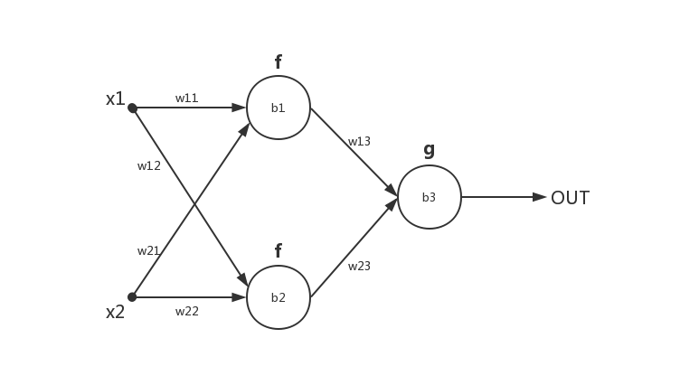

深度卷积网络有极大的参数量，要求并行运算。一般来说训练现在仍然运用的是BP和SGD，也就是以连续优化角度来看待问题，在运算中加入稀疏性质（ReLU）。一般的[神经网络](http://playground.tensorflow.org/)流程为前馈输出、计算损失、反馈训练。

### [Optimizer](https://arxiv.org/pdf/1609.04747.pdf)

Optimizer是找到让Loss减小的参数调整方法

**SGD**

随着训练会手动减少学习率，对于稀疏的出现频率少的特征我们也希望有大的更新。SGD很容易卡在鞍点或者极小值处。

**Momentum**

可以这么看，在某偏离点时梯度偏向上，原来的惯性让梯度偏向下，抵消就向“山谷”了了，所以朝“山谷”的速度会加快。

**Adagrad**

令 

自动调节学习率，并且在梯度小的地方学习率大，梯度大的地方学习率小，缺点是随着训练学习率会趋近于0。

**RMSprop**

这里  代表小窗口内的加权移动平均，防止累计过大，但是要选择初始学习率。

**Adadelta**

即替换学习率变为自动。

**Adam**

其实就是RMSprop和Momentum的结合

防止估计值偏0，修正系数

更新

**举例BP+SGD+MSE**：

要快速算出  ，我们可以将每一个神经元的输入输出的偏导作为媒介加快反向传播比如

易知  ，对于  的更新我们有

直到权重和偏执均收敛。

### Hyper-parameters

包括learning rate，batch数，epoch等

对于batch大小，如果N很大，可以保证调整值的稳定准确，但容易卡在鞍点和极小值点，如果N很小，那么调整会具有随机性，而且速度慢，但更容易跳出鞍点和极小值点

对于learning rate，一般随着学习过程深入，手动或着用自适应去减少它

### Activation

一般的激活函数有 **Sigmoid**，**TanH**，**ReLU**，**Softmax**，**Maxout**，其中**ReLU**还有若干变种比如**LeakyReLU**，**PReLU**，**ELU**等，都是在负数中加入一点调整。

梯度消失：随着传播过程梯度趋紧0。比如使用Sigmoid和TanH作为大型网络的全部激活函数，这种情况一般使用ReLU，因为梯度大于0恒为1

梯度爆炸：比如初始化过大或者梯度趋于无穷，一般在RNN或GAN中出现。

Dead ReLU：学习率太大等导致计算值为负，最后输出均为0。使用**LeakyReLU**，**PReLU**，**ELU**调整负值

对于梯度的稳定性，一般会用BN或者用一些特殊网络结构比如ResNet，以及正则化等调整梯度

### Regularization

一般来说，正则化的目的是为了避免过拟合。

**欠拟合**

很可能是网络的容量不足，或者网络规模很大但陷入了局部极值，或者网络拟合速度不够。

这很可能是训练超参不妥，如学习率过大过小，初始化效果不佳，网络不合适。也可能是数据问题，比如噪声过大，分布极端。

**过拟合**

一般认为是参数过多、拟合能力过强导致过拟合。比如高次多项式拟合，虽然极好拟合训练集的数据点但是不能符合数据后的规律，无法泛化到测试集中。而且，实际数据集往往有噪声，很可能噪声也会表现出来。

**Occam’s Razor**

前提假设尽可能简单。在神经网络中，网络连接越少越好，权重为0相当于没有连接。

**L0**

稀疏手段，可以用L1进行凸近似

**L1**

任何的规则化算子，如果他在  的地方不可微，并且可以分解为一个“求和”的形式，那么这个规则化算子就可以实现稀疏。稀疏化有利于特征选择和可解释

**L2**

如果让L2范数的规则项最小，可以使得w的每个元素都很小，都接近于0，但与L1范数不同，它不会让它等于0，而是接近于0。优化论里，解决ill-conditioned问题，ill-conditioned意味着矩阵求解中变化某值对求解影响很大，一般要让 condition number趋近为1。

L1会趋向于产生少量的特征，而其他的特征都是0，而L2会选择更多的特征，这些特征都会接近于0。Lasso在特征选择时候非常有用，而Ridge就只是一种规则化而已。

**Nuclear Norm**

即奇异值之和。约束Low-Rank。Low-Rank 可用于数据恢复等，因为有很多数据行列相关，比如图像。

**Dropout**

删除点。

### Loss

**MSE**

**Hinge Loss**

用于SVM中，其中二分类问题可以写成

**Softmax Loss**

相当于归一化。由交叉熵

其中 s 代表softmax输出，交叉熵可以看作两个分布的差距，y取0或1

### 更多的技巧

**多模型集合**

比如模型拼接或者集成学习等

**多任务学习**

同时完成多个任务

**参数共享**

共享神经元或者共享参数，比如卷积网络

**标签平滑**

网络权重可能会越来越大，比如softmax要无穷大才会到1，smooth让输出概率变小。

**数据增强**

丰富数据，比如图片镜像、平移、剪切、旋转、缩放、变形、亮度对比度改变、色彩调整、加入噪声等，也有用AE或者GAN生成新数据，或者其他增强方法比如mixup。

**初始化**

一般初始化权重为N(0,1)正态分布，偏置为0。但是这样很可能会和训练集有数量级差别导致梯度消失等。一般有Xavier初始化和He初始化。

Xavier定义输入维度n，输出维度m，那么就在  采样，主要是默认各层的激活值和状态梯度的方差在传播过程中的方差保持一致。对对称激活函数比如TanH效果好。

He使用输入维度，针对ReLU。

**预处理**

数据集很少可以针对噪声和特征进行预处理。

**调参**

可以用较大的批逐渐提高学习率，然后再降低学习率。

**bug检查**

可视化、打乱数据集、小数据集拟合、标签正确性等

**性能提高**

1. 增强+预处理很重要
2. 数据应该有均衡性和代表性
3. 取用噪声较小的数据集
4. 网络取用、正则化等适度
5. 数据可视化。分布不均匀应注意
6. 耐心度过平台期

